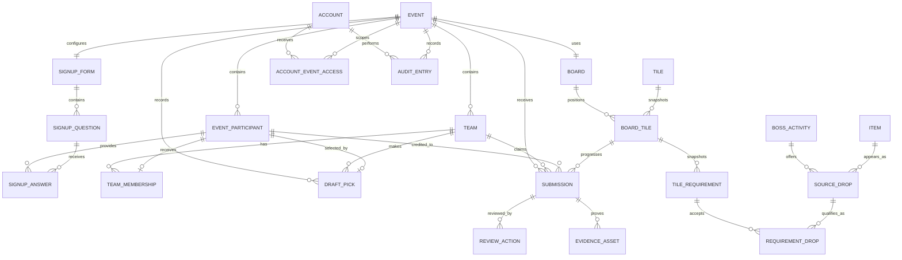

# OSRS Community Bingo Platform

## Data Model and Calculation Specification

**Status:** Planning draft v0.1  
**Last updated:** 2026-07-11  
**Companion document:** `PRODUCT_REQUIREMENTS.md`

## 1. Purpose

This document defines the logical data model, relationships, state transitions, calculations, and integrity rules for the OSRS community bingo platform. It intentionally avoids choosing a programming language, database product, framework, or hosting provider.

The model must support:

- Two or three community events per year
- Public signup without participant accounts
- Capacity limits and an ordered waiting list
- Admin-operated snake drafts
- Temporary captain and co-captain accounts
- Flexible bingo tile requirements
- Screenshot evidence and reversible admin review
- Live public boards and rankings
- EHB-based board balancing and player contribution statistics
- Historical events that do not change when catalogue data changes
- A complete audit history of competitive and administrative changes

## 2. Modeling principles

### 2.1 Events own competitive data

Players, teams, boards, submissions, rankings, and draft records are scoped to an event. A global catalogue may be reused, but published events preserve snapshots of the values used at that time.

### 2.2 Approved evidence is the source of progress

Official tile and team progress must be reproducible from approved evidence contributions. Reversing an approval must recalculate the affected progress rather than relying on an unexplained manual total.

### 2.3 History is preserved

Records that influenced an event should normally be disabled, withdrawn, rejected, reversed, or archived rather than permanently deleted.

### 2.4 Catalogue data and event snapshots are separate

Boss rates, drop rates, and EHB values may change between events. Updating a global catalogue entry must not silently alter a published or historical board.

### 2.5 Derived values are distinguishable from authoritative values

Values such as current tile progress and team rank are derived from authoritative records such as approved submissions and board configuration. Cached derived values may be stored for speed but must be reproducible.

## 3. Relationship overview



## 4. Common conventions

Every persistent record should normally contain:

- `id`: Stable internal identifier
- `created_at`: Creation timestamp
- `updated_at`: Last modification timestamp

Records that can be disabled or archived may also contain:

- `active`: Whether the record can be selected for new work
- `archived_at`: When it was archived

All timestamps are stored as timezone-aware instants. Events also store their display timezone, normally `Europe/Copenhagen`.

User-facing ordering should not depend on database insertion order. Explicit position, sequence, signup time, or name fields are used.

## 5. Event domain

### 5.1 Event

Represents one bingo event.

Required fields:

- `id`
- `name`
- `slug`: Public URL identifier
- `description`
- `timezone`
- `state`
- `signup_opens_at`
- `signup_closes_at`
- `event_starts_at`
- `event_ends_at`
- `submission_cutoff_at`
- `participant_cap`
- `waiting_list_enabled`
- `created_by_account_id`

Optional fields:

- `banner_asset_id`
- `actual_started_at`
- `submissions_closed_at`
- `finalized_at`
- `archived_at`
- `signup_code_hash`
- `verification_code`
- `verification_code_enabled`
- `buy_in_description`
- `prize_description`
- `public_rules`
- `expected_team_count`
- `expected_team_size`
- `expected_board_rows`
- `expected_board_columns`

Event state:

```text
DRAFT
SIGNUP_OPEN
SIGNUP_CLOSED
LIVE
AWAITING_FINAL_REVIEW
FINALIZED
ARCHIVED
```

Normal transitions:

```text
DRAFT → SIGNUP_OPEN → SIGNUP_CLOSED → LIVE
LIVE → AWAITING_FINAL_REVIEW → FINALIZED → ARCHIVED
```

Exceptional admin transitions may reopen signups, reopen submissions, or unfinalize an event. Each exceptional transition requires an audit reason.

### 5.2 Event publication controls

Event lifecycle and publication are related but not identical. The event stores separate controls for:

- Signup page publication
- Participant-list publication
- Draft-result publication
- Team-roster publication
- Board publication
- Results publication

Opening signups publishes only the signup page and its basic event information. Board and draft publication remain independent.

### 5.3 EventStateTransition

Records every event lifecycle change.

Fields:

- `event_id`
- `from_state`
- `to_state`
- `performed_by_account_id`
- `performed_at`
- `reason`, required for exceptional or backward transitions
- `scheduled`: Whether it resulted from an admin-configured scheduled action

## 6. Signup domain

### 6.1 SignupForm

One active form definition belongs to an event. Historical question definitions remain available after changes.

Fields:

- `event_id`
- `version`
- `published_at`
- `closed_at`
- `require_signup_code`
- `allow_private_editing`

### 6.2 SignupQuestion

Fields:

- `signup_form_id`
- `key`: Stable machine identifier
- `label`
- `help_text`
- `type`
- `required`
- `system_field`
- `admin_only_answer`
- `position`
- `active`
- `options`, for choice questions

Question types:

```text
SHORT_TEXT
LONG_TEXT
NUMBER
YES_NO
SINGLE_CHOICE
```

System questions such as primary OSRS account and required EHB cannot be removed while required by event configuration.

### 6.3 EventParticipant

Represents one signup and participant identity for one event. Participants are intentionally not linked across events. A player who signs up for a later bingo creates a new event-participant record even if the submitted name is unchanged.

Fields:

- `event_id`
- `primary_account_name`
- `normalized_primary_account_name`
- `second_account_name`
- `discord_identity`
- `ehb_snapshot`
- `comments`
- `captain_volunteer`
- `payment_status`
- `signup_status`
- `signup_sequence`
- `signed_up_at`
- `confirmed_at`
- `waiting_listed_at`
- `withdrawn_at`
- `removed_at`
- `status_reason`
- `private_edit_token_hash`
- `form_version`
- `source`

Signup status:

```text
CONFIRMED
WAITING_LIST
WITHDRAWN
REMOVED
```

Payment status:

```text
NOT_REQUIRED
UNKNOWN
UNPAID
PAID
WAIVED
```

Signup source:

```text
WEBSITE
CSV_IMPORT
ADMIN_CREATED
```

Name normalization is used only to detect likely duplicate signups inside the same event. It does not create a reusable identity or link name changes across bingos.

There may be only one active signup for the same normalized primary account in one event unless an admin explicitly approves an exception.

### 6.4 SignupAnswer

Stores event-specific custom answers.

Fields:

- `event_participant_id`
- `signup_question_id`
- `question_label_snapshot`
- `value`

The label snapshot preserves meaning if the form question is later edited.

### 6.6 Waiting-list calculation

Confirmed count includes `CONFIRMED` participants only.

When a valid signup is accepted:

```text
if confirmed_count < participant_cap:
    status = CONFIRMED
else:
    status = WAITING_LIST
```

Waiting-list position is derived by ordering active `WAITING_LIST` records by:

1. `signed_up_at` ascending
2. `signup_sequence` ascending as a deterministic tie-breaker

When capacity increases or a confirmed place becomes available before the draft is locked:

```text
open_places = participant_cap - confirmed_count
promote the first open_places waiting-list records
```

The participant cap can be increased but not lowered. If signups close below the cap, the confirmed participants at that time are simply the available participant pool.

After the draft is locked, automatic promotion stops. Replacements require explicit admin action.

## 7. Team and draft domain

### 7.1 Team

Fields:

- `event_id`
- `name`
- `slug`
- `image_asset_id`
- `draft_position`
- `active`
- `finalized_at`

### 7.2 TeamMembership

Fields:

- `team_id`
- `event_participant_id`
- `role`
- `joined_at`
- `left_at`
- `assigned_by_draft_pick_id`
- `assignment_reason`

Membership role:

```text
PARTICIPANT
CAPTAIN
CO_CAPTAIN
```

An event participant can have at most one active team membership per event.

### 7.3 Draft

Fields:

- `event_id`
- `type`: `SNAKE`
- `state`
- `team_count`
- `target_team_size`
- `initial_order_randomized_at`
- `started_at`
- `paused_at`
- `finalized_at`
- `locked`

Draft state:

```text
SETUP
READY
LIVE
PAUSED
FINALIZED
```

### 7.4 DraftTeamOrder

Fields:

- `draft_id`
- `team_id`
- `initial_position`: 1-based round-one position

### 7.5 DraftPick

Fields:

- `draft_id`
- `overall_pick_number`: 1-based
- `round_number`: 1-based
- `pick_in_round`: 1-based
- `team_id`
- `event_participant_id`
- `picked_at`
- `recorded_by_account_id`
- `undone_at`
- `undone_by_account_id`
- `undo_reason`

### 7.6 Snake-draft turn calculation

For `N` teams and zero-based overall pick index `p`:

```text
round_index = floor(p / N)
position_in_round = p mod N

if round_index is even:
    order_index = position_in_round
else:
    order_index = N - 1 - position_in_round
```

The team at `initial_order[order_index]` owns the pick.

Undone picks remain stored but become inactive. Undoing the latest active pick removes its active team membership and returns the participant to available status.

Every confirmed participant remains visible during the draft. Drafted players display their assigned team rather than disappearing.

## 8. Account and access domain

### 8.1 Account

Fields:

- `username`
- `password_hash`
- `account_type`
- `active`
- `last_login_at`
- `password_changed_at`

Account type:

```text
ADMIN
CAPTAIN
```

Public participants do not have accounts.

### 8.2 AccountEventAccess

Scopes a captain account to one event and team. Admin access may be global or event-specific depending on later architecture decisions.

Fields:

- `account_id`
- `event_id`
- `team_id`, required for captain accounts
- `access_role`
- `active_from`
- `expires_at`
- `manually_disabled_at`
- `re_enabled_at`
- `correction_only`

Access role:

```text
ADMIN
CAPTAIN
CO_CAPTAIN
```

Captain authorization requires all of:

- Account is active
- Event access is active
- Current time is within access window, unless manually re-enabled without expiry
- Submission team matches the access team
- Event state permits new submission or correction

## 9. Global OSRS catalogue

### 9.1 BossActivity

Fields:

- `name`
- `slug`
- `category`
- `image_asset_id`
- `efficient_completions_per_hour`
- `external_identifier`
- `data_source`
- `data_updated_at`
- `active`
- `notes`

Categories may include boss, raid, skilling, minigame, or other activity.

### 9.2 Item

Fields:

- `name`
- `normalized_name`
- `image_asset_id`
- `external_identifier`
- `active`
- `notes`

### 9.3 SourceDrop

Connects an item to one boss/activity. The relationship is source-specific because the same item may have different rates from different sources.

Fields:

- `boss_activity_id`
- `item_id`
- `display_rate`
- `numeric_probability`
- `rate_condition_note`
- `default_ehb_estimate`
- `data_source`
- `data_updated_at`
- `active`

`numeric_probability` is optional because not every OSRS reward rate can be expressed as one unconditional probability.

## 10. Board and tile domain

### 10.1 Board

Fields:

- `event_id`
- `name`
- `rows`
- `columns`
- `state`
- `published_at`
- `locked_at`
- `total_ehb_estimate`
- `calculation_version`

Board state:

```text
DRAFT
VALIDATED
PUBLISHED
ARCHIVED
```

Only one board is active for competitive progress in version one.

### 10.2 Tile

A reusable or event-created objective template. Editing a template does not change an event board that already copied it.

Fields:

- `name`
- `description`
- `image_asset_id`
- `objective_type`
- `evidence_instructions`
- `manual_ehb_override`
- `active`

Objective type:

```text
DROP_REQUIREMENTS
MANUAL
```

### 10.3 BoardTile

Places a tile onto an event board and owns its event-specific snapshot. When a template is placed, its current requirements and eligible drops are copied into board-tile-owned snapshot records.

Fields:

- `board_id`
- `tile_id`
- `row_index`: zero-based
- `column_index`: zero-based
- `name_snapshot`
- `description_snapshot`
- `image_snapshot`
- `estimated_ehb_snapshot`
- `evidence_instructions_snapshot`

There may be only one board tile per board position and only one position per board tile.

Once a board is published, its board tile, requirement, eligible-drop, rate, and EHB snapshot records are immutable through normal catalogue editing. An explicit post-publication board correction creates audited replacement values without rewriting the historical before-state.

### 10.4 TileRequirement

Fields:

- `board_tile_id`
- `position`
- `target_contribution`
- `duplicates_allowed`
- `allow_higher_weightings`
- `requirement_description`
- `manual_completion_rule`
- `manual_objective`

All active requirements on a tile must be complete for the tile to complete.

### 10.5 RequirementBossActivity

Allows one requirement to reference multiple bosses or activities.

Fields:

- `tile_requirement_id`
- `boss_activity_id`
- `boss_name_snapshot`
- `efficient_rate_snapshot`

### 10.6 RequirementDrop

Defines one eligible source-specific drop.

Fields:

- `tile_requirement_id`
- `source_drop_id`
- `boss_name_snapshot`
- `item_name_snapshot`
- `display_rate_snapshot`
- `numeric_probability_snapshot`
- `maximum_total_contribution`
- `ehb_per_contribution_snapshot`

Every eligible drop has a default credited weight of `1`. When the requirement enables `allow_higher_weightings`, a captain may enter a higher credited weight for an individual submission and an admin verifies it during review.

When duplicates are not allowed, each eligible item normally has a maximum contribution of `1`. An explicit maximum can override this behavior.

### 10.7 Board resizing

Before publication, board dimensions may change. When shrinking, placed tiles are compacted toward the top-left in their existing row-major relative order.

```text
new_capacity = new_rows × new_columns
placed_tile_count = count(active board tiles)
```

If `placed_tile_count <= new_capacity`, the system previews the compacted layout before applying it.

If `placed_tile_count > new_capacity`, resizing is blocked. A confirmation popup explains that `placed_tile_count - new_capacity` tiles must be removed before the smaller dimensions can be used.

After publication, resizing requires explicit confirmation, an audit reason, and recalculation of every team's board and line state.

## 11. Evidence and submission domain

### 11.1 Submission

Fields:

- `event_id`
- `team_id`
- `board_tile_id`
- `tile_requirement_id`
- `source_drop_id`, optional for manual objectives
- `credited_event_participant_id`
- `submitted_by_account_id`
- `credited_weight`
- `total_claimed_contribution`
- `total_approved_contribution`
- `obtained_at`
- `submitted_at`
- `captain_note`
- `status`
- `public_evidence_hidden`
- `public_player_hidden`
- `current_reviewer_note`

Submission status:

```text
PENDING
CHANGES_REQUESTED
APPROVED
REJECTED
WITHDRAWN
REVERSED
```

`credited_weight` defaults to `1`. It cannot be edited above `1` unless the tile requirement enables higher weightings. A captain may, for example, enter `2` for a megarare. The admin can correct the weight before approval.

### 11.2 EvidenceAsset

Fields:

- `submission_id`
- `storage_key`
- `original_filename`
- `media_type`
- `byte_size`
- `pixel_width`
- `pixel_height`
- `checksum`
- `uploaded_at`
- `uploaded_by_account_id`
- `asset_role`
- `active`

Asset role:

```text
ORIGINAL_EVIDENCE
REPLACEMENT_EVIDENCE
ADMIN_ATTACHMENT
```

Only one active original or replacement screenshot is used as the primary evidence at a time. Previous evidence remains historical.

### 11.3 ReviewAction

Fields:

- `submission_id`
- `action`
- `performed_by_account_id`
- `performed_at`
- `note`
- `before_snapshot`
- `after_snapshot`

Review action:

```text
REQUEST_CHANGES
EDIT_METADATA
APPROVE
REJECT
MARK_DUPLICATE
HIDE_PUBLIC_EVIDENCE
SHOW_PUBLIC_EVIDENCE
REVERSE_APPROVAL
WITHDRAW
RESUBMIT
```

Notes are required for request changes, rejection, reversal, and material admin corrections.

### 11.4 Submission transitions

Normal transitions:

```text
PENDING → APPROVED
PENDING → REJECTED
PENDING → CHANGES_REQUESTED
PENDING → WITHDRAWN
CHANGES_REQUESTED → PENDING
CHANGES_REQUESTED → WITHDRAWN
APPROVED → REVERSED
```

An admin may correct metadata while pending or changes requested. Correcting an approved submission should normally reverse it, correct it, and approve it again so progress changes remain explicit.

### 11.5 Submission timing validity

For a normal drop submission:

```text
event_starts_at <= obtained_at <= event_ends_at
submitted_at <= active submission cutoff or approved reopening cutoff
```

Reopening submissions extends the evidence-upload window but does not extend the valid obtained window unless the event end itself is changed.

## 12. Contribution and progress calculations

### 12.1 Claimed contribution

```text
claimed = credited_weight
```

### 12.2 Approved contribution

On approval, contribution is limited by:

- Remaining requirement target
- Per-drop maximum contribution
- Duplicate rule
- Admin-approved amount

Conceptually:

```text
approved = min(
    claimed,
    remaining_requirement_progress,
    remaining_drop_cap
)
```

Progress never exceeds the requirement target and never carries to another tile.

### 12.3 Duplicate behavior

When duplicates are allowed, multiple approved submissions for the same eligible drop can contribute until the requirement target or explicit drop cap is reached.

When duplicates are not allowed, only the permitted contribution from the first active approved instance of each eligible item counts. Another copy of that item receives zero additional contribution unless the configuration explicitly sets a higher cap.

### 12.4 Requirement progress

```text
requirement_progress = sum(active approved contributions for requirement)
requirement_complete = requirement_progress >= target_contribution
```

### 12.5 Tile completion

For a drop-requirement tile:

```text
tile_complete = every active requirement is complete
```

For a manual tile, each approved completion contributes its approved credited quantity, normally `1`:

```text
manual_progress = sum(active approved manual completion contributions)
tile_complete = manual_progress >= manual target_contribution
```

This supports both one-off objectives and repeated objectives such as three Inferno completions.

`tile_completed_at` is the latest obtained time among the contributions necessary to first satisfy every requirement.

### 12.6 Row and column completion

For a team and board:

```text
row_complete(r) = every board tile in row r is complete
column_complete(c) = every board tile in column c is complete
```

Diagonals are ignored.

A completed tile is counted once as a completed tile but contributes to both its row and column. Overlapping completed lines count independently.

### 12.7 Full-board completion

```text
board_complete = every board tile is complete
board_completed_at = latest tile_completed_at on the board
```

The first team by `board_completed_at` is the provisional winner. Approval time does not determine finishing order.

### 12.8 Approval reversal

When an approved submission is reversed:

1. Mark its approved contribution inactive.
2. Recalculate the affected requirement.
3. Recalculate the affected tile.
4. Recalculate its row and column.
5. Recalculate full-board completion.
6. Recalculate team placements.
7. Recalculate the credited player's statistics.
8. Record before and after values in the audit log.

## 13. Ranking calculations

### 13.1 Team ranking tuple

Teams are ordered using the following comparison priority:

1. Full-board completion status
2. Full-board obtained completion time, earliest first among finishers
3. Completed rows and columns, highest first
4. Completed tiles, highest first
5. Configured EHB tie-break value, highest first

Conceptually, non-finishers are compared using:

```text
(
    completed_line_count,
    completed_tile_count,
    ehb_tiebreak_value
)
```

Finishers rank ahead of all non-finishers and are ordered by completion time.

If every defined value is equal, the teams remain tied until an admin applies the event's documented tie procedure.

### 13.2 Provisional and official placements

Placements are provisional while the event is live or awaiting final review. Finalization stores official placement snapshots.

Fields for an official `EventPlacement` record:

- `event_id`
- `team_id`
- `place`
- `board_complete`
- `board_completed_at`
- `completed_lines`
- `completed_tiles`
- `ehb_tiebreak_value`
- `finalized_at`
- `calculation_snapshot`

Unfinalizing does not delete the previous snapshot. It supersedes it with a new calculation after re-finalization.

## 14. EHB calculations

### 14.1 Simple single-drop estimate

For an unconditional item probability `p` and efficient boss rate `k` kills per hour:

```text
expected kills per drop = 1 / p
expected hours per drop = (1 / p) / k
```

Example:

```text
k = 100 kills/hour
p = 1/1000
expected EHB = 1000 / 100 = 10 hours
```

For a target of `q` interchangeable drops under a simple model:

```text
tile EHB estimate = q × expected hours per qualifying drop
```

### 14.2 Complex estimate

Requirements involving multiple rates, distinct components, weighted drops, conditional raid rewards, or several independent groups may use a calculated estimate or an admin override.

Every board tile stores the EHB estimate used when the board was published.

### 14.3 Line and board EHB

```text
row_ehb = sum(tile EHB snapshots in row)
column_ehb = sum(tile EHB snapshots in column)
board_ehb = sum(all tile EHB snapshots)
line_spread_percent = (highest_line_ehb - lowest_line_ehb) / lowest_line_ehb × 100
```

The board editor warns when spread exceeds the event's chosen balancing target.

### 14.4 Player EHB contribution

Each approved submission stores or derives an EHB contribution snapshot based on its drop and tile configuration.

```text
player_ehb_contribution = sum(active approved submission EHB contributions credited to player)
```

This is an estimated approved-drop value, not a measurement of actual time played.

## 15. Derived progress views

The following may be calculated dynamically or stored as rebuildable cache records:

### 15.1 TeamTileProgress

- `team_id`
- `board_tile_id`
- `approved_contribution`
- `complete`
- `completed_at`
- `calculated_at`
- `calculation_version`

For tiles with several requirements, per-requirement progress must also be available.

### 15.2 TeamBoardProgress

- `team_id`
- `board_id`
- `completed_tiles`
- `completed_rows`
- `completed_columns`
- `completed_lines`
- `board_complete`
- `board_completed_at`
- `ehb_tiebreak_value`
- `provisional_rank`
- `calculated_at`

These records are caches. Approved evidence and board configuration remain authoritative.

## 16. Evidence visibility

Submission visibility is derived from status, team access, and privacy flags.

### Public

- Approved evidence only
- Screenshot hidden when `public_evidence_hidden` is true
- Credited player hidden when `public_player_hidden` is true
- Hidden record still shows that qualifying evidence was approved

### Captain/co-captain

- All submissions for their own team
- Approved evidence for other teams only through the same public view available to visitors
- No access to other teams' pending, rejected, changes-requested, withdrawn, or hidden private data

### Admin

- Complete evidence, metadata, prior evidence versions, review actions, and audit history

Hiding a screenshot publicly automatically hides the credited player outside admin views.

## 17. Finalization and blockers

### 17.1 Finalization blockers

The event cannot finalize while any configured competitive blocker is active, including:

- Pending submissions that may affect results
- Changes-requested submissions still eligible for correction
- Required completion-time inspections not acknowledged
- Invalid or unreproducible progress calculation
- Open manual placement correction

Checklist items are derived from underlying records. They normally clear when those records are resolved.

An admin may use a one-click **Mark resolved anyway** override for an edge case where the outstanding condition cannot affect the clear result or does not require action. The override:

- Shows a confirmation popup describing the unresolved condition
- Requires an admin reason
- Stores the unresolved count and relevant record identifiers
- Clears the condition only as a finalization blocker
- Does not approve, reject, withdraw, or otherwise change the underlying submissions
- Is recorded in the audit log and finalization snapshot

### 17.2 Finalization

Finalization:

1. Verifies blockers are clear.
2. Recalculates all progress and rankings.
3. Stores official placement snapshots.
4. Records the finalization actor and time.
5. Publishes official results.
6. Schedules captain account expiry 24 hours later.

### 17.3 Unfinalization

Unfinalization requires an admin reason. It:

- Marks the current placement snapshot superseded
- Returns results to provisional status
- Reopens final review but does not automatically reopen new submissions
- Preserves the prior finalization and placement history

## 18. Assets

### 18.1 Asset

General stored-file record for banners, team images, item images, boss images, and evidence.

Fields:

- `storage_key`
- `original_filename`
- `media_type`
- `byte_size`
- `checksum`
- `width`
- `height`
- `created_at`
- `created_by_account_id`
- `purpose`

Evidence assets require stricter retention and access rules than decorative images.

## 19. Audit domain

### 19.1 AuditEntry

Fields:

- `event_id`, optional for global catalogue/admin actions
- `actor_account_id`
- `action_type`
- `entity_type`
- `entity_id`
- `performed_at`
- `reason`
- `before_snapshot`
- `after_snapshot`
- `request_context`, containing safe operational metadata when appropriate

Audited actions include:

- Event state changes
- Signup deadline and capacity changes
- Waiting-list promotions and manual status changes
- Participant removal or withdrawal
- Draft scrambling, picks, undo, and finalization
- Team and roster corrections
- Board resizing, publication, and post-publication edits
- Submission metadata edits and review actions
- Evidence privacy changes
- Completion-time corrections
- Approval reversals
- Placement finalization and unfinalization
- Captain access changes
- Catalogue imports and overrides

Audit snapshots must avoid storing password hashes, private edit tokens, or other authentication secrets.

## 20. Concurrency and integrity rules

The implementation must enforce these rules atomically:

1. One submission cannot be approved twice.
2. Two admins reviewing the same pending submission cannot both apply contribution.
3. Waiting-list promotion cannot overfill the current participant cap.
4. One participant cannot be drafted by two teams.
5. One active board tile cannot occupy two positions.
6. One board position cannot contain two active board tiles.
7. A captain cannot submit for another team even if a request is manually altered.
8. A contribution cannot exceed requirement or per-drop caps.
9. Finalization cannot occur while blockers remain.
10. Historical snapshots are not rewritten by catalogue updates.

## 21. Representative tile mappings

### 21.1 Zulrah unique-table drops

```text
Tile: Zulrah uniques
Requirement target: 5
Boss/activity: Zulrah
Eligible drops:
  - Tanzanite fang, contribution 1
  - Magic fang, contribution 1
  - Serpentine visage, contribution 1
  - Uncut onyx, contribution 1
Duplicates allowed: yes
```

Five copies of the same eligible item can complete the tile.

### 21.2 Full Voidwaker

```text
Tile: Complete a Voidwaker
Requirement target: 3
Eligible drops:
  - Voidwaker hilt from Artio, contribution 1
  - Voidwaker blade from Calvar'ion, contribution 1
  - Voidwaker gem from Spindel, contribution 1
Duplicates allowed: no
```

Each component can contribute once.

### 21.3 Weighted raid drops

```text
Tile: Theatre of Blood purples
Requirement target: 6
Duplicates allowed: yes
Allow higher weightings: yes
```

Every submission defaults to weight `1`. When submitting a megarare, the captain manually changes its credited weight to `2`; the admin verifies that weight during review.

### 21.4 Barrows and Moons

```text
Tile: Barrows / Moons
Requirement 1:
  Target: 5
  Eligible drops: selected Barrows pieces
Requirement 2:
  Target: 5
  Eligible drops: selected Moons pieces
Tile completes when both requirements complete.
```

### 21.5 Timed manual objective

```text
Tile: Theatre of Blood speed
Objective type: MANUAL
Target contribution: 1
Rule: Complete Theatre of Blood at four-player scale under the configured time.
Evidence: Screenshot showing completion time, scale, player identity, timestamp, and event code.
```

A repeated manual objective such as three Inferno completions uses target contribution `3`. Each separately evidenced and approved completion contributes `1`.

## 22. Open technical decisions

These decisions belong to technical architecture rather than the logical model:

- Relational database product
- Whether cached progress uses database views, materialized records, or application calculations
- Authentication-session implementation
- Image/object storage provider
- Background-job mechanism for scheduled openings, closures, expiry, and recalculation
- Exact password hashing and two-factor authentication choices
- Data import source and one-time OSRS/Wise Old Man ingestion process
- Backup retention and recovery point objectives
- Exact transaction and locking strategy

## 23. Data-model acceptance criteria

The data model is ready for architecture planning when it can represent and explain:

1. Opening signup without exposing teams or the board.
2. Confirming participants up to a cap and ordering later signups on a waiting list.
3. Increasing capacity and promoting the correct waiting-list participants.
4. Changing final team count and size before a snake draft.
5. Keeping drafted and available participants visible.
6. Every objective on the supplied 5x5 example board.
7. A source-specific drop rate and EHB snapshot.
8. One screenshot/drop submission credited to one player and tile.
9. Weighted contribution such as a megarare counting as two.
10. Duplicate-allowed and duplicate-disallowed requirements.
11. Multiple requirements such as five Barrows and five Moons drops.
12. Manual timed objectives.
13. Approval, correction, rejection, requested changes, withdrawal, and reversal.
14. Public evidence with optional image and player hiding.
15. Tile, line, full-board, ranking, and EHB calculations.
16. Recalculation after reversing approved evidence.
17. Final-review blockers and admin-confirmed placements.
18. Historical event snapshots that survive catalogue updates.
19. Temporary captain access and post-finalization expiry.
20. Auditable corrections without destructive history deletion.
