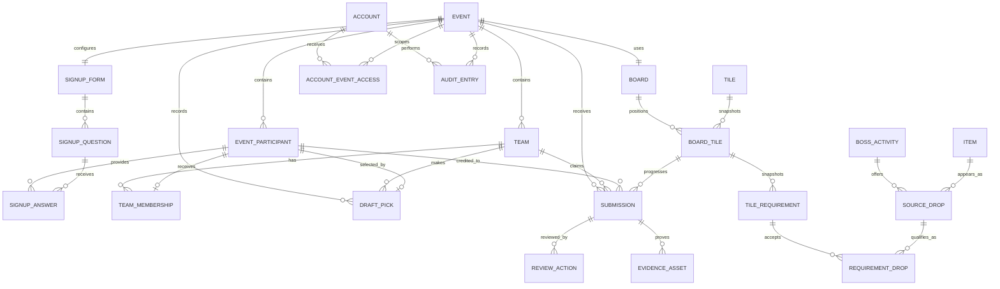

# OSRS Community Bingo Platform

## Data Model and Calculation Specification

**Status:** Planning Pass 2 target model v0.2; implementation and migration details are maintained in the current checkout
**Last updated:** 2026-07-25
**Companion document:** `PRODUCT_REQUIREMENTS.md`

## 1. Purpose

This document defines the logical data model, relationships, state transitions, calculations, and integrity rules for the OSRS community bingo platform. It intentionally avoids choosing a programming language, database product, framework, or hosting provider.

The model must support:

- Two or three community events per year
- Hybrid-authenticated normal website accounts plus admin-created/imported/external roster records without inferred website ownership
- Capacity limits and an ordered waiting list
- Admin-operated snake drafts
- Event-scoped captain and co-captain roles, with disabled-by-default emergency credentials
- Flexible bingo tile requirements
- Screenshot evidence and reversible admin review
- Live public boards and rankings
- EHB-based board balancing and player contribution statistics
- Historical events that do not change when catalogue data changes
- A complete audit history of competitive and administrative changes

## 2. Modeling principles

### 2.1 Events own competitive data

Players, teams, boards, submissions, rankings, and draft records are scoped to an event. A global catalogue may be reused, but published events preserve snapshots of the values used at that time.

### 2.2 Approved evidence is the source of progress

Official tile and team progress must be reproducible from approved evidence contributions. Reversing an approval must recalculate the affected progress rather than relying on an unexplained manual total.

### 2.3 History is preserved

Records that influenced an event should normally be disabled, withdrawn, rejected, reversed, or archived rather than permanently deleted.

### 2.4 Catalogue data and event snapshots are separate

Boss rates, drop rates, and EHB values may change between events. Updating a global catalogue entry must not silently alter a published or historical board.

### 2.5 Derived values are distinguishable from authoritative values

Values such as current tile progress and team rank are derived from authoritative records such as approved submissions and board configuration. Cached derived values may be stored for speed but must be reproducible.

## 3. Relationship overview



## 4. Common conventions

Every persistent record should normally contain:

- `id`: Stable internal identifier
- `created_at`: Creation timestamp
- `updated_at`: Last modification timestamp

Records that can be disabled or archived may also contain:

- `active`: Whether the record can be selected for new work
- `archived_at`: When it was archived

All timestamps are stored as timezone-aware instants. Events also store their display timezone, normally `Europe/Copenhagen`.

User-facing ordering should not depend on database insertion order. Explicit position, sequence, signup time, or name fields are used.

## 5. Event domain

### 5.1 Event

Represents one bingo event.

Required fields:

- `id`
- `name`
- `slug`: Public URL identifier
- `timezone`
- `state`
- `created_by_account_id`

Optional fields:

- `description`
- `banner_asset_id`
- `first_public_at`
- `signup_opens_at`
- `signup_closes_at`
- `draft_at`
- `event_starts_at`
- `event_ends_at`
- `submission_cutoff_at`
- `participant_cap`
- `waiting_list_enabled`
- `actual_started_at`
- `actual_ended_at`
- `submissions_closed_at`
- `finalized_at`
- `archived_at`
- `cancelled_at`
- `cancelled_by_account_id`
- `cancellation_reason`
- `discarded_at`
- `discarded_by_account_id`
- `signup_code_hash`
- `evidence_code_enabled`
- `reopened_submission_cutoff_at`
- `buy_in_description`
- `prize_description`
- `board_ehb_estimated_team_count`
- `board_ehb_estimated_team_size`
- `expected_board_rows`
- `expected_board_columns`

Event state:

```text
DRAFT
SIGNUP_OPEN
SIGNUP_CLOSED
LIVE
AWAITING_FINAL_REVIEW
FINALIZED
ARCHIVED
CANCELLED
DISCARDED
```

`board_ehb_estimated_team_count` and `board_ehb_estimated_team_size` are edited with the board and exist only to estimate board EHB. They do not seed draft teams, constrain roster sizes, or represent the completed event structure.

Normal transitions:

```text
DRAFT → SIGNUP_OPEN → SIGNUP_CLOSED → LIVE
LIVE → AWAITING_FINAL_REVIEW → FINALIZED → ARCHIVED
```

Exceptional admin transitions may reopen signups, reopen submissions, or unfinalize an event. Each exceptional transition requires an audit reason.

The scheduled end transition sets `actual_ended_at = event_ends_at`, even if a background check persists the transition later. An authorized early-end command sets `actual_ended_at` to its authoritative confirmation time and requires a reason in the audit record. The event moves from `LIVE` to `AWAITING_FINAL_REVIEW` at that effective instant. `submission_cutoff_at` remains independent and is not rewritten by early end.

An incomplete `DRAFT` requires only a valid name, unique slug, timezone, creator, and creation time. Schedule, signup, capacity, and planning fields become required only at the readiness gate for the transition that uses them. A field being available during initial creation does not make it required for the first save.

Duplicate event names are allowed. The slug is unique and may change until the event first becomes public; it is immutable afterward.

`first_public_at` records the first instant any event-owned public page is intentionally exposed and is never cleared. It is the authoritative slug-lock boundary.

Description may be null while the event remains a private draft and is required before signup publication. `banner_asset_id` is optional in every state and references a managed decorative asset. Replacing or removing the banner does not change event history or competitive snapshots. Discard creates an `EventBannerCleanup` record before removing event-owned banner metadata: it retains the discarded event ID, event-scoped managed storage key, queued/last-attempt times, attempt count, and safe operational failure detail. The record is unique per event/key and can only represent a key under that event's managed storage namespace; it is removed only after deletion succeeds or the object is already absent.

Timezone defaults to `Europe/Copenhagen` and stores a supported canonical timezone ID. Changing timezone changes only how stored UTC instants are displayed; it never rewrites those instants. Changes after signup publication require explicit confirmation, and changes after event start also require an audit reason.

Schedule fields may be null in an incomplete private draft. Signup publication requires `signup_closes_at`, `event_starts_at`, and `event_ends_at`; `signup_opens_at` is required only for scheduled opening and is set to the actual opening instant for manual opening. `draft_at` is optional and informational. The invariants are:

```text
signup_opens_at < signup_closes_at <= event_starts_at < event_ends_at <= submission_cutoff_at
```

For manual opening with no explicit closing time:

```text
signup_opens_at = now
signup_closes_at = min(round_up(now + 3 months), event_starts_at)
```

A valid explicit future closing time no later than event start is preserved. An invalid explicit value blocks opening rather than being silently overwritten. Starting the draft closes and locks signup regardless of the configured closing time.

`DISCARDED` is a terminal administrative tombstone for an accidental or experimental event. Discard is allowed only when no event participant, team, event-scoped account access, submission, or evidence record exists. Event-owned setup records, including boards, tiles, requirements, questions, and planning configuration, may be removed in the discard transaction and do not block it. The tombstone retains the event ID, name, slug, creator, discard actor, and timestamps; the slug remains reserved. Discarded events are excluded from active administration and public listings.

`CANCELLED` is a terminal preserved state for an event with protected records that will not take place. It is reachable only before `LIVE`, requires actor/time/reason, suppresses every scheduled transition, and ends ordinary event-scoped mutations without deleting configuration, participants, assignments, teams, draft history, board data, submissions, evidence, or audit records. A never-public cancelled event remains non-public; an already-public cancelled event exposes only its previously published projection plus a generic cancellation status.

`ARCHIVED` is read-only public history derived only from `FINALIZED`. Archive does not supersede finalization snapshots or alter public URLs. Unfinalization may move an archived event back to final review with a reason only when the production current-event policy permits it.

Each authoritative transition into `AWAITING_FINAL_REVIEW` identifies one immutable review cycle. Completion-time acknowledgements, completion corrections, exceptional blocker resolutions, and finalization snapshots are scoped to that cycle; prior-cycle records remain retained and cannot authorize a later cycle. Finalization snapshots retain the consumed resolution identities and authoritative calculation inputs/results used for the official projection. A former participant of an archived event may read only their own rejected/withdrawn evidence history through the normal account-history route; this does not grant team-private or mutation authority.

Evidence eligibility is derived from the append-only lifecycle transitions. If an event resumes from `AWAITING_FINAL_REVIEW` to `LIVE`, the interval between those authoritative effective times remains ineligible; review projections identify evidence timestamps in that gap without rewriting the submission or asset timestamp. Normal finalization also requires an explicit server-validated confirmation value; browser confirmation is only an enhancement.

Production permits multiple `SIGNUP_OPEN` and `SIGNUP_CLOSED` events only when their configured half-open event windows `[event_starts_at, event_ends_at)` do not overlap; an end exactly equal to another start is allowed. Only `LIVE`, `AWAITING_FINAL_REVIEW`, and `FINALIZED` are singleton current states. Drafts do not reserve a window, and cancelled, discarded, or archived events do not block a new one. `is_development_fixture` is an internal persisted marker set only by the Development scenario seeder; ordinary Admin input cannot set it and Production lifecycle commands never honor it.

### 5.2 Event publication controls

Event lifecycle and publication are related but not identical. The event stores separate controls for:

- Signup page publication
- Participant-list publication
- Draft-result publication
- Team-roster publication
- Board publication
- Results publication

Opening signups publishes only the signup page and its basic event information. Board and draft publication remain independent.

### 5.3 EventStateTransition

Records every event lifecycle change.

Fields:

- `event_id`
- `from_state`
- `to_state`
- `performed_by_account_id`
- `performed_at`
- `reason`, required for exceptional or backward transitions
- `scheduled`: Whether it resulted from an admin-configured scheduled action

### 5.3.1 ScheduledEventStartAttempt

Records a scheduled start check even when no state transition is allowed.

Fields:

- `event_id`
- `scheduled_for`
- `attempted_at`
- `started`
- `blocker_codes`
- `resolved_at`, nullable

When the scheduled instant arrives, the event may enter `LIVE` only if draft finalization, board publication, Captain/emergency-access readiness, and every other event-start invariant pass in the same transaction. A blocked attempt leaves the event pre-live, retains the original scheduled instant, creates the **Automatic start postponed** admin action/notification, and never backdates later eligibility. It is not automatically retried after blockers clear. The later manual start resolves the attempt/action, uses its actual transition time, and requires no written reason when `now >= scheduled_for`; an early manual start requires one.

### 5.3.2 ScheduledSignupOpeningAttempt

`scheduled_signup_opening_enabled` distinguishes an intentional future opening from an informational `signup_opens_at` value. `scheduled_signup_warning_codes` stores the stable warning codes acknowledged for that purpose. One `ScheduledSignupOpeningAttempt` per `(event_id, scheduled_for)` records the actual attempt time, success, stable blocker/unacknowledged-warning codes, and optional resolution time. The unique boundary plus the lifecycle transaction makes worker retries and manual/scheduled races idempotent without making notification read state authoritative.

## 5A. Global public content

### 5A.1 GlobalRulesDocument

The single current Rules document for the permanent public Rules page. It is not event-scoped.

Fields:

- `id`, using a well-known singleton identity
- `body`
- `version`, for optimistic concurrency
- `updated_at`
- `updated_by_account_id`

Every successful edit retains automatic actor/time/change history through the normal audit mechanism. No written reason is required. Rules revisions do not create participant notifications and are not event-readiness inputs.

### 5A.2 Source-controlled how-to pages

Public how-to pages are application content rather than persisted domain entities. They are versioned with the source code, have stable public routes, and expose no runtime authoring model or administrator editor.

## 6. Signup domain

### 6.1 SignupForm

One active form definition belongs to an event. Historical question definitions remain available after changes.

Fields:

- `event_id`
- `version`
- `published_at`
- `closed_at`
- `first_response_at`, nullable and never cleared after the first accepted/imported response
- `require_signup_code`

### 6.2 SignupQuestion

Fields:

- `signup_form_id`
- `key`: Stable machine identifier
- `label`
- `help_text`
- `type`
- `required`
- `system_field`
- `position`
- `active`
- `disabled_at`, nullable
- `disabled_by_account_id`, nullable
- `disabled_reason`, nullable
- `replaced_by_signup_question_id`, nullable
- `options`, for choice questions
- `account_answer_role`, nullable and used only for `ACCOUNT`
- `public_on_signup_board`, retained for future compatibility and fixed/defaulted true for participant-facing questions

Question types:

```text
TEXT
NUMBER
YES_NO
SINGLE_CHOICE
ACCOUNT
```

Account answer role:

```text
PLAYING
INFORMATIONAL
```

The user-facing role names are **Regular account** for `PLAYING` and **Alt account** for `INFORMATIONAL`. The built-in primary OSRS account is a required public `ACCOUNT` question with role `PLAYING`; its compound answer requires EHB. Additional Account questions may create regular or alt assignments but are always optional at the question level. When an optional regular Account question is answered, its EHB child value becomes required. An alt Account answer has no EHB. A Yes/No support-alt question creates no OSRS-character assignment. The primary Account/EHB and captain-volunteer system questions cannot be removed.

Every participant-facing answer is public on the unlisted signup table in version one. `public_on_signup_board` remains fixed/defaulted true so selective visibility can be added later without a destructive schema change. There are no admin-only custom signup questions or post-draft privacy mutations. Payment and Admin notes remain separate private data.

Before `first_response_at`, a custom question may be structurally edited or deleted while the form is private/closed. After it is set:

- new participant-facing questions must have `required = false`;
- `type`, `account_answer_role`, `options`, stable `key`, and answer-shape constraints are immutable;
- label, help text, and position may change while signup is closed and before draft start;
- disabling sets `active = false` and `disabled_at` without deleting the question or answers;
- every change increments `SignupForm.version` and is audited.

Draft start freezes ordinary question metadata. Structural replacement disables the original question and creates a new optional question with a new stable key; it never rewrites existing answers.

### 6.3 EventParticipant

Represents one person's participation, signup, or imported roster record for one event. The participant is not the login identity and is not an OSRS character.

Fields:

- `event_id`
- `account_id`, nullable for imported/external roster records without a verified website-account relationship
- `captain_volunteer`
- `payment_received`, boolean, defaults false
- `signup_status`
- `signup_sequence`
- `signed_up_at`
- `confirmed_at`
- `waiting_listed_at`
- `withdrawn_at`
- `withdrawn_by_account_id`, nullable when the participant initiated the action
- `form_version`
- `source`

`(event_id, account_id)` is unique when `account_id` is not null. One website account can therefore own at most one participant record in an event while participating in several different events.

New normal signups have `account_id` at creation. The participant may edit signup fields only while the event is `SIGNUP_OPEN`. Imported or external participants without a verified website-account relationship remain valid roster records. Event-facing names come from registered OSRS-character assignments rather than the website username. Slice 4 removes the temporary private-edit-token model without adding a participant claim-token model.

Editing does not change `signed_up_at`, `signup_sequence`, or queue status. Cancelling/withdrawing changes status and releases current character assignments. Rejoining while signup is open reactivates the same participant identity but assigns a new `signed_up_at` and `signup_sequence` at the end of the queue. Admin restoration before draft start follows the same current-capacity calculation and never restores a former queue position.

### 6.4 OsrsCharacter

Represents a normalized OSRS character identity without asserting exclusive ownership.

Fields:

- `id`
- `display_name`
- `normalized_name`
- `created_at`

`normalized_name` trims surrounding whitespace and applies case-insensitive matching only; it does not rewrite internal spelling/spacing. The application trusts the submitted OSRS name and performs no syntax, availability, ownership, Wise Old Man membership, or existence validation. The normalized value is unique for matching case variants. The character may be linked to several website accounts globally, but it has only one event-participant assignment in a particular event.

### 6.5 AccountOsrsCharacter

Trust-based global association between a website account and an OSRS character.

Fields:

- `account_id`
- `osrs_character_id`
- `linked_at`
- `linked_by_account_id`
- `unlinked_at`, nullable; hides the association from future selection without deleting history
- `personal_label`, nullable user-entered label such as Main, Alt, or Borrowed
- `sort_order`
- `preferred`
- `saved_ehb`, nullable personal default used to prefill future regular-account answers

`(account_id, osrs_character_id)` is unique. At most one link per account is `preferred`. Several accounts may link the same OSRS character. This relationship populates My accounts and signup selectors but grants no authority, proves no ownership, and does not reserve the character for an event. Personal labels organize the list without imposing a game-mode taxonomy.

`saved_ehb` belongs to the link rather than the shared character so one borrower's update does not change another website account's default. Saving a regular Account answer updates this default and captures an independent event snapshot. Later edits to `saved_ehb` do not rewrite an existing event assignment. Alt assignments ignore it.

### 6.6 EventParticipantCharacter

Event-specific assignment of OSRS characters to an event participant.

Fields:

- `event_id`
- `event_participant_id`
- `osrs_character_id`
- `registration_order`
- `registered_at`
- `registered_by_account_id`
- `signup_question_id`
- `event_role`
- `ehb_snapshot`, required for `PLAYING` and null for `INFORMATIONAL`
- `ehb_source`, required for `PLAYING`
- `ehb_fetched_at`, nullable
- `released_at`, nullable
- `released_by_account_id`, nullable

One participant may register several characters. A partial unique constraint on `(event_id, osrs_character_id)` where `released_at IS NULL` prevents the same character from being currently assigned to several participants in one event. The participant and assignment `event_id` values must match through a relational constraint. Confirmed and waiting-list participants both hold current assignments. Withdrawal/removal before draft start releases the assignments without deleting their history, after which another participant may acquire that character. The same character may also be assigned to a different participant in another event.

Normal signup selects from `AccountOsrsCharacter`. A missing trusted/borrowed character is added through My accounts before returning to the signup form; it is not created inline by the Account answer. Admin-created, imported, or external participants may receive an event assignment without a linked website account.

Event character role:

```text
PLAYING
INFORMATIONAL
```

Each participant must have at least one current `PLAYING` assignment before signup can be completed. The assignment created by the built-in primary Account question is automatically the initial active account; signup has no separate initial-active selection. Each regular (`PLAYING`) assignment stores its own event-specific EHB snapshot. An alt (`INFORMATIONAL`) assignment has no EHB and may never appear in a swap transition, receive evidence credit, or be synchronized to Wise Old Man. The event role is determined by its Account question and is independent of the optional personal label in My accounts.

EHB source:

```text
MANUAL
WISE_OLD_MAN
IMPORT
ADMIN_CORRECTION
```

The assignment created by the built-in primary Account question supplies the participant's draft EHB. Secondary values never contribute to that derived draft value. A fetched value records `WISE_OLD_MAN` and `ehb_fetched_at`; editing it afterward changes the source to `MANUAL`. The event snapshot remains authoritative after signup closes even if the external profile changes.

My accounts stores only an optional numeric saved-EHB default. A WoM lookup performed there may populate that value, but it does not add durable source/fetch metadata to `AccountOsrsCharacter`. Using the saved default later is therefore `MANUAL`. Only a fresh signed lookup submitted and verified with an event signup may create a `WISE_OLD_MAN` event snapshot.

#### Slice 10 Wise Old Man event integration

An event may have at most one Wise Old Man integration-state record. It owns:

- event and competition identity plus validated competition title/start/end;
- latest generation identity and completeness/error state;
- last request and successful-fetch time;
- separate next normal-cycle and retry due times;
- retry count;
- opaque synchronization lease owner and expiry;
- observed request-budget diagnostics needed by Admin projection.

The competition interval must match the configured Bingo start/end within five minutes unless an Admin explicitly synchronizes a pre-Live event schedule to the exact competition instants through the existing schedule boundary. Live correction requires an already matching interval; AwaitingFinalReview, Finalized, Archived, and Cancelled configuration is immutable.

Each synchronization attempt snapshots a generation identity, competition ID, and fingerprint of all current unreleased `PLAYING` event assignments. Cached per-character activity rows belong to that generation and store the event, participant, character, gained EHB, and fetch time. Alt/informational and released assignments are excluded.

Lease acquisition and HTTP do not share a database transaction. Final cache publication succeeds only while the event remains `LIVE` and the competition ID, opaque lease owner, and assignment fingerprint still match. A later complete or partial generation is authoritative for projection and replaces older displayed values, although older rows may remain retained for recovery/diagnosis. A successful response with missing expected accounts persists only matched current-generation rows; missing accounts have no row, are never represented as zero, and never carry forward an older value. Partial projections show available totals and coverage when at least one expected account matches; zero matches show no rankings.

Participant activity is the sum of their current generation's matched regular-character deltas. Team total sums current-member participant totals once; team average divides by current participants with at least one matched account rather than accounts. Every participant tied for the highest available total is a provisional MVP; coverage makes the partial state explicit. Synchronization stops outside `LIVE`; the latest generation state is retained without mutation and may resume only after a legitimate return to `LIVE`.

### 6.7 EventParticipantCharacterSwap

Append-only history that determines the one active/drop-eligible character for a participant at any instant.

Fields:

- `id`
- `event_id`
- `event_participant_id`
- `previous_osrs_character_id`, nullable for initial activation
- `next_osrs_character_id`
- `effective_at_utc`
- `recorded_at_utc`
- `recorded_by_account_id`
- `reason`, required for admin corrections or backdated transitions

Both referenced characters must be current `PLAYING` assignments belonging to that event participant. The initial transition activates the assignment from the built-in primary Account question at event start. Normal participant/captain swaps are accepted only while the event is `LIVE`. A normal swap's `recorded_at_utc` is the request time and `effective_at_utc` is the first whole UTC minute strictly after it. The latest applicable transition determines the active character. A swap transaction locks or concurrency-checks the participant's current transition, verifies that `previous_osrs_character_id` is still current, rejects another request while a future-effective transition is pending, and appends exactly one next transition. Swaps are unlimited during live play and never rewrite earlier event assignments or swap history. Event end closes normal swaps.

Signup status:

```text
CONFIRMED
WAITING_LIST
WITHDRAWN
```

`payment_received = false` is displayed privately to admins as `Unpaid`; `true` is displayed as `Paid`. It is not projected to public, participant, team, evidence, or leaderboard views.

Signup source:

```text
WEBSITE
CSV_IMPORT
ADMIN_CREATED
```

Name normalization may identify a shared global character association for admin awareness. It must not block a valid global link, create a reusable person identity, imply account ownership, or link name changes across bingos. It does block a second event assignment for the same normalized character through the event-level uniqueness rule.

The same normalized OSRS character may be globally linked by several people but may be assigned to only one participant in an event. Character association alone never merges participant records or grants authority. In-event evidence and Wise Old Man activity resolve through that unique event assignment.

### 6.8 SignupAnswer

Stores event-specific custom answers.

Fields:

- `event_participant_id`
- `signup_question_id`
- `question_label_snapshot`
- `value`, nullable for `ACCOUNT`
- `osrs_character_id`, populated for `ACCOUNT`

The label snapshot preserves meaning if the form question is later edited.

An answer row is not guaranteed to exist for every active question and participant. Questions may be added after some players have signed up, optional questions may be left blank, and external roster members may not have a website signup at all. Team, roster, draft, and admin views must load answers with left-join/optional semantics and render missing values without throwing an exception.

Answers to disabled questions remain queryable. Public signup-table projection retains participant-facing historical answers and renders later missing optional answers as **Not answered**. Website username, Discord identity, payment, Admin notes, security data, and audit data are never included in that projection.

### 6.9 Waiting-list calculation

Confirmed count includes `CONFIRMED` participants only.

When a valid signup is accepted:

```text
if confirmed_count < participant_cap:
    status = CONFIRMED
else:
    status = WAITING_LIST
```

Both statuses hold current event-character reservations. The create/edit transaction acquires every requested current assignment and computes status before committing. A character-reservation conflict aborts the entire transaction. Withdrawal or removal before draft lock releases all current assignments for that participant in the same transaction as any waiting-list promotion.

Waiting-list position is derived by ordering active `WAITING_LIST` records by:

1. `signed_up_at` ascending
2. `signup_sequence` ascending as a deterministic tie-breaker

When capacity increases or a confirmed place becomes available before the draft is locked:

```text
open_places = participant_cap - confirmed_count
promote the first open_places waiting-list records
```

The participant cap can be increased but not lowered. If signups close below the cap, the confirmed participants at that time are simply the available participant pool.

Cancellation/withdrawal, rejoin, admin restoration, character reservation changes, status assignment, and waiting-list promotion are atomic. Restoration or rejoin must reacquire every required character reservation and fails without partial state if any is unavailable. Participant- and admin-initiated withdrawal share `WITHDRAWN`; `withdrawn_by_account_id` plus automatic transition history preserves who acted.

After the draft is locked, automatic promotion stops. Replacements require explicit admin action.

## 7. Team and draft domain

### 7.1 Team

Fields:

- `event_id`
- `name`
- `slug`
- `image_asset_id`
- `formation_type`: `DRAFTED` or `PREFORMED`
- `affiliation_name`: optional clan or community name
- `included_in_draft`
- `draft_position`
- `active`
- `finalized_at`

`included_in_draft` determines whether the team receives snake-draft turns. A pre-formed team can be added before or after the website draft and can have its roster assigned manually. Pre-formed teams compete normally but do not affect draft order, drafted-team count, derived roster-size distribution, or pick ownership. Once the first pick is recorded, changing whether a team participates in that draft is blocked. Permitted pre-event roster corrections retain automatic structured history without requiring a typed reason.

Team display name is unique within its event. `slug` is a stable event-scoped URL identifier and does not change when the display name changes. `image_asset_id` references a managed uploaded decorative asset; Team has no arbitrary image-URL field. Name, image, and affiliation may change until event start and are ordinarily locked afterward. A pre-formed team may be created before event start, including after website-draft finalization. Once any pick has been recorded, the drafted-team set and formation types remain structurally locked even if all picks are later undone.

### 7.2 TeamMembership

Fields:

- `team_id`
- `event_participant_id`
- `role`
- `joined_at`
- `left_at`
- `assigned_by_draft_pick_id`
- `assignment_reason`
- `membership_source`
- `replaces_team_membership_id`, nullable

`assigned_by_draft_pick_id` is null for manually assigned members of a pre-formed team. Manual roster assignments record the structured assignment source/action and audit actor. Ordinary corrections before event start do not require an administrator to type a reason. A participant may be created directly within the event for an invited roster and does not need to have submitted the public signup form.

Membership role:

```text
PARTICIPANT
CAPTAIN
CO_CAPTAIN
```

An event participant can have at most one active team membership per event.

Membership source:

```text
DRAFT_PICK
PREFORMED
ROSTER_REPLACEMENT
```

A post-draft withdrawal sets `left_at` without deleting the membership or its draft-pick link. A replacement membership uses `ROSTER_REPLACEMENT`, points to the ended membership, and begins prospectively. The replacement participant normally comes from the waiting list, becomes `CONFIRMED`, and retains their frozen event-character assignments/EHB. When no waiting participant is available, an admin-created participant may instead supply the required valid unique assignments/EHB and join directly as the replacement. The vacancy may also remain unfilled. The departed participant's post-draft assignments are not released.

For live changes, `left_at` is the first full UTC minute after withdrawal confirmation and the replacement `joined_at` is the first full UTC minute after replacement confirmation. These timestamps may leave a gap and must never overlap. The replacement's initial `EventParticipantCharacterSwap` activates their primary playing assignment at the same `joined_at` instant.

### 7.2.1 TeamMembershipRoleTransition

Append-only captain/co-captain role history.

Fields:

- `team_membership_id`
- `previous_role`
- `next_role`
- `effective_at`
- `performed_by_account_id`

Only an active membership may receive a current captain/co-captain role. Withdrawing the member appends the required revocation transition atomically. Role authorization resolves from the latest applicable transition/current membership rather than an OSRS character or stale credential.

Draft-start readiness requires every active `DRAFTED` team to have a current `CAPTAIN` membership. `CO_CAPTAIN` alone does not satisfy the gate. Every captain/co-captain assignment occupies a normal roster position used by the derived-size calculation.

Event-start readiness requires every active team to have a current `CAPTAIN` membership with explicit active website-account ownership or an active team-scoped emergency captain access record. A co-captain alone does not satisfy the gate. This invariant is a start-transition blocker, not a live-event invariant; losing the final captain during live play creates an urgent unresolved warning.

### 7.2.2 TeamFocusMarker

Private, non-competitive team coordination state.

Fields:

- `id`
- `event_id`
- `team_id`
- `target_kind`: `TILE`, `ROW`, or `COLUMN`
- `board_tile_id`, required only for `TILE`
- `row_index`, required only for `ROW`
- `column_index`, required only for `COLUMN`
- `focused`
- `version`
- `updated_at`
- `updated_by_account_id`

The target fields are mutually exclusive according to `target_kind`, and `(team_id, target_kind, target identity)` is unique. Only a current captain/co-captain of the team may mutate a marker. Current team members may read it. Ordinary `ADMIN` authority does not grant read access. The designated global `SUPER_ADMIN` policy may read another team's markers only after an explicit, team-scoped inspection opt-in; the default projection contains no cross-team marker data. This exception never grants mutation without the ordinary team captain/co-captain permission.

The inspection choice is transient authorization/UI state rather than a persistent domain record or global show-all preference. Focus does not affect board snapshots, evidence, progress, ranking, finalization, or public history. It becomes read-only at event end. Updates use optimistic concurrency and team-scoped invalidation so another team cannot infer marker content.

### 7.3 Draft

Fields:

- `event_id`
- `type`: `SNAKE`
- `state`
- `initial_order_randomized_at`
- `started_at`
- `paused_at`
- `finalized_at`
- `locked`

Draft state:

```text
SETUP
READY
LIVE
PAUSED
FINALIZED
```

Team count and target size are not authoritative stored configuration:

- `team_count` is derived from active `DRAFTED` teams included in the draft.
- The drafted-team participant total includes confirmed internal participants either available for the website draft or already assigned to a drafted team.
- `larger_size = ceiling(participant_total / team_count)`.
- `smaller_size = floor(participant_total / team_count)`.
- `larger_team_count = participant_total mod team_count`; the remaining teams receive `smaller_size`.
- When the remainder is zero, every team receives the same size.

Captain/co-captain memberships count toward these sizes. Pre-formed teams and all members assigned to them are absent from this calculation. The board editor's team-count/team-size estimates are a separate board-EHB planning input and never become draft constraints.

Before the first pick, the application derives a balanced per-team turn/capacity plan from the participant total, existing drafted-team memberships, and randomized order. A setup is invalid when an existing preassignment makes a maximum final size difference of one impossible. A team whose current membership count exceeds the smallest drafted-team membership count is ineligible until lower-count teams catch up. The partial final round determines which named teams receive the larger final size. The plan is not a user-entered target and cannot strand a confirmed included participant.

### 7.4 DraftTeamOrder

Fields:

- `draft_id`
- `team_id`
- `initial_position`: 1-based round-one position

### 7.5 DraftPick

Fields:

- `draft_id`
- `overall_pick_number`: 1-based
- `round_number`: 1-based
- `pick_in_round`: 1-based
- `team_id`
- `event_participant_id`
- `picked_at`
- `recorded_by_account_id`
- `undone_at`
- `undone_by_account_id`
- `undo_reason`

### 7.6 Snake-draft turn calculation

For `N` teams and zero-based overall pick index `p`:

```text
round_index = floor(p / N)
position_in_round = p mod N

if round_index is even:
    order_index = position_in_round
else:
    order_index = N - 1 - position_in_round
```

The team at `initial_order[order_index]` owns the pick.

Undone picks remain stored but become inactive. Undoing the latest active pick removes its active team membership and returns the participant to available status.

Undo may be repeated against the latest remaining active pick until no active picks remain. Each undo restores the turn calculation from the remaining active ledger; an older non-latest pick cannot be undone while later active picks remain.

Every confirmed participant remains visible during the draft. Drafted players display their assigned team rather than disappearing.

The available draft pool excludes participants already assigned to pre-formed teams. Adding or editing a pre-formed team after draft finalization does not add retrospective picks or alter the immutable draft order and pick history.

Draft finalization requires every confirmed participant included in the drafted-team total to have one active drafted-team membership and every drafted team to satisfy the derived balanced distribution.

The public finalized-draft projection includes only active picks, ordered by effective overall pick number, with participant and team. Undone/superseded attempts, recorded-by identity, timestamps, and correction details remain in the admin ledger.

Before event start, `FINALIZED` may transition back to controlled correction mode only with strong confirmation and a non-empty written reason. The current public roster and pick-order projection becomes unavailable until re-finalization, while the drafted-team set/formation lock remains. Finalization and reopening transitions are append-only so prior publication cycles, actors, times, reasons, and superseded picks are never overwritten. An already published board snapshot is independent and remains published.

## 8. Account and access domain

### 8.1 Account

Fields:

- `discord_user_id`, nullable and unique; required during initial normal-account creation but may later be unlinked
- `discord_display_name`, non-authoritative display metadata
- `public_username`, required for normal accounts and also used for password login
- `normalized_public_username`, case-insensitively unique for normal accounts
- `profile_osrs_character_id`, the character selected during onboarding
- `onboarding_completed_at`
- `login_username`, nullable and used only for emergency or legacy password credentials
- `password_hash`, required for completed normal-account onboarding and enabled emergency credentials; nullable only while a disabled emergency credential awaits initial setup
- `account_type`
- `global_role`
- `authorization_version`
- `password_version`
- `active`
- `last_login_at`
- `password_changed_at`

Account type:

```text
WEBSITE_ACCOUNT
EMERGENCY_CAPTAIN
```

Global role for a normal website account:

```text
USER
ADMIN
SUPER_ADMIN
```

Normal participants, captains, admins, and the Super Admin use one `WEBSITE_ACCOUNT` with a required public username/password of at least 10 characters and an optional current Discord association. Existing permanent Admin credentials migrate in place during Slice 1. Legacy participant free-text Discord identities remain unlinked, and Slice 2 never infers participant ownership from display text, website username, or an OSRS-character link. Discord guild membership is not required. First-time creation starts with Discord and onboarding chooses an independent website username/password plus a first OSRS character, creates/reuses that character link, and marks it preferred; after onboarding the Discord association may be removed or replaced. Public-username uniqueness is separate from character linking: another account may link the same `profile_osrs_character_id` but must choose a different public username. Later website-username changes may use any valid unique value and do not alter event-facing OSRS-character assignments. OAuth tokens, raw passwords, and recovery tokens are not stored in audit snapshots.

Exactly one active account has `global_role = SUPER_ADMIN`. A partial unique constraint enforces at most one, while controlled bootstrap/migration and the ownership-transfer transaction enforce existence. Public signup/onboarding never assigns a privileged global role. Emergency captain accounts always have no global role and cannot be promoted.

Global role grant/revoke increments `authorization_version`. Every authenticated session carries that version and fails authorization when it no longer matches, making either grant or revoke effective immediately. Revocation changes `ADMIN` to `USER` without disabling the account or changing event-owned records. Password-authenticated sessions additionally carry `password_version`; password change/reset increments it without unnecessarily invalidating a separate Discord-authenticated session. Role changes preserve automatic actor, target, timestamp, and before/after history without requiring a written reason.

A website username may change to any valid case-insensitively unique value without selecting or depending on an `AccountOsrsCharacter` link. The change updates the public website identity and password-login username together, but does not modify My Accounts links, event participants, registered characters, event assignments, evidence, teams, roles, or historical records. Event-facing participant names come from registered OSRS-character assignments. This documentation correction preserves the historical migration record and does not authorize rewriting migrations.

Disabling a normal website account sets `active = false`, records actor/time/reason, increments `authorization_version`, and invalidates every session without deleting any owned/historical records or releasing the normalized username/Discord uniqueness reservations. An Admin may disable a `USER`; only the Super Admin may disable or restore an `ADMIN`; self-disable and disabling the active Super Admin are prohibited. Re-enable clears the current disabled state while retaining transition/audit history and does not recreate expired event authority. Website accounts are neither merged nor permanently deleted in version one.

### 8.1.1 PasswordCredentialToken

Fields:

- `id`
- `account_id`
- `purpose`: `PASSWORD_RESET` or `EMERGENCY_INITIAL_SETUP`
- `token_hash`
- `created_at`
- `created_by_account_id`
- `expires_at`
- `used_at`, nullable
- `superseded_at`, nullable

Only hashes of cryptographically random setup/reset tokens are stored. A token is purpose-bound, single-use, expires 60 minutes after creation, and is valid only while unexpired and not superseded. Generating another setup/reset token for the account supersedes every unused prior token. Completion updates `password_hash`/`password_changed_at`, increments `password_version`, consumes the token, and records automatic actor/target/time history. Initial emergency setup leaves the credential disabled. It does not require a written reason.

An enabled Admin may generate a link for a `USER`; only the Super Admin may generate one for an `ADMIN`. No in-product admin-generated reset is available for the current Super Admin.

### 8.1.2 AccountDiscordIdentityTransition

Fields:

- `id`
- `account_id`
- `transition_type`: `LINK`, `UNLINK`, or `REPLACE`
- `previous_discord_user_id`, nullable only for `LINK`
- `new_discord_user_id`, nullable only for `UNLINK`
- `changed_at`
- `changed_by_account_id`

Every Discord link mutation requires fresh current-password verification. `LINK` and `REPLACE` also require a completed OAuth callback for a Discord ID not attached to another account. Updating the account and appending the transition are one transaction. `UNLINK` may leave a completed normal account with no Discord association because its password remains required; `REPLACE` never exposes an intermediate unlinked state. The transition increments `authorization_version`, invalidates other sessions, and never changes event participants, global character links, event roles, evidence, or history.

### 8.2 AccountEventAccess

Scopes an account to an event participant, team, and effective role. Normal captain/co-captain access derives from the authoritative team membership role; it is not derived from an OSRS character name.

Fields:

- `account_id`
- `event_id`
- `event_participant_id`, nullable only for emergency access
- `team_id`, required for team-scoped roles
- `access_role`
- `active_from`
- `expires_at`
- `manually_disabled_at`
- `re_enabled_at`

An emergency captain account is an individual credential separately scoped to one event/team and disabled by default. Any enabled Admin may create multiple individual credentials for the same team. Its globally unique login username shares the normal login-identifier namespace. Initial password setup and later reset use the hashed 60-minute single-use token flow; the Admin never selects or sees the lasting password. Only an initialized credential may be explicitly enabled. Creation, setup/reset, enablement, use, and disablement are audited.

`expires_at` applies only to emergency or legacy password access, not to normal website-account captain/co-captain roles. Captain role history remains on `TeamMembershipRoleTransition`; lifecycle authorization determines whether that historical role can still mutate the event.

Access role:

```text
CAPTAIN
CO_CAPTAIN
```

Captain authorization requires all of:

- Account is active
- Event access is active
- Current time is within access window, unless manually re-enabled without expiry
- Submission team matches the access team
- Event state and active upload window permit the requested submission mutation

An admin identity transfer updates the event participant's owning `account_id` and any derived normal participant/captain access atomically. The destination `(event_id, account_id)` uniqueness constraint must succeed first. The transfer does not move `AccountOsrsCharacter` rows or merge `Account` records; it preserves all event-owned participant, assignment, team, evidence, and history rows.

### 8.3 PersonalNotification

`PersonalNotification` is a durable recipient-specific in-site notification stored in the `personal_notifications` table. It is a destination and reminder, not an event, participant, evidence, account-lifecycle, or Admin-action record; those underlying records remain authoritative.

Fields:

- `Id`
- `RecipientAccountId`
- `Title`
- `Detail`
- `Route`
- `CreatedAt`
- `ReadAt`, nullable

The table has a primary key on `Id` and an index over `(RecipientAccountId, ReadAt, CreatedAt)`. It does not carry the richer event/participant/type/path foreign-key shape or a universal recipient-transition uniqueness constraint. `Route` is a supplementary direct destination and must still resolve under the recipient's current authorization and scope; an empty route falls back to the notification page.

Reading a notification is recipient-scoped and marks `ReadAt` only when it is not already set, so repeated reads are idempotent. Notifications are retained, and reading or following a destination never resolves the underlying workflow or Admin action. Pending review, waiting-list follow-up, postponed start, vacancy, missing-Captain, and other operational state disappears only when its authoritative record is resolved.

Required notifications are written with their surrounding accepted mutation. Retry-sensitive producers use deterministic IDs and their owning transition/recipient boundary where implemented, including live withdrawal/replacement and evidence rejection. Ordinary notification producers may use fresh GUIDs and rely on the surrounding accepted transaction or action; notification persistence has no universal recipient-transition deduplication rule.

Waiting-list promotion notifies the linked participant when present and enabled administrators, with the participant confirmation or Admin management destination and no private custom-answer, payment, note, OAuth-secret, or other unnecessary account data. Payment changes, private-note changes, and ordinary non-account answer corrections create no participant notification.

Vacancy and replacement notifications target enabled administrators and the remaining or newly linked current Captain/co-Captain recipients as applicable. Evidence rejection targets the linked credited participant and current linked Captain/co-Captains, includes only the necessary event/tile/drop/reason detail, and does not target ordinary team members. When the credited participant is unlinked, the current Captain/co-Captain recipients cover the notification.

## 9. Global OSRS catalogue

### 9.1 BossActivity

Fields:

- `name`
- `slug`
- `category`
- `image_asset_id`
- `source_image_url`, nullable
- `efficient_completions_per_hour`
- `external_identifier`
- `data_source`
- `data_updated_at`
- `active`
- `notes`

Categories may include boss, raid, skilling, minigame, or other activity.

### 9.2 Item

Fields:

- `name`
- `normalized_name`
- `image_asset_id`
- `source_image_url`, nullable
- `external_identifier`
- `active`
- `notes`

### 9.3 SourceDrop

Connects an item to one boss/activity. The relationship is source-specific because the same item may have different rates from different sources.

Fields:

- `boss_activity_id`
- `item_id`
- `display_rate`
- `numeric_probability`
- `probability_scope` (legacy; new and edited values are always `Participant`)
- `conditional_on_parent` (legacy)
- `parent_probability` (legacy)
- `assumed_participants` (legacy)
- `rolls_per_completion`
- `roll_group`
- `rate_condition_note`
- `default_ehb_estimate`
- `data_source`
- `data_updated_at`
- `active`

`numeric_probability` stores the final effective chance paired with the boss/activity's efficient-completion rate. For ordinary solo content this is the item's full drop chance. Group content may use either a personal in-name probability with the corresponding team completion rate, or a full-contribution probability with a completion rate already normalized per invested player-hour. The pair must represent the same strategy, scale, difficulty, team size, and contribution assumptions so group size is applied exactly once. It accepts any valid fraction numerator, not only `1/x`. Raid-specific purple-table, points, scale, and difficulty assumptions are resolved before entry and recorded in `rate_condition_note`; the EHB calculator never applies raid-specific conversions. The older scope/parent columns remain only for migration compatibility and are ignored by calculation. Repeated rolls remain explicit. `roll_group` identifies mutually exclusive results from the same roll; different groups are independent. The probability remains empty when no reviewed effective probability is available.

Each `SourceDrop` is one authoritative drop record with one displayed rate and numeric probability. Conditional mechanics are recorded in `rate_condition_note`; distinct real drops, such as `Nid` and `Nid (Destroy)`, remain separate records rather than rate choices beneath one drop.

Catalogue records use deactivate/reactivate for normal lifecycle changes. Permanent deletion is Super-Admin-only and succeeds only when a transactional dependency query finds no catalogue relationship, board draft reference, approval/publication snapshot, asset/cache metadata, import-review record, or other historical reference. Deletion of a genuinely unused row requires confirmation but no reason. Bulk import preview/apply is Super-Admin-only; apply verifies the preview version/hash and never hard-deletes referenced data.

## 10. Board and tile domain

### 10.1 Board

Fields:

- `event_id`
- `name`
- `rows`
- `columns`
- `state`
- `validated_at`
- `validated_by_account_id`
- `active_approval_snapshot_id`, nullable
- `published_at`
- `locked_at`
- `total_ehb_estimate`
- `calculation_version`

Board state:

```text
DRAFT
VALIDATED
PUBLISHED
ARCHIVED
```

Only one board is active for competitive progress in version one.

A board draft may be created as soon as its event exists and remains privately editable while signups are open or closed and while teams are being prepared. Event publication and signup opening do not require a complete board and do not publish it. While `DRAFT`, board queries derive catalogue-backed names, artwork, source-drop rates, and EHB from current catalogue rows; cached totals are non-authoritative and are invalidated/recalculated after relevant catalogue changes. `VALIDATED` means the complete board passed validation and an admin explicitly approved and snapshotted it. Draft finalization publishes that active immutable approval snapshot when it is ready; otherwise the board remains private and may be validated/published later.

Validation requires every grid position to contain a valid tile. Any enabled admin may approve. Approval locks/rechecks referenced catalogue versions, calculates the complete board, creates a `BoardApprovalSnapshot`, and assigns `active_approval_snapshot_id` atomically. Explicit unapproval or editing any tile/competitive board content changes an unpublished `VALIDATED` board back to `DRAFT`, clears the active pointer without deleting its immutable snapshot, and resumes live catalogue derivation. Prior approval actor/time/data remains append-only history and no typed reason is required while private.

Draft finalization and board publication are separate transitions. After finalization, the UI may offer the board-publication command only while the board is grid-complete, `VALIDATED`, and private. That command rechecks all three conditions in its own transaction; an ineligible request fails without changing the completed draft.

### 10.2 Tile

An objective owned by exactly one event board. It cannot be reused by, copied into, or linked from another board.

Fields:

- `board_id`
- `name`
- `description`
- `image_asset_id`
- `objective_type`
- `manual_ehb`, nullable and valid only for `MANUAL`
- `active`

Objective type:

```text
DROP_REQUIREMENTS
MANUAL
```

`DROP_REQUIREMENTS` derives EHB from current catalogue/rate mechanics while the board is `DRAFT` and from its immutable approval snapshot once `VALIDATED`. It cannot store or use `manual_ehb`. `MANUAL` represents a custom objective and requires its explicitly configured manual EHB before board approval.

### 10.3 BoardTile

Places its board-owned tile at one position. Moving/swapping changes positions; it does not duplicate the tile.

Fields:

- `board_id`
- `tile_id`
- `row_index`: zero-based
- `column_index`: zero-based
- `name_snapshot`, nullable active-approval/publication projection
- `description_snapshot`, nullable active-approval/publication projection
- `image_snapshot`, nullable active-approval/publication projection
- `estimated_ehb_snapshot`, nullable active-approval/publication projection

There may be only one board tile per board position and only one position per board tile.

While the board is `DRAFT`, editor/preview queries use the board-owned `Tile` plus live catalogue joins and ignore the approval/publication projection fields. Approval populates the active projection from an immutable `BoardApprovalSnapshot`. Once approved or published, its board tile, requirement, eligible-drop, rate, artwork, and EHB snapshot records are immutable through normal catalogue editing. An explicit unapproval returns an unpublished board to live derivation; an explicit post-publication correction creates audited replacement values without rewriting the historical before-state.

### 10.4 TileRequirement

Fields:

- `board_tile_id`
- `position`
- `target_contribution`
- `duplicates_allowed`
- `allow_higher_weightings`
- `credited_weight`, defaults to `1`
- `requirement_description`
- `manual_completion_rule`
- `manual_objective`

All active requirements on a tile must be complete for the tile to complete.

### 10.5 RequirementBossActivity

Allows one requirement to reference multiple bosses or activities.

Fields:

- `tile_requirement_id`
- `boss_activity_id`
- `boss_name_snapshot`, nullable active-approval/publication projection
- `efficient_rate_snapshot`, nullable active-approval/publication projection

While the board is `DRAFT`, queries join `boss_activity_id` to the current catalogue row and ignore these projection fields. Board approval freezes them in the new approval snapshot.

### 10.6 RequirementDrop

Defines one eligible source-specific drop.

Fields:

- `tile_requirement_id`
- `source_drop_id`
- `boss_name_snapshot`, nullable active-approval/publication projection
- `item_name_snapshot`, nullable active-approval/publication projection
- `display_rate_snapshot`, nullable active-approval/publication projection
- `numeric_probability_snapshot`, nullable active-approval/publication projection
- `maximum_total_contribution`
- `ehb_per_contribution_snapshot`, nullable active-approval/publication projection
- `credited_weight`, defaults to `1`

Every eligible drop has a default credited weight of `1`. The board designer may set a higher `credited_weight` on specific drops. Submitters cannot override the selected drop's snapshot value.

While the board is `DRAFT`, queries join `source_drop_id` to current catalogue data and ignore these projection fields. Board approval freezes the selected names, source-drop rate mechanics, and derived EHB in the new approval snapshot.

When duplicates are not allowed, each eligible item normally has a maximum contribution of `1`. An explicit maximum can override this behavior.

### 10.7 Board resizing

Before publication, board dimensions may change. When shrinking, placed tiles are compacted toward the top-left in their existing row-major relative order.

```text
new_capacity = new_rows × new_columns
placed_tile_count = count(active board tiles)
```

If `placed_tile_count <= new_capacity`, the system previews the compacted layout before applying it.

If `placed_tile_count > new_capacity`, resizing is blocked. A confirmation popup explains that `placed_tile_count - new_capacity` tiles must be removed before the smaller dimensions can be used.

After publication, resizing requires explicit confirmation, an audit reason, and recalculation of every team's board and line state.

### 10.8 BoardApprovalSnapshot

Immutable version created by **Approve board**, before publication.

Fields:

- `id`
- `board_id`
- `version`
- `approved_at`
- `approved_by_account_id`
- `rows`
- `columns`
- `calculation_version`
- `total_ehb`
- `superseded_at`, nullable

Child snapshot rows capture every tile position/name/description/artwork, requirement rule, boss/activity name and efficient rate, source drop/item/rate/probability, contribution cap/weight, manual EHB, and derived tile/line/board EHB value.

Approval locks or version-checks every referenced live board/catalogue row and fails atomically on a concurrent edit. `Board.active_approval_snapshot_id` identifies the frozen version used by `VALIDATED` preview and publication. Unapproval/editing clears that active pointer and marks the snapshot superseded without deleting it. Publication points to the active approval snapshot and never recalculates it.

## 11. Evidence and submission domain

### 11.1 Submission

Fields:

- `event_id`
- `team_id`
- `board_tile_id`
- `tile_requirement_id`
- `source_drop_id`, optional for manual objectives
- `credited_event_participant_id`
- `credited_osrs_character_id`
- `submitted_by_account_id`
- `credited_weight`
- `total_claimed_contribution`
- `total_approved_contribution`
- `submitted_at`
- `submitter_note`
- `status`
- `resubmits_submission_id`, nullable self-reference to a rejected submission
- `rejection_reason`, nullable and required when status is `REJECTED`
- `expected_evidence_code`: Immutable snapshot of the code interval active at `submitted_at`; null when verification was disabled

Submission status:

```text
PENDING
APPROVED
REJECTED
WITHDRAWN
REVERSED
```

### 11.1.1 EvidenceCode

Stores manual or generated verification-code history for one event:

- `event_id`
- `code`
- `activates_at`
- `retires_at`, null for the final scheduled interval
- `created_by_account_id`
- `created_at`
- `note`

Intervals may be scheduled in advance. Adding a code recalculates adjacent retirement boundaries, while each existing submission keeps its original `expected_evidence_code` snapshot.

`credited_weight` is copied from the selected immutable requirement-drop snapshot when a submission is created or retargeted. It defaults to `1`; submitters and reviewers do not choose a different per-submission value.

For an ordinary participant submission, `credited_event_participant_id` is the submitter's current event participant. For a captain/co-captain submission, the captain selects one current teammate. In both cases the create command resolves that participant's active character at `submitted_at` and snapshots it as `credited_osrs_character_id`; the submitter never selects a credited account. Pending submitter edits preserve both credited fields. Only a reasoned admin correction may change the credited playing account before approval/rejection.

A submission created through **Resubmit** references exactly one rejected predecessor. It copies that predecessor's credited participant and playing-character snapshots even when the participant's active character has since changed, because the new evidence is correcting the same claimed drop rather than claiming a new one. Those two copied fields are submitter-read-only. Event/team and ordinary structured evidence values are prefilled, tile/requirement/drop/note remain editable under normal validation, and a new evidence asset is required. `resubmits_submission_id` is unique, preventing concurrent direct children; a rejected child may itself be resubmitted to form an append-only chain.

### 11.2 EvidenceAsset

Fields:

- `submission_id`
- `storage_key`
- `original_filename`
- `media_type`
- `byte_size`
- `pixel_width`
- `pixel_height`
- `checksum`
- `uploaded_at`
- `uploaded_by_account_id`
- `asset_role`
- `active`

Asset role:

```text
ORIGINAL_EVIDENCE
REPLACEMENT_EVIDENCE
```

Only one active original or replacement screenshot is used as the primary evidence at a time. While a submission remains pending and its ordinary mutation window is open, its authorized participant or team captain may replace that active screenshot; the prior asset is deactivated but remains historical. Read-only submission states cannot replace evidence.

### 11.3 ReviewAction

Fields:

- `submission_id`
- `action`
- `performed_by_account_id`
- `performed_at`
- `note`
- `before_snapshot`
- `after_snapshot`

Review action:

```text
EDIT_METADATA
APPROVE
REJECT
REVERSE_APPROVAL
WITHDRAW
```

Notes are required for rejection, reversal, and material admin corrections. Approval requires no note.

### 11.4 Submission transitions

Normal transitions:

```text
PENDING → APPROVED
PENDING → REJECTED
PENDING → WITHDRAWN
APPROVED → REVERSED
```

An admin may correct a pending submission's tile/requirement, qualifying drop, or credited playing character with a required reason and complete revalidation. Credited participant is derived from the event-unique playing-character assignment and is never independently edited. Server submission time, snapshot weight, calculated contribution, and submitted evidence asset are immutable to the reviewer. Correcting an approved submission requires reversal.

A corrected attempt after rejection is a new `PENDING` submission rather than a transition of the rejected record. It is accepted only while the active upload window permits new submissions and requires a new evidence asset. The predecessor must be `REJECTED`, visible to the submitter under the ordinary participant/captain scope, and have no existing direct resubmission. The command copies and locks the predecessor's credited participant/account snapshots, revalidates the editable structured values, and atomically claims the unique predecessor link. A repeated or racing request cannot create two corrected children.

### 11.5 Submission timing validity

For a normal drop submission:

```text
submitted_at <= active submission cutoff or approved reopening cutoff
credited_osrs_character_id is a PLAYING assignment belonging to
credited_event_participant_id for the event
```

Reopening submissions extends the evidence-upload window but does not extend the valid obtained window unless the event end itself is changed.

The plugin-rendered UTC value inside the evidence image is the only recorded evidence of when the drop occurred. It is neither separately transcribed into structured submission data nor extracted through OCR. Approval attests that the administrator visually confirmed the screenshot time falls between the official event start and authoritative event end and inside an active interval for the credited playing character. No fixed upload-hours rule is represented in the domain model.

Evidence review displays the latest relevant swap transition in UTC. The full transition list remains available as an admin/audit detail when visual validation needs more context.

## 12. Contribution and progress calculations

### 12.1 Claimed contribution

```text
claimed = credited_weight
```

### 12.2 Approved contribution

On approval, contribution is limited by:

- Remaining requirement target
- Per-drop maximum contribution
- Duplicate rule
- Admin-approved amount

Conceptually:

```text
approved = min(
    claimed,
    remaining_requirement_progress,
    remaining_drop_cap
)
```

Progress never exceeds the requirement target and never carries to another tile.

### 12.3 Duplicate behavior

When duplicates are allowed, multiple approved submissions for the same eligible drop can contribute until the requirement target or explicit drop cap is reached.

When duplicates are not allowed, only the permitted contribution from the first active approved instance of each eligible item counts. Another copy of that item receives zero additional contribution unless the configuration explicitly sets a higher cap.

### 12.4 Requirement progress

```text
requirement_progress = sum(active approved contributions for requirement)
requirement_complete = requirement_progress >= target_contribution
```

### 12.5 Tile completion

For a drop-requirement tile:

```text
tile_complete = every active requirement is complete
```

For a manual tile, each approved completion contributes its approved credited quantity, normally `1`:

```text
manual_progress = sum(active approved manual completion contributions)
tile_complete = manual_progress >= manual target_contribution
```

This supports both one-off objectives and repeated objectives such as three Inferno completions.

`tile_completed_at` is the latest immutable submission time among the contributions necessary to first satisfy every requirement.

### 12.6 Row and column completion

For a team and board:

```text
row_complete(r) = every board tile in row r is complete
column_complete(c) = every board tile in column c is complete
```

Diagonals are ignored.

A completed tile is counted once as a completed tile but contributes to both its row and column. Overlapping completed lines count independently.

### 12.7 Full-board completion

```text
board_complete = every board tile is complete
board_completed_at = latest tile_completed_at on the board
```

The first team by `board_completed_at` is the provisional winner. Approval time does not determine finishing order.

### 12.8 Approval reversal

When an approved submission is reversed:

1. Mark its approved contribution inactive.
2. Re-evaluate later approved evidence for the same requirement and increase previously capped contributions up to their original eligible claims.
3. Record each automatic contribution adjustment in review history.
4. Recalculate the affected requirement and tile.
5. Recalculate its row and column.
6. Recalculate full-board completion.
7. Recalculate team placements.
8. Recalculate the credited player's statistics.
9. Record before and after values in the audit log.

## 13. Ranking calculations

### 13.1 Team ranking tuple

Teams are ordered using the following comparison priority:

1. Full-board completion status
2. Full-board obtained completion time, earliest first among finishers
3. Completed rows and columns, highest first
4. Completed tiles, highest first
5. Configured EHB tie-break value, highest first

Conceptually, non-finishers are compared using:

```text
(
    completed_line_count,
    completed_tile_count,
    ehb_tiebreak_value
)
```

Finishers rank ahead of all non-finishers and are ordered by completion time.

If every defined value is equal, the teams remain tied until an admin applies the event's documented tie procedure.

### 13.2 Provisional and official placements

Placements are provisional while the event is live or awaiting final review. Finalization stores official placement snapshots.

Fields for an official `OfficialPlacementSnapshot` record:

- `event_id`
- `team_id`
- `place`
- `board_complete`
- `board_completed_at`
- `completed_lines`
- `completed_tiles`
- `ehb_tiebreak_value`
- `finalized_at`
- `calculation_snapshot`

Unfinalizing does not delete the previous snapshot. It supersedes it with a new calculation after re-finalization.

## 14. EHB calculations

### 14.1 Simple single-drop estimate

For an unconditional item probability `p` and efficient boss rate `k` kills per hour:

```text
expected kills per drop = 1 / p
expected hours per drop = (1 / p) / k
```

Example:

```text
k = 100 kills/hour
p = 1/1000
expected EHB = 1000 / 100 = 10 hours
```

For a target of `q` interchangeable drops under a simple one-outcome model:

```text
tile EHB estimate = q × expected hours per qualifying drop
```

### 14.2 Complex estimate

Every catalogue probability supplied to the calculator is already a final effective probability per roll. The catalogue probability and efficient completion rate must be a reviewed pair using the same strategy, scale, difficulty, team, and contribution assumptions. A personal in-name probability is paired with team completions per hour; a full-contribution probability is paired with completions normalized per invested player-hour. Team size must never be applied to both values. The calculator contains no boss- or raid-specific conversion rules.

For more complex requirements the calculator models one completion at a time. Drops in the same roll group are mutually exclusive, separate roll groups are independent, and `rolls_per_completion` repeats that roll. It calculates the expected remaining person-hours for each possible progress state, including credited weights and already-collected identities, and chooses the most efficient available boss/activity from that state. Separate objectives are calculated independently and then added.

If a required probability, efficient-completion rate, or source-drop assumption is missing or inconsistent, automatic EHB returns no estimate and the catalogue-backed/drop tile fails board validation. The administrator must correct the catalogue or requirement configuration. The system does not guess and does not permit a manual override for that tile. Only a `MANUAL` custom objective uses its required explicit manual EHB value.

Every board tile stores the EHB estimate used when the board was published.

### 14.3 Line and board EHB

```text
row_ehb = sum(tile EHB snapshots in row)
column_ehb = sum(tile EHB snapshots in column)
board_ehb = sum(all tile EHB snapshots)
line_spread_percent = (highest_line_ehb - lowest_line_ehb) / lowest_line_ehb × 100
```

The board editor warns when spread exceeds the event's chosen balancing target.

### 14.4 Player EHB contribution

Each approved contribution receives a proportional share of its tile's immutable combined expected EHB snapshot:

```text
tile_target = sum(target contribution of every requirement on the tile)
ehb_per_contribution = tile EHB snapshot / tile_target
submission_ehb_contribution = approved contribution × ehb_per_contribution
player_ehb_contribution = sum(active approved submission EHB contributions credited to player)
team_ehb_tiebreak = sum(active approved submission EHB contributions credited to team)
```

Completing a tile therefore credits exactly that tile's expected EHB, and completing a board credits exactly the board's expected EHB. A drop with credited weight `2` advances two contribution units and receives two shares. This allocation uses the combined objective calculation because eligible drops are rolled together; it must not add the standalone time-to-specific-drop values, which would count the same underlying kills repeatedly. Voidwaker-style objectives remain appropriately expensive because their tile EHB calculation requires the specified components.

This is an estimated share of expected objective effort, not a measurement of actual time played.

## 15. Derived progress views

The following may be calculated dynamically or stored as rebuildable cache records:

### 15.1 TeamTileProgress

- `team_id`
- `board_tile_id`
- `approved_contribution`
- `complete`
- `completed_at`
- `calculated_at`
- `calculation_version`

For tiles with several requirements, per-requirement progress must also be available.

### 15.2 TeamBoardProgress

- `team_id`
- `board_id`
- `completed_tiles`
- `completed_rows`
- `completed_columns`
- `completed_lines`
- `board_complete`
- `board_completed_at`
- `ehb_tiebreak_value`
- `provisional_rank`
- `calculated_at`

These records are caches. Approved evidence and board configuration remain authoritative.

## 16. Evidence visibility

Submission visibility is derived from status and team access.

### Public

- Approved evidence metadata, credited player, and screenshot

### Captain/co-captain

- All submissions for their own team
- Approved evidence for other teams only through the same public view available to visitors
- No access to other teams' pending, rejected, or withdrawn private data

### Participant

- Their own pending, rejected, and withdrawn submissions, including rejection feedback
- Their own pending edit/withdraw actions only while the upload window remains open
- Approved evidence through the ordinary public view
- No access to another participant's non-public submission state
- After archive, read-only access to their own rejected/withdrawn history remains while every mutation is disabled

### Admin

- Complete evidence, metadata, prior evidence versions, review actions, and audit history

There is no participant/captain evidence-privacy request, public-player hiding flag, or hidden-but-still-approved evidence state. If an approved screenshot must cease being public, an admin reverses approval with a reason; the corrected/redacted attempt is a new submission under the ordinary cutoff and resubmission rules.

## 17. Finalization and blockers

### 17.1 Finalization blockers

The event cannot finalize while any configured competitive blocker is active, including:

- Pending submissions that may affect results
- Required completion-time inspections not acknowledged
- Invalid or unreproducible progress calculation
- Open manual placement correction

Checklist items are derived from underlying records. They normally clear when those records are resolved.

An admin may use a one-click **Mark resolved anyway** override for an edge case where the outstanding condition cannot affect the clear result or does not require action. The override:

- Shows a confirmation popup describing the unresolved condition
- Requires an admin reason
- Stores the unresolved count and relevant record identifiers
- Clears the condition only as a finalization blocker
- Does not approve, reject, withdraw, or otherwise change the underlying submissions
- Is recorded in the audit log and finalization snapshot

### 17.2 Finalization

Finalization:

1. Verifies blockers are clear.
2. Recalculates all progress and rankings.
3. Stores official placement snapshots.
4. Records the finalization actor and time.
5. Publishes official results.

Normal finalization requires strong confirmation but no reason. Every `PENDING` submission is a blocker. `APPROVED`, `REJECTED`, `WITHDRAWN`, and `REVERSED` submissions do not block solely because of status.

At `submissions_closed_at`, every enabled emergency captain `AccountEventAccess` record for the event receives `manually_disabled_at` through the automatic cutoff actor/context. Normal website-account captain/co-captain roles are not deleted, expired, or rewritten. Reopening submissions does not clear emergency disablement.

### 17.3 Unfinalization

Unfinalization requires strong confirmation and an admin reason. It:

- Marks the current placement snapshot superseded
- Returns results to provisional status
- Reopens final review but does not automatically reopen new submissions
- Preserves the prior finalization and placement history

## 18. Assets

### 18.1 Asset

General stored-file record for banners, team images, item images, boss images, and evidence.

Fields:

- `storage_key`
- `original_filename`
- `media_type`
- `byte_size`
- `checksum`
- `width`
- `height`
- `created_at`
- `created_by_account_id`
- `purpose`

Evidence assets require stricter retention and access rules than decorative images.

Every application-owned event, team, board/tile, profile, or evidence image is created through managed file upload and referenced by an asset ID; those domain records do not store arbitrary image URLs. `BossActivity.source_image_url` and `Item.source_image_url` are the only permitted external image-source fields. They belong to the global OSRS catalogue and may be resolved into cached/local `image_asset_id` records by catalogue infrastructure.

## 19. Audit domain

### 19.1 AuditEntry

Fields:

- `event_id`, optional for global catalogue/admin actions
- `actor_account_id`
- `action_type`
- `entity_type`
- `entity_id`
- `performed_at`
- `reason`
- `before_snapshot`
- `after_snapshot`
- `request_context`, containing safe operational metadata when appropriate

Audited actions include:

- Event creation and discard
- Event state changes
- Signup deadline and capacity changes
- Waiting-list promotions and manual status changes
- Participant removal or withdrawal
- Draft scrambling, picks, undo, and finalization
- Team and roster corrections
- Board resizing, publication, and post-publication edits
- Submission metadata edits and review actions
- Completion-time corrections
- Approval reversals
- Placement finalization and unfinalization
- Captain access changes
- Catalogue imports and overrides

Audit snapshots must avoid storing password hashes, private edit tokens, or other authentication secrets.

## 20. Concurrency and integrity rules

The implementation must enforce these rules atomically:

1. One submission cannot be approved twice.
2. Two admins reviewing the same pending submission cannot both apply contribution.
3. Waiting-list promotion cannot overfill the current participant cap.
4. One participant cannot be drafted by two teams.
5. One active board tile cannot occupy two positions.
6. One board position cannot contain two active board tiles.
7. A captain cannot submit for another team even if a request is manually altered.
8. A contribution cannot exceed requirement or per-drop caps.
9. Finalization cannot occur while blockers remain.
10. Historical snapshots are not rewritten by catalogue updates.
11. Pre-formed teams do not receive draft turns or alter snake-draft calculations.
12. A participant assigned to a pre-formed team is excluded from the available draft pool.

## 21. Representative tile mappings

### 21.1 Zulrah unique-table drops

```text
Tile: Zulrah uniques
Requirement target: 5
Boss/activity: Zulrah
Eligible drops:
  - Tanzanite fang, contribution 1
  - Magic fang, contribution 1
  - Serpentine visage, contribution 1
  - Uncut onyx, contribution 1
Duplicates allowed: yes
```

Five copies of the same eligible item can complete the tile.

### 21.2 Full Voidwaker

```text
Tile: Complete a Voidwaker
Requirement target: 3
Eligible drops:
  - Voidwaker hilt from Artio, contribution 1
  - Voidwaker blade from Calvar'ion, contribution 1
  - Voidwaker gem from Spindel, contribution 1
Duplicates allowed: no
```

Each component can contribute once.

### 21.3 Weighted raid drops

```text
Tile: Theatre of Blood purples
Requirement target: 6
Duplicates allowed: yes
Allow higher weightings: yes
```

The board designer configures the requirement's credited weight as `2`. Every eligible approved submission against that requirement receives that weight automatically, capped by remaining progress.

### 21.4 Barrows and Moons

```text
Tile: Barrows / Moons
Requirement 1:
  Target: 5
  Eligible drops: selected Barrows pieces
Requirement 2:
  Target: 5
  Eligible drops: selected Moons pieces
Tile completes when both requirements complete.
```

### 21.5 Timed manual objective

```text
Tile: Theatre of Blood speed
Objective type: MANUAL
Target contribution: 1
Rule: Complete Theatre of Blood at four-player scale under the configured time.
Evidence: Screenshot showing completion time, scale, player identity, timestamp, and event code.
```

A repeated manual objective such as three Inferno completions uses target contribution `3`. Each separately evidenced and approved completion contributes `1`.

## 22. Open technical decisions

These decisions belong to technical architecture rather than the logical model:

- Relational database product
- Whether cached progress uses database views, materialized records, or application calculations
- Authentication-session implementation
- Image/object storage provider
- Background-job mechanism for scheduled openings, closures, expiry, and recalculation
- Exact password hashing and two-factor authentication choices
- Data import source and one-time OSRS/Wise Old Man ingestion process
- Backup retention and recovery point objectives
- Exact transaction and locking strategy

## 23. Data-model acceptance criteria

The data model is ready for architecture planning when it can represent and explain:

1. Opening signup without exposing teams or the board.
2. Confirming participants up to a cap and ordering later signups on a waiting list.
3. Increasing capacity and promoting the correct waiting-list participants.
4. Changing final team count and size before a snake draft.
5. Keeping drafted and available participants visible.
6. Every objective on the supplied 5x5 example board.
7. A source-specific drop rate and EHB snapshot.
8. One screenshot/drop submission credited to one player and tile.
9. Weighted contribution such as a megarare counting as two.
10. Duplicate-allowed and duplicate-disallowed requirements.
11. Multiple requirements such as five Barrows and five Moons drops.
12. Manual timed objectives.
13. Approval, correction, rejection, requested changes, withdrawal, and reversal.
14. Public evidence with optional image and player hiding.
15. Tile, line, full-board, ranking, and EHB calculations.
16. Recalculation after reversing approved evidence.
17. Final-review blockers and admin-confirmed placements.
18. Historical event snapshots that survive catalogue updates.
19. Temporary emergency captain access and automatic submission-cutoff disablement without expiring website-account role history.
20. Auditable corrections without destructive history deletion.
21. Pre-formed internal or external teams added before or after a draft without altering draft history.
22. A partially built private board that remains editable while event signups are open.
