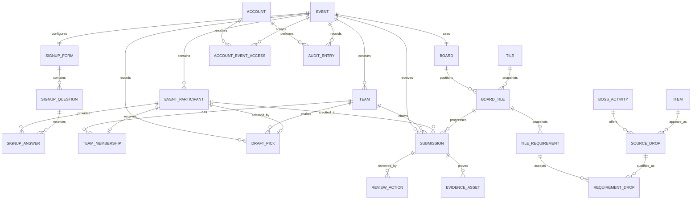

# OSRS Community Bingo Platform

## Data Model and Calculation Specification

**Status:** Current data model; entity and migration details are in the code and the migrations
**Last updated:** 10 October 2026
**Companion document:** `PRODUCT_REQUIREMENTS.md`

## Events directory projection — AU04, 2026-10-02

No persistence is added. Directory Live/past participation uses the existing
Dashboard population mapper and valid retained membership intervals, including
import provenance. Missing actual start/end remains unavailable (including
pre-Live cancellation), never current confirmed signups or fabricated zero.
Nullable capacity remains nullable. Directory reads use the same repeatable-read
participation boundary and enabled Admin check; hidden records require an enabled
SuperAdmin and never enter ordinary directory populations or Dashboard totals.

## Community Dashboard read projection — 2026-10-01

The approved Dashboard backend adds no entity, column, table, migration or
background job. `IAdminDashboardService` reads the existing PostgreSQL model in
one repeatable-read snapshot after capturing one request clock and confirming an
enabled Admin or Super Admin. The projection is read-only and no provider sync,
lifecycle transition or cache write is part of the read.

The source mapping is:

- Visible statistics, chart, history and recap events come from the event
  lifecycle and actual dates. Live, AwaitingFinalReview, Finalized and Archived
  are eligible; HiddenAt, cancellation and discard exclude an event everywhere.
  Live and AwaitingFinalReview are provisional. Missing authoritative actual dates
  remain unavailable rather than borrowing CreatedAt.
- People come from event-owned participants, team memberships and their valid
  `[JoinedAt, LeftAt)` intervals. A pre-Live departure at or before the event
  start, or a membership joined at or after the event end, is excluded. Live
  eligibility requires `JoinedAt <= requestClock` and `LeftAt > actualStart`
  (with `LeftAt == requestClock` still eligible); zero-length and reversed
  intervals are rejected. Linked people are
  deduplicated by `(EventId, WebsiteAccountId)` and unlinked people by
  `(EventId, ParticipantId)`; character/name guesses and current signup status
  are not identity sources. Disabled WebsiteAccounts remain historical people;
  EmergencyCaptain accounts do not.
- Approved submissions use distinct SubmissionId rows, active unreversed
  authoritative contributions, published approval requirements and matching
  event/team ownership. Reconstructed import contributions are excluded. A
  normal real submission set can measure zero; imported-only coverage without a
  later authoritative set is unavailable.
- Winners use the latest active EventFinalizationSnapshot with
  `UnfinalizedAt IS NULL` for Finalized/Archived events, retain snapshot TeamName
  and preserve all placement-one ties. Reopened/provisional events do not borrow
  an old official winner. Board completion divides the snapshot-approved tile
  count by the immutable active published BoardApproval snapshot denominator,
  never by working dimensions.
- EHB uses compatible stored event/competition/generation/fingerprint activity
  against the expected Playing character assignment set over retained membership
  intervals. Deduplicated matching accounts can report Complete, Partial or
  MeasuredZero. Missing or incompatible historical coverage reports Unavailable;
  the current-roster projection is not called per history row and no WOM/provider
  fetch or signup EHB substitution is permitted.
- Community CreatedAt and stored LastLoginAt figures use the same captured clock;
  strict date boundaries exclude null or future values. New accounts use the
  interval after the latest actual ended event, or 30 days only when no ended
  event exists. Login counts always use the independent 30-day interval. If an
  eligible ended-state event exists but its actual boundary is missing or
  inverted, `NewWebsiteAccounts` is unavailable and `Since` is null; that
  unavailable boundary cannot create a 30-day ended-event fallback. An eligible
  event with missing or inverted actual dates keeps related aggregate values
  unavailable. The card chooses latest-start Live, then the earliest scheduled
  preparation including overdue events, then an unscheduled setup fallback
  ordered by stable ID.

Application results expose typed dates, stable IDs and value/coverage metadata so
the UI can preserve unavailable versus zero, provisional versus
official, and real event destinations without adding persistence.

## Participants data-contract refinement — 2026-09-30

Apply the [approved Participants operations](PRODUCT_REQUIREMENTS.md#participants-backend-changes--approved-2026-09-30)
without rewriting existing snapshots/history.

- Selected confirmation, selected override restore and selected override Add
  serialize on authoritative capacity/participant state. A full-event override
  adds exactly one place and consumes it for that participant in the same
  transaction. Ordinary capacity-increase promotion remains unchanged. Retried or
  stale intent must not double-increment capacity or duplicate audit/notifications.
- Moving Confirmed to Waiting retains current event-character reservations,
  preserves other queue ordering, appends the moved participant to the queue and
  promotes the next pre-existing eligible waiter atomically. Keep membership and
  leadership history while ending current authority. No-waiter and open-place
  requests fail without mutation.
- Restoration keeps the participant identity and existing new signup/queue
  sequencing. Default placement is capacity-driven; explicitly selected expansion
  is the sole new full-event exception. Preserve reservation reacquisition checks.
- Question-free Admin Add still uses an existing active website account, unique
  event ownership, at least one Playing assignment, non-negative supported EHB,
  configured slot limits and exactly one primary. Save selected payment atomically;
  captain is false, while unrelated unanswered questions remain absent.
- The first/protected Playing question is the existing primary authority. Prefer
  reusing that representation by consistently mapping the selected primary into
  it and preserving other account/value associations; confirm the concrete mapping
  in readiness. Avoid a second competing primary flag or destructive migration.
  Keep all directly affected read/draft consumers consistent. Do not alter Live
  active-account switching or historical snapshot semantics.
- Admin event-only corrections do not change AccountOsrsCharacter links/defaults
  or rename a shared OsrsCharacter identity. Reassignment selects/resolves a
  character for this event, retaining assignment history and event uniqueness.
  This scopes the legacy saved-default update clause below: public self-signup and
  explicit My accounts behavior are unchanged by this admin correction pass.
- Global links remain non-exclusive. Event assignment conflicts, configured account
  roles and existing numeric precision remain authoritative. Optional Alt accounts
  are not Playing slots and do not supply EHB.

No new tables, background jobs or dependencies are budgeted. Prefer existing
entities/services; if a schema change proves necessary, return the concrete need
and preserve migration/designer/snapshot and retained-data rollout requirements.

## Approved Admin simplification data contract — 2026-09-26

The [approved product target](PRODUCT_REQUIREMENTS.md#approved-admin-simplification-target--2026-09-26)
supersedes conflicting future state/operation rules below. Remove future authority
before deleting historical storage. Retain harmless enum values, columns and
foreign keys for emergency actors, accountless participants, old formation types,
departures/replacement links, legacy resubmission predecessors, review resolutions/manual
corrections, legacy Finalized events and old planning fields. Historical records
must stay readable without reactivating retired commands.

New roster publication distinguishes direct manual assembly (0/1 included team)
from an actual website draft (2+); never infer no-draft from absence of active
picks alone or fabricate pick/Running history. Backfill only from reliable evidence,
retaining historical unknown where necessary. Preserve original picks and prior
publication versions. First actual Live permanently fixes membership/registration;
disablement affects access only. New official publication creates Archived plus
an immutable placement version atomically; exact equality of all competitive
inputs alone permits shared rank. Old official versions, board approvals and
evidence-attribution snapshots retain their saved identities/values.

Immediate Playing switching preserves old transitions and submitted attribution;
handle existing future-effective switches explicitly before rollout. Ordering and
concurrency must survive PostgreSQL microsecond precision. WOM provenance and
credential/write capability are separate; unknown provenance cannot gain delete
permission. Existing external ID-only links remain read-only, and protected
credentials never become output or Audit content.

For unfinished/Live events, do not automatically resume Paused drafts, match
accountless participants to names, cancel pending remote operations, enable disabled
scheduled opening, rewrite finalized rosters or recalculate historical results.
Each affected transition requires a deterministic rule with evidence or a controlled
operator decision. The [release-readiness gate](DELIVERY_PLAN.md#release-readiness-gate)
owns the release-time PRE-01 checks and bounded blockers. Future waiting-list enablement must not invoke legacy promote-all
or silently expand capacity.

Physical banner removal requires authoritative checks of database references,
stored objects and cleanup state, then explicit retention/disposal treatment for
meaningful assets. Complete required cleanup before deleting its mechanism; protect
shared evidence/team/tile storage. Empty development data or absent visible banners
is insufficient. PRE-01 performs no transformations.

Only one migration owner at a time; migration/designer/snapshot move together.
Retain historical migrations, rehearse from the verified deployed schema, check
foreign keys/filtered uniqueness on PostgreSQL and respect timestamp precision.
Use normal backup/deployment procedures, never reset-based rollout. Private inputs
stay outside committed artifacts. Data findings must record source, observation
time, release/schema identity where known, aggregate count/state category and
limitations; source-code capability or old logs are not current production counts.

## 1. Purpose

This document defines the logical data model, relationships, state transitions, calculations, and integrity rules for the OSRS community bingo platform. It intentionally avoids choosing a programming language, database product, framework, or hosting provider.

The model must support:

- Two or three community events per year
- Hybrid-authenticated normal website accounts plus admin-created/imported/external roster records without inferred website ownership
- Capacity limits and an ordered waiting list
- Admin-operated snake drafts
- Event-scoped captain and co-captain membership roles; emergency identities/access remain historical only
- Flexible bingo tile requirements
- Screenshot evidence and reversible admin review
- Live public boards and rankings
- EHB-based board balancing and player contribution statistics
- Historical events that do not change when catalogue data changes
- A complete audit history of competitive and administrative changes

## 2. Modeling principles

### 2.1 Events own competitive data

Players, teams, boards, submissions, rankings, and draft records are scoped to an event. A global catalogue may be reused, but published events preserve snapshots of the values used at that time.

### 2.2 Approved evidence is the source of progress

Official tile and team progress must be reproducible from approved evidence contributions. Reversing an approval must recalculate the affected progress rather than relying on an unexplained manual total.

### 2.3 History is preserved

Records that influenced an event should normally be disabled, withdrawn, rejected, reversed, or archived rather than permanently deleted.

### 2.4 Catalogue data and event snapshots are separate

Boss rates, drop rates, and EHB values may change between events. Updating a global catalogue entry must not silently alter a published or historical board.

### 2.5 Derived values are distinguishable from authoritative values

Values such as current tile progress and team rank are derived from authoritative records such as approved submissions and board configuration. Cached derived values may be stored for speed but must be reproducible.

## 3. Relationship overview



## 4. Common conventions

Every persistent record should normally contain:

- `id`: Stable internal identifier
- `created_at`: Creation timestamp
- `updated_at`: Last modification timestamp

Records that can be disabled or archived may also contain:

- `active`: Whether the record can be selected for new work
- `archived_at`: When it was archived

All timestamps are stored as timezone-aware instants. Events also store their display timezone, normally `Europe/Copenhagen`.

User-facing ordering should not depend on database insertion order. Explicit position, sequence, signup time, or name fields are used.

## 5. Event domain

### 5.1 Event

Represents one bingo event.

Required fields:

- `id`
- `name`
- `slug`: Public URL identifier
- `timezone`
- `state`
- `created_by_account_id`

Optional fields:

- `description`
- `first_public_at`
- `signup_opens_at`
- `signup_closes_at`
- `draft_at`
- `event_starts_at`
- `event_ends_at`
- `submission_cutoff_at`
- `participant_cap`
- `waiting_list_enabled`
- `actual_started_at`
- `actual_ended_at`
- `submissions_closed_at`
- `finalized_at`
- `archived_at`
- `hidden_at`
- `hidden_by_account_id`
- `hidden_reason`
- `cancelled_at`
- `cancelled_by_account_id`
- `cancellation_reason`
- `discarded_at`
- `discarded_by_account_id`
- `signup_code_hash`
- `evidence_code_enabled`
- `reopened_submission_cutoff_at`
- `buy_in_description`
- `prize_description`
- `board_ehb_estimated_team_count`
- `board_ehb_estimated_team_size`
- `expected_board_rows`
- `expected_board_columns`

Event state:

```text
DRAFT
SIGNUP_OPEN
SIGNUP_CLOSED
LIVE
AWAITING_FINAL_REVIEW
FINALIZED
ARCHIVED
CANCELLED
DISCARDED
```

`board_ehb_estimated_team_count` and `board_ehb_estimated_team_size` are edited with the board and exist only to estimate board EHB. They do not seed draft teams, constrain roster sizes, or represent the completed event structure.

Normal transitions:

```text
DRAFT → SIGNUP_OPEN → SIGNUP_CLOSED → LIVE
LIVE → AWAITING_FINAL_REVIEW → FINALIZED → ARCHIVED
```

Reopen signups uses shared confirmation without a written reason. Reopen submissions and official results require reason/confirmation; every transition remains audited.

The scheduled end transition sets `actual_ended_at = event_ends_at`, even if a background check persists the transition later. An authorized early-end command sets `actual_ended_at` to its authoritative confirmation time and requires a reason in the audit record. The event moves from `LIVE` to `AWAITING_FINAL_REVIEW` at that effective instant. Early end sets the normal `submission_cutoff_at` to actual end plus 30 minutes.

Early end sets the configured end and requested WOM end to the click instant
rounded up to the next whole minute (an exact minute stays unchanged); actual end
retains the precise click. Resume requires the Admin's validated future replacement
end using the existing schedule increments, with no rounding. Both actions commit
locally within ordinary lifecycle rules and record a pending end update for a linked WOM competition.
WOM matching uses exact configured UTC start/end at every stage, including Final
Review; actual times still own eligibility/cutoff/review. The existing management
worker attempts the update immediately, then uses spaced retries until publication
or permanent rejection. While the end is unmatched, post-actual-end fetches are
suppressed. Publication persists CouldNotUpdate and an AU18 skipped outcome, using
the last pre-end cache as official WOM data with its original Luck freshness.

An incomplete `DRAFT` requires only a valid name, unique slug, timezone, creator, and creation time. Schedule, signup, capacity, and planning fields become required only at the readiness gate for the transition that uses them. A field being available during initial creation does not make it required for the first save.

Duplicate event names are allowed. The slug is unique and may change until the event first becomes public; it is immutable afterward.

`first_public_at` records the first instant any event-owned public page is intentionally exposed and is never cleared. It is the authoritative slug-lock boundary.

Description may be null while the event remains a private draft and is required before signup publication. Events have no event-level banner/artwork field or active banner asset relation. The BNR-01 retirement migration removes the legacy banner reference, asset table, and cleanup outbox only after its temporary exact-key ledger records every legacy object as deleted, missing, or shared-retained. That one-time cleanup does not rewrite event history, competitive snapshots, evidence, team images, board/tile artwork, catalogue data, or other storage references.

Timezone defaults to `Europe/Copenhagen` and stores a supported canonical timezone ID. Changing timezone changes only how stored UTC instants are displayed; it never rewrites those instants. Name/description/buy-in remain editable through Live/Final Review; timezone locks permanently at first Live. Public timezone changes require confirmation of current participant-facing timestamp consequences.

AU08 Identity concurrency uses original/intended/current canonical field values.
Untouched fields take current; intended values apply when current equals original
or already equals intent. Other same-field changes block the atomic save until
explicitly resolved against the reviewed current value, which is rechecked inside
the existing Serializable transaction. Failure does not advance unresolved original
baselines or erase drafts. Legacy stale requests without complete baselines fail
closed. Timezone confirmation additionally compares the current timeline consequence
fingerprint, using UTC timestamps at PostgreSQL microsecond precision; schedule-only
changes require a fresh review independently of Identity field conflicts. No new
persistence, receipt or historical rewrite is introduced.

Schedule fields may be null in an incomplete private draft. Signup publication requires `signup_closes_at`, `event_starts_at`, and `event_ends_at`; `signup_opens_at` is required only for scheduled opening and retains the configured/scheduled opening instant as historical data. `actual_signup_opened_at` records the actual opening and becomes the effective lower boundary once signups have opened; manual opening records it without overwriting `signup_opens_at`. `draft_at` is optional and informational. The invariants are:

```text
effective_signup_opening_at = actual_signup_opened_at ?? signup_opens_at
effective_signup_opening_at < signup_closes_at <= event_starts_at < event_ends_at <= submission_cutoff_at
```

Unchanged stored timestamps retain exact UTC precision. Changed local values follow future/timezone/order checks. Passed signup boundaries remain historical; draft time locks at actual draft start. Until first actual Live, event start/end may be repaired to future instants even after configured boundaries pass. Published start/end cannot be cleared. Schedule does not own capacity or a user-facing opening toggle. Normal cutoff derives from end plus 30 minutes. Preserve overlap checks and existing legacy disabled-overdue opening behavior; exact configured WOM start/end matching replaces the former five-minute tolerance.

For manual opening with no explicit closing time:

```text
signup_opens_at = now
signup_closes_at = min(round_up(now + 3 months), event_starts_at)
```

A valid explicit future closing time no later than event start is preserved. An invalid explicit value blocks opening rather than being silently overwritten. Starting the draft closes and locks signup regardless of the configured closing time.

`DISCARDED` is a terminal administrative tombstone for an accidental or experimental event. Discard is allowed only when no event participant, team, event-scoped account access, submission, or evidence record exists. Event-owned setup records, including boards, tiles, requirements, questions, and planning configuration, may be removed in the discard transaction and do not block it. The tombstone retains the event ID, name, slug, creator, discard actor, and timestamps; the slug remains reserved. Discarded events are excluded from active administration and public listings.

`CANCELLED` is a terminal preserved state for an event with protected records that will not take place. It is reachable only before `LIVE`, requires actor/time/reason, suppresses every scheduled transition, and ends ordinary event-scoped mutations without deleting configuration, participants, assignments, teams, draft history, board data, submissions, evidence, or audit records. A never-public cancelled event remains non-public; an already-public cancelled event exposes only its previously published projection plus a generic cancellation status.

`ARCHIVED` is entered atomically by official publication, with immutable results/public URLs preserved. Legacy `FINALIZED` remains readable, not a new intermediate resting state. Reasoned reopening returns to Final Review only when current-event exclusivity permits.

Each authoritative transition into `AWAITING_FINAL_REVIEW` identifies one immutable review cycle. Completion-time acknowledgements, completion corrections, exceptional blocker resolutions, and finalization snapshots are scoped to that cycle; prior-cycle records remain retained and cannot authorize a later cycle. Finalization snapshots retain the consumed resolution identities and authoritative calculation inputs/results used for the official projection. A former participant of an archived event may read only their own rejected/withdrawn evidence history through the normal account-history route; this does not grant team-private or mutation authority.

Evidence eligibility is derived from the append-only lifecycle transitions. If an event resumes from `AWAITING_FINAL_REVIEW` to `LIVE`, the interval between those authoritative effective times remains ineligible; review projections identify evidence timestamps in that gap without rewriting the submission or asset timestamp. Normal finalization also requires an explicit server-validated confirmation value; browser confirmation is only an enhancement.

Production permits multiple `SIGNUP_OPEN` and `SIGNUP_CLOSED` events only when their configured half-open event windows `event_starts_at, event_ends_at)` do not overlap; an end exactly equal to another start is allowed. Only `LIVE`, `AWAITING_FINAL_REVIEW`, and `FINALIZED` are singleton current states. Never allow two visible current events (authority: [quoted Step 0 user assignment): every entry path (Start, restore/unhide, reopen, future imports or repairs) must enforce the same authoritative singleton boundary. Hidden events are excluded; historical imports enter Archived. Two current events would mutually block finalization and subsequent starts. This is the approved invariant from the quoted Step 0 assignment, not new implemented behavior. Drafts do not reserve a window, and cancelled, discarded, or archived events do not block a new one. `is_development_fixture` is an internal persisted marker set only by the Development scenario seeder; ordinary Admin input cannot set it and Production lifecycle commands never honor it.

### Event creation operation (AU03)

`event_creation_operations` stores `(actor_account_id, request_id)` as its composite
primary key, the original trimmed `name` and supported `timezone`, and unique
`event_id`. The row is immutable and commits with the event's complete minimal
aggregate and creation audit. Restrictive account/event foreign keys retain the
outcome through rename, quarantine and discard (the event tombstone remains).
No backfill or synthetic request identity is assigned to pre-existing events.
Payload comparison is ordinal on the stored strings; timestamps, current event
metadata and slug allocation are not part of request identity. A new key denotes
a new operation even when names match. Validation failure leaves no operation row.

### 5.1.1 Event quarantine metadata

Hidden is not an `EventState` value. It is derived from the nullable
`hidden_at` field and is therefore reversible administrative quarantine:

```text
is_hidden = hidden_at != null
```

`hidden_by_account_id` references the Super Admin account that performed the
current hide, and `hidden_reason` is mandatory when `hidden_at` is set. The
database retains the event's unchanged lifecycle state and every event-owned
relationship. Hiding is valid only for `AWAITING_FINAL_REVIEW`, `FINALIZED`, or
`ARCHIVED`; all pre- and active-event states, plus `CANCELLED` and `DISCARDED`,
are ineligible. Hide and restore are audited mutations, not lifecycle
transitions, and Restore clears only these three metadata fields.

Visible-event queries and guards must explicitly require `is_hidden = false`
where a public, participant, Captain, emergency-authority, ordinary-Admin,
notification, action, audit, evidence, or realtime projection is allowed. There is no
global EF query filter. A hidden event is available only to the separated
SuperAdmin Events Control Hidden projection and its limited Manage inspection;
all other event routes fail closed with 404, including for Super Admins.
Snapshots, rankings, submissions, evidence, audit history, assets, storage
objects, and all other database relations remain retained and unchanged.

### 5.1.2 Frozen historical import metadata

The approved historical import uses the existing event, participant, team,
board, tile, requirement, contribution, ranking, and audit aggregates. It is
created directly in `ARCHIVED` with `Europe/Copenhagen`, start
`2026-07-14T16:00Z`, end `2026-07-19T16:00Z`, and `archived_at` equal to the
event end. The persisted event must retain the source event identifier,
competition identifier, import hash, and the approved source/synchronization
metadata needed to explain the frozen read. The source account username is
stored separately from any current website-account link.

The import retains 90 participants, 93 source accounts, and six public
board-spelled teams with 15 participants each. The source-to-website-account
mapping is private, external to Git, deterministic, and never inferred from a
current link, username, Discord identity, or OSRS name. The secondary mappings
are fixed as primary `Ezzi → Also Ezzi` and primary `wolles → w olles`, plus the unused zero-gain
`Coxophobia` attached to an existing Xen participant.

For the approved Maggot King eligibility rule, the existing immutable approval
requirement-drop snapshot resolves the exact active catalogue-backed `Elder
venator fang` and `Crimson kisten` source drops, while explicitly excluding
`Maggot marquess`. The normal catalogue rate and EHB mechanics must produce a
rounded historical tile estimate of exactly `31.1487`; preflight fails closed
for any other value. Reconstructed contributions still retain null item
identity and never assert an item drop.

Versioned public import metadata may retain the approved English 5×5 board
manifest, the exact corrected 402 counter units across 150 team/tile cells,
source identifiers, and source hashes, but never the private roster or account
mapping. The reviewed public manifest SHA-256 is
`e5297b20fc5e4a842b6a1e5ab378128cbe1c2bad16033fc875c54607c0d49438`. The public
Wise Old Man competition link is `145197`; the frozen per-account start EHB,
end EHB, gained EHB, and complete synchronization snapshot are historical
inputs, not a live cache contract and not refreshed normally. Board standings
are official placements in the frozen order The Agency, Xen0%_d_rops, Touch
Kids, not grass, Morytania Monkeys,
Zalamalikum, Såeh cs?, and archived public team cards follow those snapshots.
Wise Old Man EHB/activity ranking is a separate projection and cannot alter
board results.

Import application is preflight-first and transactional: an exact previously
applied import hash is a no-op, a divergent hash fails closed, and any apply
failure rolls back the transaction without leaving a partial historical
aggregate.

### 5.2 Event publication controls

Event lifecycle and publication are related but not identical. The event stores separate controls for:

- Signup page publication
- Participant-list publication
- Draft-result publication
- Team-roster publication
- Board publication
- Results publication

Opening signups publishes only the signup page and its basic event information. Board and draft publication remain independent.

### 5.3 EventStateTransition

Records every event lifecycle change.

Fields:

- `event_id`
- `from_state`
- `to_state`
- `performed_by_account_id`
- `performed_at`
- `reason`, required for exceptional or backward transitions
- `scheduled`: Whether it resulted from an admin-configured scheduled action

### 5.3.1 ScheduledEventStartAttempt

Records a scheduled start check even when no state transition is allowed.

Fields:

- `event_id`
- `scheduled_for`
- `attempted_at`
- `started`
- `blocker_codes`
- `resolved_at`, nullable

When the scheduled instant arrives, the event may enter `LIVE` only if draft finalization, board publication, and every other event-start invariant pass in the same transaction. A blocked attempt leaves the event pre-live, retains the original scheduled instant, creates the **Automatic start postponed** admin action/notification, and never backdates later eligibility. It is not automatically retried after blockers clear. The later manual start resolves the attempt/action, uses its actual transition time, and requires one confirmation but no written reason for either early or overdue manual start.

### 5.3.2 ScheduledSignupOpeningAttempt

`scheduled_signup_opening_enabled` remains compatibility state, not an Admin control. Future opening timestamps schedule the action; manual actions supersede their corresponding scheduled transition. Preserve the legacy disabled/overdue exception so unchanged old data cannot activate a new opening. One ScheduledSignupOpeningAttempt per event/boundary stores the actual attempt, outcome and resolution; transaction/uniqueness guards make scheduled/manual races idempotent. Readiness is always rechecked; old warning acknowledgments grant no new authority.

## 5A. Global public content

### 5A.1 GlobalRulesDocument

The single current Rules document for the permanent public Rules page. It is not event-scoped.

Fields:

- `id`, using a well-known singleton identity
- `body`
- `version`, for optimistic concurrency
- `updated_at`
- `updated_by_account_id`

Every successful edit retains automatic actor/time/change history through the normal audit mechanism. No written reason is required. Rules revisions do not create participant notifications and are not event-readiness inputs.

### 5A.2 Source-controlled how-to pages

Public how-to pages are application content rather than persisted domain entities. They are versioned with the source code, have stable public routes, and expose no runtime authoring model or administrator editor.

## 6. Signup domain

### 6.1 SignupForm

One active form definition belongs to an event. Historical question definitions remain available after changes.

Fields:

- `event_id`
- `version`
- `published_at`
- `closed_at`
- `first_response_at`, nullable and never cleared after the first accepted/imported response
- `require_signup_code`

AU05 client baselines: custom/account-field add, custom edit, account rename, move and co-captain enable submit the rendered `SignupForm.version` as `expectedFormVersion`. Missing or malformed baselines fail closed; stale baselines are rejected under the event lock before writes. Delete/disable retain their existing question-version and impact-count confirmation contract. Existing forms forward this token without introducing a new UI workflow. Settings results retain the immutable submitted event version separately from the authoritative saved/current event version, capacity, waiting-list state, code-required and code-present flags; code values/hashes are never returned. Capacity and code remain separate transactions.

AU07 response boundary: the ordinary null-to-first-accepted `FirstResponseAt`
transition alone is response metadata and preserves the editable form version.
Any simultaneous definition/settings mutation or explicit Version mark/advance
still advances it. No stale-baseline bypass is permitted. The immutable first
marker, required/type restrictions and all current guards are rechecked under the
existing Serializable event lock. A required custom add after that boundary succeeds
as optional with an explicit `CompletedAsOptional` outcome, explanation and original
committed definition; there is no rejection or backfill. Exact replay/readback uses
AU06 identity plus its uniquely linked immutable creation audit and verified original
intent, preserving the normalization and definition after later edits. Missing or
corrupt creation audit fails closed without returning a guessed definition or writing.

AU06 uses one `SignupQuestionCreationOperation` per committed add: globally unique
`request_id`, `actor_account_id`, `event_id`, SHA-256 of the canonical requested
shape (including original `expectedFormVersion`) and `question_id`. The operation,
question, audit and form-version advance commit atomically. Actor/event references
are restricted; question identity is retained without a deletion-cascading foreign
key so cleanup cannot erase retry history. Deleted/inactive fields are never
recreated by replay. Development reset clears operations with event-owned data.
There is no backfill, request receipt for failed writes, expiry or generic framework.

### 6.2 SignupQuestion

Fields:

- `signup_form_id`
- `key`: Stable machine identifier
- `label`
- `help_text`
- `type`
- `required`
- `system_field`
- `position`
- `active`
- `disabled_at`, nullable
- `disabled_by_account_id`, nullable
- `disabled_reason`, nullable
- `replaced_by_signup_question_id`, nullable
- `options`, for choice questions
- `account_answer_role`, nullable and used only for `ACCOUNT`
- `public_on_signup_board`, retained for future compatibility and fixed/defaulted true for participant-facing questions

Question types:

```text
TEXT
NUMBER
YES_NO
SINGLE_CHOICE
ACCOUNT
```

Account answer role:

```text
PLAYING
INFORMATIONAL
```

The user-facing role names are **Regular account** for `PLAYING` and **Alt account** for `INFORMATIONAL`. The built-in primary OSRS account is a required public `ACCOUNT` question with role `PLAYING`; its compound answer requires EHB. Additional Account questions may create regular or alt assignments but are always optional at the question level. When an optional regular Account question is answered, its EHB child value becomes required. An alt Account answer has no EHB. A Yes/No support-alt question creates no OSRS-character assignment. The primary Account/EHB and captain-volunteer system questions cannot be removed.

Every active participant-facing answer is public on the unlisted signup table in version one. Inactive legacy questions and their retained answers remain available to authorized private/admin history views but are excluded from public signup-table projections. `public_on_signup_board` remains fixed/defaulted true for active participant-facing questions; it is not historical disclosure evidence and no disclosure-tracking field or backfill is introduced. Private fields and co-captain answers remain outside the public projection. There are no admin-only custom signup questions or post-draft privacy mutations. Payment and Admin notes remain separate private data.

Before draft start, custom questions may be added, edited, reordered, or deleted while signup is open or closed. Before `first_response_at`, an existing question's answer shape may change. After it is set:

- new participant-facing questions must have `required = false`;
- `type`, `account_answer_role`, `options`, stable `key`, and answer-shape constraints are immutable;
- an optional question cannot become required;
- label, help text, and position may change while signup is open or closed and before draft start;
- changing a question's format is an explicit delete-then-create operation: deletion removes every answer permanently and releases only affected event assignments/reservations, then ordinary creation adds the new question; existing inactive legacy questions and retained answers remain authorized private history only and are excluded from every public signup-table projection;
- deleting an optional Account question releases its current event assignments/reservations atomically without deleting assignment/audit history or global My accounts links; restoration must not reacquire assignments from deleted questions; the definition may remain an internal historical tombstone;
- every change increments `SignupForm.version` and is audited.

Draft start freezes ordinary question metadata. Delete-then-create gives the new question a new stable key; it never rewrites the deleted answers. Deletion uses an internal tombstone so assignment and audit references remain valid, but removes all answer rows and releases current optional assignments in the same transaction under the event lock; form and affected participant versions advance. Repeated deletion is harmless and cannot reinterpret a replacement or retained-conversion record. Upgrade repair of earlier deletion-only deactivations is limited to pre-draft Draft/SignupOpen/SignupClosed events and excludes system, replacement and retained-conversion/legacy questions. Already draft-locked or later event records are preserved unchanged; this correction does not rewrite competitive history.

### 6.3 EventParticipant

Represents one person's participation, signup, or imported roster record for one event. The participant is not the login identity and is not an OSRS character.

Fields:

- `event_id`
- `account_id`, nullable for imported/external roster records without a verified website-account relationship
- `captain_volunteer`
- `payment_received`, boolean, defaults false
- `signup_status`
- `signup_sequence`
- `signed_up_at`
- `confirmed_at`
- `waiting_listed_at`
- `withdrawn_at`
- `withdrawn_by_account_id`, nullable when the participant initiated the action
- `form_version`
- `source`

`(event_id, account_id)` is unique when `account_id` is not null. One website account can therefore own at most one participant record in an event while participating in several different events.

All new ordinary signup/Admin additions require an existing active website account at creation. The participant may edit signup fields only while the event is `SIGNUP_OPEN`. Retained or explicitly operator-imported records without an account remain readable, but ordinary UI cannot create or claim them. Event-facing names come from registered OSRS-character assignments rather than the website username. Slice 4 removes the temporary private-edit-token model without adding a participant claim-token model.

Editing does not change `signed_up_at`, `signup_sequence`, or queue status. Cancelling/withdrawing changes status and releases current character assignments. Rejoining while signup is open reactivates the same participant identity but assigns a new `signed_up_at` and `signup_sequence` at the end of the queue. Admin restoration before draft start follows the same current-capacity calculation and never restores a former queue position.

### 6.4 OsrsCharacter

Represents a normalized OSRS character identity without asserting exclusive ownership.

Fields:

- `id`
- `display_name`
- `normalized_name`
- `created_at`

`normalized_name` trims surrounding whitespace and applies case-insensitive matching only; it does not rewrite internal spelling/spacing. The application trusts the submitted OSRS name and performs no syntax, availability, ownership, Wise Old Man membership, or existence validation. The normalized value is unique for matching case variants. The character may be linked to several website accounts globally, but it has only one event-participant assignment in a particular event.

### 6.5 AccountOsrsCharacter

Trust-based global association between a website account and an OSRS character.

Fields:

- `account_id`
- `osrs_character_id`
- `linked_at`
- `linked_by_account_id`
- `unlinked_at`, nullable; hides the association from future selection without deleting history
- `personal_label`, nullable user-entered label such as Main, Alt, or Borrowed
- `sort_order`
- `preferred`
- `saved_ehb`, nullable personal default used to prefill future regular-account answers

`(account_id, osrs_character_id)` is unique. At most one link per account is `preferred`. Several accounts may link the same OSRS character. This relationship populates My accounts and signup selectors but grants no authority, proves no ownership, and does not reserve the character for an event. Personal labels organize the list without imposing a game-mode taxonomy.

`saved_ehb` belongs to the link rather than the shared character so one borrower's update does not change another website account's default. Saving a regular Account answer updates this default and captures an independent event snapshot. Later edits to `saved_ehb` do not rewrite an existing event assignment. Alt assignments ignore it.

### 6.6 EventParticipantCharacter

Event-specific assignment of OSRS characters to an event participant.

Fields:

- `event_id`
- `event_participant_id`
- `osrs_character_id`
- `registration_order`
- `registered_at`
- `registered_by_account_id`
- `signup_question_id`
- `event_role`
- `ehb_snapshot`, required for `PLAYING` and null for `INFORMATIONAL`
- `ehb_source`, required for `PLAYING`
- `ehb_fetched_at`, nullable
- `released_at`, nullable
- `released_by_account_id`, nullable

One participant may register several characters. A partial unique constraint on `(event_id, osrs_character_id)` where `released_at IS NULL` prevents the same character from being currently assigned to several participants in one event. The participant and assignment `event_id` values must match through a relational constraint. Confirmed and waiting-list participants both hold current assignments. Withdrawal/removal before draft start releases the assignments without deleting their history, after which another participant may acquire that character. The same character may also be assigned to a different participant in another event.

Normal signup selects from `AccountOsrsCharacter`. A missing trusted/borrowed character is added through My accounts before returning to the signup form; it is not created inline by the Account answer. Admin-created, imported, or external participants may receive an event assignment without a linked website account.

Event character role:

```text
PLAYING
INFORMATIONAL
```

Each participant must have at least one current `PLAYING` assignment before signup can be completed. The assignment created by the built-in primary Account question is automatically the initial active account; signup has no separate initial-active selection. Each regular (`PLAYING`) assignment stores its own event-specific EHB snapshot. An alt (`INFORMATIONAL`) assignment has no EHB and may never appear in a swap transition, receive evidence credit, or be synchronized to Wise Old Man. The event role is determined by its Account question and is independent of the optional personal label in My accounts.

EHB source:

```text
MANUAL
WISE_OLD_MAN
IMPORT
ADMIN_CORRECTION
```

Exactly one explicitly selected primary Playing assignment supplies draft EHB (F05). Switching preserves all per-account snapshots; other accounts never add to that draft value. A fetched value records `WISE_OLD_MAN` and `ehb_fetched_at`; editing it afterward changes the source to `MANUAL`. The event snapshot remains authoritative after signup closes even if the external profile changes.

My accounts stores only an optional numeric saved-EHB default. A WoM lookup performed there may populate that value, but it does not add durable source/fetch metadata to `AccountOsrsCharacter`. Using the saved default later is therefore `MANUAL`. Only a fresh signed lookup submitted and verified with an event signup may create a `WISE_OLD_MAN` event snapshot.

#### Slice 10 Wise Old Man event integration

An event may have at most one Wise Old Man integration-state record. It owns:

- event and competition identity plus validated competition title/start/end;
- latest generation identity and completeness/error state;
- last request and successful-fetch time;
- separate fixed-hourly normal-slot and retry due times. A normal slot is UTC and anchored to the event's retained `actual_started_at` (first slot +1h); a missing anchor leaves the normal due explicitly `NULL` rather than creating a rolling fallback;
- retry count;
- opaque synchronization lease owner and expiry;
- observed request-budget diagnostics needed by Admin projection;
- end-update status (NotRequired, Pending, Succeeded, Rejected, CouldNotUpdate), UTC
  target/requested timestamps and a sanitized safe rejection code. End-update status
  is persisted by name: NotRequired, Pending, Succeeded, Rejected and CouldNotUpdate
  are immutable stored names and must never be renamed. The AU20 migration
  backfills existing rows as NotRequired with no inferred target; Down removes only
  the new fields and cannot preserve pending end requests across rollback.

The competition interval must match both website UTC boundaries exactly (configured window, including Final Review). Website dates cannot be imported from WOM. Matching replacement is allowed before/during Live and local disconnect before first Live, with active/unresolved-operation guards and no external remote deletion or credential reuse. Final Review and terminal connection configuration stays read-only.

Each synchronization attempt snapshots a generation identity, competition ID, and fingerprint of all current unreleased `PLAYING` event assignments. Cached per-character activity rows belong to that generation and store the event, participant, character, gained EHB, and fetch time. Alt/informational and released assignments are excluded.

Lease acquisition and HTTP do not share a database transaction. Final cache publication succeeds only while the event remains `LIVE` or `AWAITING_FINAL_REVIEW` and the competition ID, opaque lease owner, and assignment fingerprint still match. A later complete or partial generation is authoritative for projection and replaces older displayed values, although older rows may remain retained for recovery/diagnosis. A successful response with missing expected accounts persists only matched current-generation rows; missing accounts have no row, are never represented as zero, and never carry forward an older value. Partial projections show available totals and coverage when at least one expected account matches; zero matches show no rankings.

Participant activity is the sum of their current generation's matched regular-character deltas. Team total sums current-member participant totals once; team average divides by current participants with at least one matched account rather than accounts. Every participant tied for the highest available total is a provisional MVP; coverage makes the partial state explicit. Synchronization stops outside `LIVE` and `AWAITING_FINAL_REVIEW`; the latest generation state is retained without mutation and may resume only after a legitimate return to `LIVE`. Existing Live rows are reconciled lazily to the current anchored slot; a consumed current slot is detected from its recorded attempt time even when its legacy due value came from the old rolling cadence, so recovery advances to the next future slot without replaying a slot. Downtime does not backfill a burst, and retries/manual/urgent requests do not move the normal anchor.

AU20 persisted WOM outcome compatibility:

AU18 refresh skip reasons retain their stored names and explicit numbers:
EventUnavailable=0, EventNotInFinalReview=1, IncompleteEventWindow=2, NoCompetition=3,
RefreshInProgress=4, RetryDelay=5, NotDue=6, ServiceUnavailable=7. AU20 appends
EndWindowUnmatched=8 and EndCouldNotBeUpdated=9. Published CalculationInputsJson
continues to read old string/numeric outcomes; names/numbers must never be reused.
Fallback publication records Skipped / EndCouldNotBeUpdated without replacing the
pre-end cache or its fetched/calculated timestamps with fresh values or zeroes.

#### Admin-managed Wise Old Man competition state — authorized 2026-09-22

The existing event competition link remains the source identity for both manual
and managed integrations. A separate management record is created after a
successful explicit Create or explicit protected-code adoption on an external link. It stores the event
and link identity, encrypted versioned management code, managed-field scope,
management status, last applied local and remote fingerprints, last acknowledged
roster, management version, and the permanent `actual_started_at` cutover
observed for destructive/roster decisions. The code is never stored in
cleartext, public/statistics DTOs, TempData, logs, exceptions, or raw operation
payloads. ID-only links have no writable management capability. Explicit code adoption may
add it without changing External provenance or authorizing remote deletion.
External replacement/disconnect retires the local management connection, removes
its protected credential and current-operation receipt, and preserves operation
history. A later explicit code adoption rebinds the unique management row with the
new code, never the retired credential. Replacement resets end-update state for
the new configured connection.

Durable management operations retain only an operation ID/type, authorized
actor or originating local change, immutable desired fingerprint/payload
reference, phase, remote ID/receipt reference, safe error code, retry timestamp,
and outcome timestamps. PostgreSQL uniqueness/conditional claims serialize
operations per managed event/link across Admin requests and worker instances;
expired Sending claims become Unknown and never authorize a blind duplicate
Create or Delete. Pending updates survive restart and coalesce to the newest
permitted revision. Team/membership/assignment history and local evidence are
never deleted by remote management.

The managed desired fingerprint includes UTC schedule, active finalized draft
publication, active memberships and teams, participant status, every unreleased
Playing assignment, provider-normalized character names, and managed identity
mapping. Before Live, a managed roster must contain every eligible Playing
assignment for each active team and cannot contain an empty team. After the
first actual Live start, roster mutations are permanently forbidden; dates-only
updates remain permitted where the lifecycle contract allows them. A remote
delete can be enqueued and dispatched only before that permanent marker, with
fresh credentials, current authority, link/version, and explicit confirmation.
An in-flight pre-Live operation may complete after Live and reconcile its exact
receipt, while no new roster/delete request or destructive retry may be sent.

### 6.7 EventParticipantCharacterSwap

Append-only history that determines the one active/drop-eligible character for a participant at any instant.

Fields:

- `id`
- `event_id`
- `event_participant_id`
- `previous_osrs_character_id`, nullable for initial activation
- `next_osrs_character_id`
- `effective_at_utc`
- `recorded_at_utc`
- `recorded_by_account_id`
- `reason`, retained where present in historical records; no new backdated switch workflow

Normal participant swaps select that participant's frozen Playing assignments while Live, take effect at authoritative server time and serialize with submission attribution. There is no new next-minute pending swap or Captain/Admin switch-on-behalf authority. Exactly one active account supplies future submissions; historical transitions and original evidence snapshots remain unchanged. PostgreSQL precision applies. Initial activation uses the selected primary.

Signup status:

```text
CONFIRMED
WAITING_LIST
WITHDRAWN
```

`payment_received = false` is displayed privately to admins as `Unpaid`; `true` is displayed as `Paid`. It is not projected to public, participant, team, evidence, or leaderboard views.

Signup source:

```text
WEBSITE
CSV_IMPORT
ADMIN_CREATED
```

Name normalization may identify a shared global character association for admin awareness. It must not block a valid global link, create a reusable person identity, imply account ownership, or link name changes across bingos. It does block a second event assignment for the same normalized character through the event-level uniqueness rule.

The same normalized OSRS character may be globally linked by several people but may be assigned to only one participant in an event. Character association alone never merges participant records or grants authority. In-event evidence and Wise Old Man activity resolve through that unique event assignment.

### 6.8 SignupAnswer

Stores event-specific custom answers.

Fields:

- `event_participant_id`
- `signup_question_id`
- `question_label_snapshot`
- `value`, nullable for `ACCOUNT`
- `osrs_character_id`, populated for `ACCOUNT`

The label snapshot preserves meaning if the form question is later edited.

An answer row is not guaranteed to exist for every active question and participant. Questions may be added after some players have signed up, optional questions may be left blank, and external roster members may not have a website signup at all. Team, roster, draft, and admin views must load answers with left-join/optional semantics and render missing values without throwing an exception.

Answers to disabled questions remain queryable for authorized history. Public signup-table projection includes active participant-facing answers only and renders later missing optional answers as **Not answered**; inactive legacy answers, private fields, and co-captain answers are excluded. Website username, Discord identity, payment, Admin notes, security data, and audit data are never included in that projection.

### 6.9 Waiting-list calculation

Confirmed count includes `CONFIRMED` participants only.

When a valid signup is accepted:

```text
if confirmed_count < participant_cap:
    status = CONFIRMED
else:
    status = WAITING_LIST
```

Both statuses hold current event-character reservations. The create/edit transaction acquires every requested current assignment and computes status before committing. A character-reservation conflict aborts the entire transaction. Withdrawal or removal before draft lock releases all current assignments for that participant in the same transaction as any waiting-list promotion.

Waiting-list position is derived by ordering active `WAITING_LIST` records by:

1. `signed_up_at` ascending
2. `signup_sequence` ascending as a deterministic tie-breaker

When capacity increases or a confirmed place becomes available before the draft is locked:

```text
open_places = participant_cap - confirmed_count
promote the first open_places waiting-list records
```

Capacity is editable before team-draft lock and cannot fall below the Confirmed count across all event participants, regardless of team inclusion or manual-team membership. Manual-team membership never frees a signup place; manual teams still consume no draft turns. Ordinary increases promote earliest eligible waiters atomically with the capacity write, audit and notifications. F01–F04 explicit selected-person +1 exceptions never promote anyone else. Waiting remains enabled while open.

The participant cap can be increased but not lowered. If signups close below the cap, the confirmed participants at that time are simply the available participant pool.

Cancellation/withdrawal, rejoin, admin restoration, character reservation changes, status assignment, and waiting-list promotion are atomic. Restoration or rejoin must reacquire every required character reservation and fails without partial state if any is unavailable. Participant- and admin-initiated withdrawal share `WITHDRAWN`; `withdrawn_by_account_id` plus automatic transition history preserves who acted.

After the draft is locked, automatic promotion stops. Replacement workflows are
retired. Finalized pre-first-Live roster Add/Remove uses the separate correction
flow; first Live locks membership permanently.

## 7. Team and draft domain

### 7.1 Team

Fields:

- `event_id`
- `name`
- `slug`
- `image_asset_id`
- `formation_type`: retained historical `DRAFTED`/`PREFORMED` compatibility only
- `affiliation_name`: optional clan or community name
- `included_in_draft`
- `draft_position`
- `active`
- `finalized_at`

`included_in_draft` alone determines draft participation; formation_type is historical compatibility and grants no restriction or exemption. New teams require existing-account members. With 0/1 included team finalize manual rosters; 2+ use balanced website draft. Original picks/publications remain immutable.

Team display name is unique within its event and its slug is stable. Retained image/affiliation fields are history/compatibility; the accepted Teams UI removes those controls. IncludedInDraft alone controls participation; first-pick structural locks persist after Undo. No new preformed/accountless workflow or finalized-draft reopening is permitted.

### 7.2 TeamMembership

Fields:

- `team_id`
- `event_participant_id`
- `role`
- `joined_at`
- `left_at`
- `assigned_by_draft_pick_id`
- `assignment_reason`
- `membership_source`
- `replaces_team_membership_id`, nullable

`assigned_by_draft_pick_id` is null for manually assigned members. Manual roster assignments record the structured assignment source/action and audit actor. Ordinary corrections before event start do not require an administrator to type a reason. A participant may be created directly within the event for an invited roster and does not need to have submitted the public signup form.

Membership role:

```text
PARTICIPANT
CAPTAIN
CO_CAPTAIN
```

An event participant can have at most one active team membership per event.

Membership source:

```text
DRAFT_PICK
PREFORMED
ROSTER_REPLACEMENT
```

Historical departure/replacement memberships, former left_at and ROSTER_REPLACEMENT links remain readable. New finalized pre-first-Live Add/Remove updates current publication and preserves original picks/prior versions. First Live permanently locks membership/registration; no future vacancy/replacement workflow or notification is generated.

`ROSTER_REPLACEMENT` is a retained historical membership source only. The current
draft and Live workflows do not create new vacancy or replacement actions.

For live changes, `left_at` is the first full UTC minute after withdrawal confirmation and the replacement `joined_at` is the first full UTC minute after replacement confirmation. These timestamps may leave a gap and must never overlap. The replacement's initial `EventParticipantCharacterSwap` activates their primary playing assignment at the same `joined_at` instant.

### 7.2.1 TeamMembershipRoleTransition

Append-only captain/co-captain role history.

Fields:

- `team_membership_id`
- `previous_role`
- `next_role`
- `effective_at`
- `performed_by_account_id`

Only an active membership may receive a current captain/co-captain role. Withdrawing the member appends the required revocation transition atomically. Role authorization resolves from the latest applicable transition/current membership rather than an OSRS character or stale credential.

Draft-start readiness requires every active team with `included_in_draft = true` to
have a current `CAPTAIN` membership. `CO_CAPTAIN` alone does not satisfy the gate.
Every captain/co-captain assignment occupies a normal roster position used for the
derived-size calculation.

Live-start readiness does not require a current Captain or credential. Actual website-draft start and finalization retain their current-Captain requirements. Losing a current Captain during live play can still produce an unresolved support warning; that warning grants no fallback authority.

### 7.2.2 TeamFocusMarker

Private, non-competitive team coordination state.

Fields:

- `id`
- `event_id`
- `team_id`
- `target_kind`: `TILE`, `ROW`, or `COLUMN`
- `board_tile_id`, required only for `TILE`
- `row_index`, required only for `ROW`
- `column_index`, required only for `COLUMN`
- `focused`
- `version`
- `updated_at`
- `updated_by_account_id`

The target fields are mutually exclusive according to `target_kind`, and `(team_id, target_kind, target identity)` is unique. Only a current captain/co-captain of the team may mutate a marker. Current team members may read it. Ordinary `ADMIN` authority does not grant read access. The designated global `SUPER_ADMIN` policy may read another team's markers only after an explicit, team-scoped inspection opt-in; the default projection contains no cross-team marker data. This exception never grants mutation without the ordinary team captain/co-captain permission.

The inspection choice is transient authorization/UI state rather than a persistent domain record or global show-all preference. Focus does not affect board snapshots, evidence, progress, ranking, finalization, or public history. It becomes read-only at event end. Updates use optimistic concurrency and team-scoped invalidation so another team cannot infer marker content.

### 7.3 Draft

Fields:

- `event_id`
- `type`: `SNAKE`
- `state`
- `initial_order_randomized_at`
- `first_pick_recorded_at`: retained first-ever pick time, including after Undo/cancel
- `requires_fresh_order`: discard the prior order on restart after a picked attempt was cancelled; establish a fresh order before picks
- `started_at`
- `paused_at`
- `finalized_at`
- `locked`

Draft state:

```text
SETUP
RUNNING
FINALIZED
```

`PAUSED` remains a readable legacy state for historical rows only; it is not a
current draft control state. `included_in_draft` is the only current participation
flag; the retained `formation_type` values do not decide eligibility.

Team count and target size are not authoritative stored configuration:

- `team_count` is derived from active teams with `included_in_draft = true`.
- The drafted-team participant total includes confirmed internal participants either available for the website draft or already assigned to a drafted team.
- `larger_size = ceiling(participant_total / team_count)`.
- `smaller_size = floor(participant_total / team_count)`.
- `larger_team_count = participant_total mod team_count`; the remaining teams receive `smaller_size`.
- When the remainder is zero, every team receives the same size.

Captain/co-captain memberships count toward derived draft sizes. Teams not included in the draft and their assigned members do not consume draft turns. Planning team size is separate; AU13 preserves its editability after finalization.

Before the first pick, the application derives a balanced per-team turn/capacity plan from the participant total, existing drafted-team memberships, and randomized order. A setup is invalid when an existing preassignment makes a maximum final size difference of one impossible. A team whose current membership count exceeds the smallest drafted-team membership count is ineligible until lower-count teams catch up. The partial final round determines which named teams receive the larger final size. The plan is not a user-entered target and cannot strand a confirmed included participant.

### 7.4 DraftTeamOrder

Fields:

- `draft_id`
- `team_id`
- `initial_position`: 1-based round-one position

### 7.5 DraftPick

Fields:

- `draft_id`
- `overall_pick_number`: 1-based
- `round_number`: 1-based
- `pick_in_round`: 1-based
- `team_id`
- `event_participant_id`
- `picked_at`
- `recorded_by_account_id`
- `undone_at`
- `undone_by_account_id`
- `undo_reason`

### 7.6 Snake-draft turn calculation

For `N` teams and zero-based overall pick index `p`:

```text
round_index = floor(p / N)
position_in_round = p mod N

if round_index is even:
    order_index = position_in_round
else:
    order_index = N - 1 - position_in_round
```

The team at `initial_order[order_index]` owns the pick.

Undone picks remain stored but become inactive. Undoing the latest active pick removes its active team membership and returns the participant to available status.

Undo may be repeated against the latest remaining active pick until no active picks remain. Each undo restores the turn calculation from the remaining active ledger; an older non-latest pick cannot be undone while later active picks remain.

Every confirmed participant remains visible during the draft. Drafted players display their assigned team rather than disappearing.

The available draft pool is recomputed after each pick and excludes participants
already assigned according to current membership and `IncludedInDraft`; it therefore
shrinks as teams fill and a picked participant cannot return until that pick is
undone. Formation labels do not decide eligibility. Finalized pre-first-Live
Add/Remove never fabricates picks or changes original order.

Draft finalization requires every confirmed participant included in the drafted-team total to have one active drafted-team membership and every drafted team to satisfy the derived balanced distribution.

The public finalized-draft projection includes only active picks, ordered by effective overall pick number, with participant and team. Undone/superseded attempts, recorded-by identity, timestamps, and correction details remain in the admin ledger.

A finalized draft cannot reopen. Before first actual Live, separate roster Add/Remove republishes current membership without altering original picks/prior versions; those corrections do not withdraw the public roster. Cancel is available only for a private Running draft after individual latest-pick Undo leaves zero active picks. Cancel returns the draft to Setup. If any pick was ever recorded,
`requires_fresh_order` is true. Start clears prior team positions when no pick
has ever been recorded or `RequiresFreshOrder` is set; the separate Scramble action
establishes the new random order before picks. `first_pick_recorded_at` is retained.
Historical reopened/paused state and audit remain readable without new transition authority.

## 8. Account and access domain

### 8.1 Account

Fields:

- `discord_user_id`, nullable and unique; required during initial normal-account creation but may later be unlinked
- `discord_display_name`, non-authoritative display metadata
- `public_username`, required for normal accounts and also used for password login
- `normalized_public_username`, case-insensitively unique for normal accounts
- `profile_osrs_character_id`, the character selected during onboarding
- `onboarding_completed_at`
- `login_username`, nullable and used only for emergency or legacy password credentials
- `password_hash`, required for completed normal-account onboarding; retained emergency rows may have a password hash or null, neither grants authentication
- `account_type`
- `global_role`
- `authorization_version`
- `password_version`
- `active`
- `last_login_at`
- `password_changed_at`

Account type:

```text
WEBSITE_ACCOUNT
EMERGENCY_CAPTAIN
```

Global role for a normal website account:

```text
USER
ADMIN
SUPER_ADMIN
```

Normal participants, captains, admins, and the Super Admin use one `WEBSITE_ACCOUNT` with a required public username/password of at least 10 characters and an optional current Discord association. Existing permanent Admin credentials migrate in place during Slice 1. Legacy participant free-text Discord identities remain unlinked, and Slice 2 never infers participant ownership from display text, website username, or an OSRS-character link. Discord guild membership is not required. First-time creation starts with Discord and onboarding chooses an independent website username/password plus a first OSRS character, creates/reuses that character link, and marks it preferred; after onboarding the Discord association may be removed or replaced. Public-username uniqueness is separate from character linking: another account may link the same `profile_osrs_character_id` but must choose a different public username. Later website-username changes may use any valid unique value and do not alter event-facing OSRS-character assignments. OAuth tokens, raw passwords, and recovery tokens are not stored in audit snapshots.

Exactly one active account has `global_role = SUPER_ADMIN`. A partial unique constraint enforces at most one, while controlled bootstrap/migration and the ownership-transfer transaction enforce existence. Public signup/onboarding never assigns a privileged global role. Emergency captain accounts always have no global role and cannot be promoted.

Global role grant/revoke increments `authorization_version`. Every authenticated session carries that version and fails authorization when it no longer matches, making either grant or revoke effective immediately. Revocation changes `ADMIN` to `USER` without disabling the account or changing event-owned records. Password-authenticated sessions additionally carry `password_version`; password change/reset increments it without unnecessarily invalidating a separate Discord-authenticated session. Role changes preserve automatic actor, target, timestamp, and before/after history without requiring a written reason.

A website username may change to any valid case-insensitively unique value without selecting or depending on an `AccountOsrsCharacter` link. The change updates the public website identity and password-login username together, but does not modify My Accounts links, event participants, registered characters, event assignments, evidence, teams, roles, or historical records. Event-facing participant names come from registered OSRS-character assignments. This documentation correction preserves the historical migration record and does not authorize rewriting migrations.

Disabling a normal website account sets `active = false`, records actor/time/reason, increments `authorization_version`, and invalidates every session without deleting any owned/historical records or releasing the normalized username/Discord uniqueness reservations. An Admin may disable a `USER`; only the Super Admin may disable or restore an `ADMIN`; self-disable and disabling the active Super Admin are prohibited. Re-enable clears the current disabled state while retaining transition/audit history and does not recreate expired event authority. Website accounts are neither merged nor permanently deleted in version one.

### 8.1.1 PasswordCredentialToken

Fields:

- `id`
- `account_id`
- `purpose`: `PASSWORD_RESET` or `EMERGENCY_INITIAL_SETUP`
- `token_hash`
- `created_at`
- `created_by_account_id`
- `expires_at`
- `used_at`, nullable
- `superseded_at`, nullable

Only hashes of cryptographically random setup/reset tokens are stored. A token is purpose-bound, single-use, expires 60 minutes after creation, and is valid only while unexpired and not superseded. Generating another setup/reset token for the account supersedes every unused prior token. Completion updates `password_hash`/`password_changed_at`, increments `password_version`, consumes the token, and records automatic actor/target/time history. Retained emergency setup/reset tokens and any token targeting an emergency account are rejected without consuming the token or changing account history. It does not require a written reason.

An enabled Admin may generate a link for a `USER`; only the Super Admin may generate one for an `ADMIN`. No in-product admin-generated reset is available for the current Super Admin.

### 8.1.2 AccountDiscordIdentityTransition

Fields:

- `id`
- `account_id`
- `transition_type`: `LINK`, `UNLINK`, or `REPLACE`
- `previous_discord_user_id`, nullable only for `LINK`
- `new_discord_user_id`, nullable only for `UNLINK`
- `changed_at`
- `changed_by_account_id`

Every Discord link mutation requires fresh current-password verification. `LINK` and `REPLACE` also require a completed OAuth callback for a Discord ID not attached to another account. Updating the account and appending the transition are one transaction. `UNLINK` may leave a completed normal account with no Discord association because its password remains required; `REPLACE` never exposes an intermediate unlinked state. The transition increments `authorization_version`, invalidates other sessions, and never changes event participants, global character links, event roles, evidence, or history.

### 8.2 AccountEventAccess

Scopes an account to an event participant, team, and effective role. Normal captain/co-captain access derives from the authoritative team membership role; it is not derived from an OSRS character name.

Fields:

- `account_id`
- `event_id`
- `event_participant_id`, nullable only for emergency access
- `team_id`, required for team-scoped roles
- `access_role`
- `active_from`
- `expires_at`
- `manually_disabled_at`
- `re_enabled_at`

Retained emergency accounts and event/team access rows preserve historical foreign keys, actor identity, username reservation and past Audit. Their enabled/expiry/setup fields no longer grant authority. No provisioning, token consumption, enable/disable, expiry-worker mutation or identity conversion is performed.

`expires_at` applies only to emergency or legacy password access, not to normal website-account captain/co-captain roles. Captain role history remains on `TeamMembershipRoleTransition`; lifecycle authorization determines whether that historical role can still mutate the event.

Access role:

```text
CAPTAIN
CO_CAPTAIN
```

Captain authorization requires all of:

- Account is an active normal website account
- Participant ownership and current Captain/Co-captain membership match the event/team
- Event is visible
- Submission team matches the current membership
- Event state and active upload window permit the requested submission mutation

An admin identity transfer updates the event participant's owning `account_id` and any derived normal participant/captain access atomically. The destination `(event_id, account_id)` uniqueness constraint must succeed first. The transfer does not move `AccountOsrsCharacter` rows or merge `Account` records; it preserves all event-owned participant, assignment, team, evidence, and history rows.

### 8.3 PersonalNotification

`PersonalNotification` is a durable recipient-specific in-site notification stored in the `personal_notifications` table. It is a destination and reminder, not an event, participant, evidence, account-lifecycle, or Admin-action record; those underlying records remain authoritative.

Fields:

- `Id`
- `EventId`, nullable for global/non-event notifications
- `RecipientAccountId`
- `Title`
- `Detail`
- `Route`
- `CreatedAt`
- `ReadAt`, nullable

The table has a primary key on `Id`, an optional foreign key from `EventId` to
`Event`, and indexes over `(RecipientAccountId, ReadAt, CreatedAt)` and
`(EventId, RecipientAccountId, CreatedAt)` when the event association is used.
It does not carry the richer event/participant/type/path foreign-key shape or a
universal recipient-transition uniqueness constraint. `Route` is a
supplementary direct destination and must still resolve under the recipient's
current authorization and scope; an empty route falls back to the notification
page. Event-linked notifications are filtered through `EventId` plus the
explicit visible-event predicate so hiding cannot leak stale event actions or
destinations.

Reading a notification is recipient-scoped and marks `ReadAt` only when it is not already set, so repeated reads are idempotent. Notifications are retained, and reading or following a destination never resolves the underlying workflow or Admin action. Current pending review and unresolved scheduled opening/start failures disappear only when their authoritative condition resolves. Retired vacancy, promotion-follow-up and missing-Captain categories generate no new actions.

Required notifications are written with their surrounding accepted mutation. Retry-sensitive producers use deterministic IDs and their owning transition/recipient boundary where implemented, including retained historical withdrawal/replacement records and current evidence rejection. Ordinary notification producers may use fresh GUIDs and rely on the surrounding accepted transaction or action; notification persistence has no universal recipient-transition deduplication rule.

Waiting-list promotion notifies the linked participant when present and enabled administrators, with the participant confirmation or Admin management destination and no private custom-answer, payment, note, OAuth-secret, or other unnecessary account data. Payment changes, private-note changes, and ordinary non-account answer corrections create no participant notification.

New vacancy/replacement notifications are retired. Retain historical notifications without generating new actions. Evidence rejection targets the credited participant and current authorized Captain/co-captains; pending reviews and unresolved scheduled failures remain operational actions.

### 8.4 Participant drop-announcement state

Announcement acknowledgement and Drops NEW acknowledgement are independent of
`PersonalNotification.ReadAt`. The active journey is `PUB-UPDATES-01` in
FUNCTIONAL_CONTRACTS; DELIVERY_PLAN owns the delivery contract.

- One unique account/event state stores the durable automatic-expansion cooldown
  and last automatically announced approval ordinal. A claim requires an outstanding
  eligible approval beyond that ordinal and atomically advances it only through
  the claimed snapshot alongside the cooldown. No new tracking table is required.
  Sparse unique account/submission records store banner and Drops acknowledgements;
  bulk actions acknowledge the eligible rows under their ordinal snapshot boundary.
  Approval does not fan out a record to every recipient.
- Eligibility requires an enabled account, Confirmed participant and current
  membership in an active team of the non-hidden Live/AwaitingFinalReview event.
  This authorizes receiving every eligible approval in that event; it does not filter
  approvals to the recipient's own credited player or team.
  The later of the stable event tracking start and membership join boundary excludes
  earlier history without losing approvals received while the account is offline.
- Approval records immutable completion-at-that-approval metadata and an event-scoped
  ordinal inside the existing serialized approval transaction. Queue snapshots use
  the committed ordinal boundary so bulk dismissal and paging preserve later arrivals.
  Competitive progress remains derived from approved evidence.
- Dismissal clears the represented banner snapshot only. Successful evidence-popup
  opening clears both states for that approval; CLEAR ALL NEW clears both across
  the event's current action snapshot. Retries are idempotent and account-scoped.
  Automatic expansion atomically claims a 120-second cooldown; dismissal starts it
  again. Client navigation and another device cannot override it.
- Reversal excludes that approval from current update eligibility. Finalization
  advances the event tracking generation and clears all banner/NEW eligibility,
  including offline accounts, while retaining actual approved feed/evidence history.
  Unfinalizing cannot resurrect updates from the previous generation.

## 9. Global OSRS catalogue

### 9.1 BossActivity

Fields:

- `name`
- `slug`
- `category`
- `image_asset_id`
- `source_image_url`, nullable
- `efficient_completions_per_hour`
- `team_size` (informational agreed activity team size; integer >= 1, default 1)
- `external_identifier`
- `data_source`
- `data_updated_at`
- `active`
- `notes`

Categories may include boss, raid, skilling, minigame, or other activity.

### 9.2 Item

Fields:

- `name`
- `normalized_name`
- `image_asset_id`
- `source_image_url`, nullable
- `external_identifier`
- `active`
- `notes`

### 9.3 SourceDrop

Connects an item to one boss/activity. The relationship is source-specific because the same item may have different rates from different sources.

Fields:

- `boss_activity_id`
- `item_id`
- `display_rate`
- `numeric_probability`
- `probability_scope` (retained context; final chance is in-name; AU23 backend delivered)
- `conditional_on_parent` (retained; new input retired by AU23)
- `parent_probability` (retained with parent flag/history)
- `assumed_participants` (retained per-drop history; activity context moved to BossActivity by CAT-1)
- `rolls_per_completion`
- `roll_group`
- `rate_condition_note`
- `default_ehb_estimate`
- `data_source`
- `data_updated_at`
- `active`

**4 October final-chance decision (AU23/CAT-1):** `numeric_probability`
is paired with the activity's efficient completion rate for the same agreed team
size/strategy and stores the final in-name chance per roll; `N x` explicitly
records repeated rolls. Valid fraction numerators are allowed. Enter a raid's
final item chance with the purple chance already included; never add “Only after”
for that final rate. Retire parent input/editor/panel controls, retaining
`conditional_on_parent` and `parent_probability` columns/values for history and
snapshot integrity. No EHB parent-chance fix ticket is created. Existing Luck code
can still apply retained parent mechanics while EHB currently ignores them; the
user reported zero conditional production drops on 4 October, so this decision
does not rewrite historical calculations. Recheck before change and stop if any
unexpected conditional records appear.

Scope/assumed-participant context never multiplies a calculation. CAT-1 moves the
agreed team size to one informational activity value (integer >=1, default 1),
editable by every Admin beside efficient completions/hour. The production query
reported zero non-default per-drop contexts on 4 October; recheck set values and
per-activity conflicts before migration, with no silent loss and no rewriting
approved/published snapshots. The activity `team_size` column is now the current
field; the retired per-drop columns remain for history and snapshots.

New or attempted writes of `probability_scope`, `conditional_on_parent`,
`parent_probability`, or `assumed_participants` are refused for every role.
Their retained values remain readable in historical rows and snapshots.

`roll_group` remains a real EHB/Luck calculation input for mutually exclusive
results from one roll; different groups are independent. New drops use `default`;
existing production groups (`barrows-equipment`, `purple table`,
`doom-1-16-aggregate`, `fortis-full-run-unique`, 56 active rows reported by the user)
are preserved. Only SuperAdmin edits advanced groups; ordinary Admins may add/edit
`N x` rate text under AU23. The effective chance remains empty without a reviewed
rate. Source/strategy details belong in `rate_condition_note`, never ad hoc
calculator exceptions. Operator-reported counts are not agent verification.

Each `SourceDrop` is one authoritative drop record with one displayed rate and numeric probability. Conditional mechanics are recorded in `rate_condition_note`; distinct real drops, such as `Nid` and `Nid (Destroy)`, remain separate records rather than rate choices beneath one drop.

Catalogue records use deactivate/reactivate for normal lifecycle changes. Permanent deletion is Super-Admin-only and succeeds only when a transactional dependency query finds no catalogue relationship, board draft reference, approval/publication snapshot, asset/cache metadata, import-review record, or other historical reference. Deletion of a genuinely unused row requires confirmation but no reason. The reviewed catalogue snapshot loader is a CI/Development/manual-test data loader, validates retired per-drop context before writing, and never runs as a production deployment step.

## 10. Board and tile domain

### 10.1 Board

Fields:

- `event_id`
- `name`
- `rows`
- `columns`
- `state`
- `validated_at`
- `validated_by_account_id`
- `active_approval_snapshot_id`, nullable
- `published_at`
- `locked_at`
- `total_ehb_estimate`
- `calculation_version`

Board state:

```text
DRAFT
VALIDATED
PUBLISHED
ARCHIVED
```

Only one board is active for competitive progress in version one.

A board draft may be created as soon as its event exists and remains privately editable while signups are open or closed and while teams are being prepared. Event publication and signup opening do not require a complete board and do not publish it. While `DRAFT`, board queries derive catalogue-backed names, artwork, source-drop rates, and EHB from current catalogue rows; cached totals are non-authoritative and are invalidated/recalculated after relevant catalogue changes. `VALIDATED` means the complete board passed validation and an admin explicitly approved and snapshotted it. Draft finalization makes a valid roster available but does not publish the board; the separately confirmed publication command uses the immutable approval snapshot.

Validation requires every grid position to contain a valid tile. Any enabled admin may approve. Approval locks/rechecks referenced catalogue versions, calculates the complete board, creates a `BoardApprovalSnapshot`, and assigns `active_approval_snapshot_id` atomically. Explicit unapproval or editing any tile/competitive board content changes an unpublished `VALIDATED` board back to `DRAFT`, clears the active pointer without deleting its immutable snapshot, and resumes live catalogue derivation. Prior approval actor/time/data remains append-only history and no typed reason is required while private.

Draft finalization and board publication are separate transitions. After finalization, the UI may offer the board-publication command only while the board is grid-complete, `VALIDATED`, and private. That command rechecks all three conditions in its own transaction; an ineligible request fails without changing the completed draft.

### 10.2 Tile

An objective owned by exactly one event board. It cannot be reused by, copied into, or linked from another board.

Fields:

- `board_id`
- `name`
- `description`
- `description_is_automatic`
- `image_asset_id`
- `objective_type`
- `manual_ehb`: optional total event-tile override, persisted in the existing
  tile-local `tile_templates.manual_ehb_override` column. Manual objectives require
  this estimate. AU11 requires no schema migration.
- `active`

Objective type:

```text
DROP_REQUIREMENTS
MANUAL
```

`DROP_REQUIREMENTS` derives EHB from current catalogue/rate mechanics while the board is `DRAFT` and from its immutable approval snapshot once `VALIDATED`. AU11 supersedes the old manual-only restriction: a valid calculated tile may
have an optional total tile override with its automatic baseline retained/resettable.
The editor readback includes the calculated baseline; clearing the override restores
the automatic effective value. Approval freezes the effective total. Overrides never bypass missing mechanics,
change catalogue rates or rewrite evidence-bound/approved/historical scoring. `MANUAL` represents a custom objective and requires its explicitly configured manual EHB before board approval. Every requirement in a tile/template must match that single objective kind; mixed manual/drop requirements are invalid. Reject mixed create/update or new approval attempts without partial changes. Existing approved snapshots and historical competitive results are not rewritten; any retained invalid draft requires an explicit user correction into separate tiles.

`description_is_automatic` records whether the tile description is derived from
its current ordered requirements. New blank/whitespace-only edits set it true
and store an empty editable description; nonblank edits store trimmed authored
text and set it false. Existing nonblank template/working descriptions are
backfilled as manual, including text that happens to match a former generator;
existing blank descriptions are backfilled as automatic. No description text
is rewritten by the migration. This applies to working/template records only;
immutable approval snapshot text and mode are not backfilled or rewritten.

### 10.3 BoardTile

Places its board-owned tile at one position. Moving/swapping changes positions; it does not duplicate the tile.

Fields:

- `board_id`
- `tile_id`
- `row_index`: zero-based
- `column_index`: zero-based
- `name_snapshot`, nullable active-approval/publication projection
- `description_snapshot`, nullable active-approval/publication projection
- `description_is_automatic`
- `image_snapshot`, nullable active-approval/publication projection
- `estimated_ehb_snapshot`, nullable active-approval/publication projection

There may be only one board tile per board position and only one position per board tile.

While the board is `DRAFT`, editor/preview queries use the board-owned `Tile` plus live catalogue joins and ignore the approval/publication projection fields. Approval populates the active projection from an immutable `BoardApprovalSnapshot`. Once approved or published, its board tile, requirement, eligible-drop, rate, artwork, and EHB snapshot records are immutable through normal catalogue editing. An explicit unapproval returns an unpublished board to live derivation; an explicit post-publication correction creates audited replacement values without rewriting the historical before-state.

### 10.4 TileRequirement

Fields:

- `board_tile_id`
- `position`
- `target_contribution`
- `duplicates_allowed`
- `allow_higher_weightings`
- `credited_weight`, defaults to `1`
- `requirement_description`
- `manual_completion_rule`
- `manual_objective`

All active requirements on a tile must be complete for the tile to complete.

### 10.5 RequirementBossActivity

Allows one requirement to reference multiple bosses or activities.

Fields:

- `tile_requirement_id`
- `boss_activity_id`
- `boss_name_snapshot`, nullable active-approval/publication projection
- `efficient_rate_snapshot`, nullable active-approval/publication projection

While the board is `DRAFT`, queries join `boss_activity_id` to the current catalogue row and ignore these projection fields. Board approval freezes them in the new approval snapshot.

### 10.6 RequirementDrop

Defines one eligible source-specific drop.

Fields:

- `tile_requirement_id`
- `source_drop_id`
- `item_id_snapshot`, immutable shared catalogue-item identity
- `boss_name_snapshot`, nullable active-approval/publication projection
- `item_name_snapshot`, nullable active-approval/publication projection
- `display_rate_snapshot`, nullable active-approval/publication projection
- `numeric_probability_snapshot`, nullable active-approval/publication projection
- `maximum_total_contribution`
- `ehb_per_contribution_snapshot`, nullable active-approval/publication projection
- `credited_weight`, defaults to `1`

Every eligible drop has a default credited weight of `1`. The board designer may set a higher `credited_weight` on specific drops. Submitters cannot override the selected drop's snapshot value.

While the board is `DRAFT`, queries join `source_drop_id` to current catalogue data and ignore these projection fields. Board approval freezes the selected immutable shared catalogue-item identity, names, source-drop rate mechanics, and derived EHB in the new approval snapshot.

When duplicates are not allowed, each immutable shared catalogue item within one
requirement normally has a maximum contribution of `1`, even when multiple
source-specific drops refer to that item. Allocation is keyed by `(team_id,
tile_requirement_id, item_id_snapshot)`. A missing source-row maximum has effective
value `1`; every alias for that item in the requirement must expose the same
effective maximum or board approval fails. An explicit consistent maximum can
override `1`. The same item in a sibling requirement is an independent objective.

For C20 (planner-resolved boundary, 14 September 2026), retain existing
`BoardRequirementDropSnapshot` rows whose requirement is referenced by an immutable
approval, even if private working requirements/tiles are removed. These retained rows
provide immutable drop identity; authoritative rules/weights come from the appropriate
approval tree, not mutable catalogue or the retained row's cached rule values. Resolve
only within the authorized event/board/approval requirement using the exact retained
`RequirementId + SourceDropId + ItemId` association. Missing or ambiguous associations
fail closed; never guess, recreate lost IDs or choose the first match. Retention must
not make removed private objectives current or visible across approval/event boundaries.
Substantive no-evidence replacements must not reuse an approved identity for different
rules or create duplicate identity candidates; wording-only edits retain identity.
Protect evidence arriving during correction with consistent transaction/lock ordering
across the directly affected mutation, submission and publication paths. This authorizes
bounded retention using existing tables only, not migration, historical repair or source
integration. Existing retained evidence/history remains readable through its authorized
context; current ordinary submissions continue to use the active published contract.

### 10.7 Board resizing

Before publication, board dimensions may change without relocating occupied tiles. Every occupied tile must fit within the proposed row and column bounds; resizing is blocked until any out-of-bounds tile is moved or removed.

```text
new_rows, new_columns ∈ [1, 8]
for every active board tile:
  0 ≤ tile.row_index < new_rows
  0 ≤ tile.column_index < new_columns
```

If every occupied tile fits, the system applies the dimension change while preserving each tile's identity and coordinates.

If any occupied tile falls outside the proposed bounds, resizing is blocked. The board dimensions, tile layout, approval/history and public snapshot remain unchanged; the tile must be moved or removed before the smaller dimensions can be used.

After publication, resizing requires explicit confirmation, an audit reason, and recalculation of every team's board and line state.

### 10.8 BoardApprovalSnapshot

Immutable version created by **Approve board**, before publication.

Fields:

- `id`
- `board_id`
- `version`
- `approved_at`
- `approved_by_account_id`
- `rows`
- `columns`
- `calculation_version`
- `total_ehb`
- `superseded_at`, nullable

Child snapshot rows capture every tile position/name/description/artwork,
`description_is_automatic`, requirement rule, boss/activity name and efficient
rate, source drop plus immutable shared catalogue-item identity/name/rate/probability,
contribution cap/weight, manual EHB, and derived tile/line/board EHB value.
Automatic tile copy is materialized from ordered requirements and their selected
drop/item/source identities during approval, stored with the automatic-mode
flag, and then read only from the immutable approval snapshot. The frozen
description column is sized for multi-objective output; approval rejects any
derived text that exceeds its limit instead of truncating it. Discarding an
open correction restores the prior mode along with the active approved copy.

The immutable item identity is added by exactly one migration covering active event
and approval drop snapshots. Historical rows are backfilled only when frozen
snapshot facts resolve safely to one item. A fail-closed extension of the existing
operator preflight emits event, snapshot family/row, requirement, source-drop ID,
frozen item name, current mapping, candidate item IDs, and a database fingerprint
plus deterministic external mapping template for every ambiguous or mismatched
row. The operator adjudicates the catalogue-item IDs outside the repository and
confirms the mapping-file hash. The existing migrate command validates that input,
loads it into a connection-scoped temporary table, and runs the single migration
on the same open connection. The migration auto-fills only unambiguous rows,
consumes and verifies required mappings for both families, makes both columns
non-null, and leaves no staging table. Neither frozen names nor mutable current
catalogue mappings are rewritten to manufacture a match.

Approval locks or version-checks every referenced live board/catalogue row and fails atomically on a concurrent edit. `Board.active_approval_snapshot_id` identifies the frozen version used by `VALIDATED` preview and publication. Unapproval/editing clears that active pointer and marks the snapshot superseded without deleting it. Publication points to the active approval snapshot and never recalculates it.

## 11. Evidence and submission domain

### 11.1 Submission

Fields:

- `event_id`
- `team_id`
- `board_tile_id`
- `tile_requirement_id`
- `source_drop_id`, optional for manual objectives
- `credited_event_participant_id`
- `credited_osrs_character_id`
- `submitted_by_account_id`
- `credited_weight`
- `total_claimed_contribution`
- `total_approved_contribution`
- `submitted_at`
- `submitter_note`
- `status`
- `resubmits_submission_id`, nullable self-reference retained for legacy rejected/reversed history display; new ordinary attempts leave it null
- `rejection_reason`, nullable and required when status is `REJECTED`
- `expected_evidence_code`: Immutable snapshot of the code interval active at `submitted_at`; null when verification was disabled

Submission status:

```text
PENDING
APPROVED
REJECTED
WITHDRAWN
REVERSED
```

### 11.1.1 EvidenceCode

Stores manual or generated verification-code history for one event:

- `event_id`
- `code`
- `activates_at`
- `retires_at`, null for the final scheduled interval
- `created_by_account_id`
- `created_at`
- `note`

Intervals may be scheduled in advance. Adding a code recalculates adjacent retirement boundaries, while each existing submission keeps its original `expected_evidence_code` snapshot.

`credited_weight` is copied from the selected immutable requirement-drop snapshot when a submission is created or retargeted. It defaults to `1`; submitters and reviewers do not choose a different per-submission value.

For an ordinary participant submission, `credited_event_participant_id` is the submitter's current event participant. For a captain/co-captain submission, the captain selects one current teammate. In both cases the create command resolves that participant's active character at `submitted_at` and snapshots it as `credited_osrs_character_id`; the submitter never selects a credited account. Pending submitter edits preserve both credited fields. Only a reasoned admin correction may change the credited playing account before approval/rejection.

An ordinary later submission after rejection or reversal is an independent record. It resolves the credited participant and active playing-character snapshot through the same normal create rules, receives a new immutable server submission time and evidence asset, and is reviewed independently; it does not copy predecessor attribution or require a predecessor link. Existing `resubmission_of_submission_id` predecessor links and `ReviewActionType.Resubmit` values remain retained for historical display only. They do not authorize, limit, or form new linked children, and a Reversed predecessor remains inactive and cannot be directly re-approved.

### 11.2 EvidenceAsset

Fields:

- `submission_id`
- `storage_key`
- `original_filename`
- `media_type`
- `byte_size`
- `pixel_width`
- `pixel_height`
- `checksum`
- `uploaded_at`
- `uploaded_by_account_id`
- `asset_role`
- `active`

Asset role:

```text
ORIGINAL_EVIDENCE
REPLACEMENT_EVIDENCE
```

Only one active original or replacement screenshot is used as the primary evidence at a time. While a submission remains pending and its ordinary mutation window is open, its authorized participant or team captain may replace that active screenshot; the prior asset is deactivated but remains historical. Read-only submission states cannot replace evidence.

### 11.3 ReviewAction

Fields:

- `submission_id`
- `action`
- `performed_by_account_id`
- `performed_at`
- `note`
- `before_snapshot`
- `after_snapshot`

Review action:

```text
EDIT_METADATA
APPROVE
REJECT
REVERSE_APPROVAL
WITHDRAW
```

Notes are required for rejection, reversal, and material admin corrections. Approval requires no note.

### 11.4 Submission transitions

Normal transitions:

```text
PENDING → APPROVED
PENDING → REJECTED
PENDING → WITHDRAWN
APPROVED → REVERSED
```

An admin may correct a pending submission's tile/requirement, qualifying drop, or credited character from current or released Playing assignments in the event belonging to current members of the submission’s own team or former members whose membership covered the upload time (joined at or before SubmittedAt and not ended before it; D12) with a required reason (AU17a; D11 option b, Informational accounts excluded) and complete revalidation. Credited participant is derived from the unambiguous event-pool character identity, including retained/non-current entries under AU17a and is never independently edited. Server submission time, calculated contribution, and submitted evidence asset are immutable to the reviewer. Snapshot weight is not manually editable; retargeting atomically replaces it with the selected destination requirement/drop's frozen authoritative weight. Correcting an approved submission requires reversal.

A later attempt after rejection or reversal is a new `PENDING` submission rather than a transition or direct reapproval of the predecessor. It is accepted only while the active/reopened upload window permits new submissions and requires a new evidence asset. The attempt follows ordinary participant/captain authorization and validation, resolves its own credited participant/account snapshots, and creates its own review history and contribution if approved. Existing predecessor links and `ReviewActionType.Resubmit` values remain display-only legacy history; no unique-child claim, predecessor copy, or linked-chain rule applies to new submissions. A reversed predecessor's contribution stays inactive.

### 11.5 Submission timing validity

For a normal drop submission:

```text
submitted_at <= active submission cutoff or approved reopening cutoff
credited_osrs_character_id is a PLAYING assignment belonging to
credited_event_participant_id for the event
```

Reopening submissions extends the evidence-upload window but does not extend the valid obtained window unless the event end itself is changed.

The plugin-rendered UTC value inside the evidence image is the only recorded evidence of when the drop occurred. It is neither separately transcribed into structured submission data nor extracted through OCR. Approval attests that the administrator visually confirmed the screenshot time falls between the official event start and authoritative event end and inside an active interval for the credited playing character. No fixed upload-hours rule is represented in the domain model.

Evidence review displays the latest relevant swap transition in UTC. The full transition list remains available as an admin/audit detail when visual validation needs more context.

## 12. Contribution and progress calculations

### 12.1 Claimed contribution

```text
claimed = credited_weight
```

### 12.2 Approved contribution

On approval, contribution is limited by:

- Remaining requirement target
- Per-drop maximum contribution
- Duplicate rule
- Admin-approved amount

Conceptually:

```text
approved = min(
    claimed,
    remaining_requirement_progress,
    remaining_drop_cap
)
```

Progress never exceeds the requirement target and never carries to another tile.

### 12.3 Duplicate behavior

When duplicates are allowed, multiple approved submissions for the same eligible drop can contribute until the requirement target or explicit drop cap is reached.

When duplicates are not allowed, active contribution is capped per `(team_id, tile_requirement_id, item_id_snapshot)`. A source-specific alias of the same item shares that cap; its missing explicit cap means `1`, and board approval has already established that every alias has the same effective maximum. The same item in a separate sibling requirement is independent and may count there; contribution, completion, reversal, and rebalancing never cross `tile_requirement_id`.

### 12.4 Requirement progress

```text
requirement_progress = sum(active approved contributions for requirement)
requirement_complete = requirement_progress >= target_contribution
```

### 12.5 Tile completion

For a drop-requirement tile:

```text
tile_complete = every active requirement is complete
```

For a manual tile, each approved completion contributes its approved credited quantity, normally `1`:

```text
manual_progress = sum(active approved manual completion contributions)
tile_complete = manual_progress >= manual target_contribution
```

This supports both one-off objectives and repeated objectives such as three Inferno completions.

For each requirement, its completion time is the immutable `SubmittedAt` of the
effective contribution that first reaches the target. `tile_completed_at` is the
latest requirement-completion time needed to satisfy every requirement.

The current public approval generation persists one `tile_completion_facts` row
per event, team, board tile, and approval snapshot. A completed row stores that
tile time and JSON provenance for its qualifying requirement/contribution/
submission identities and effective amounts. Approval and reversal/rebalance
transactions reconcile affected rows from approved, non-reversed effective
contributions; every later ordinary submission contributes its own immutable
`SubmittedAt`. Reversal can update a still-complete tile's active-generation
fact when its surviving threshold evidence changes. Replacement approval
creates facts for the new generation without deleting prior-generation facts.
Retained submissions and reversal history remain the source for reconstructing
older active-generation state; public reads do not write competitive facts.

### 12.6 Row and column completion

For a team and board:

```text
row_complete(r) = every board tile in row r is complete
column_complete(c) = every board tile in column c is complete
```

Diagonals are ignored.

A completed tile is counted once as a completed tile but contributes to both its row and column. Overlapping completed lines count independently.

### 12.7 Full-board completion

```text
board_complete = every board tile is complete
board_completed_at = latest tile_completed_at on the board
```

The first team by `board_completed_at` is the provisional winner. Approval time does not determine finishing order.

### 12.8 Approval reversal

When an approved submission is reversed:

1. Mark its approved contribution inactive.
2. Re-evaluate later approved evidence for the same requirement and increase previously capped contributions up to their original eligible claims.
3. Record each automatic contribution adjustment in review history.
4. Recalculate the affected requirement and tile.
5. Recalculate its row and column.
6. Recalculate full-board completion.
7. Reconcile its active-generation tile completion fact and provenance.
8. Recalculate team placements.
9. Recalculate the credited player's statistics.
10. Record before and after values in the audit log.

### 12.9 Historical reconstructed progress

Historical import contributions are approved reconstructed records rather
than evidence submissions. Their item and evidence associations are null, but
the approved rows are included in public Recent Drops without fabricating a
drop identity or evidence asset.
Participant attribution is deterministic and weighted toward combined starting
EHB; reconstructed timestamps are deterministically spread across the event
window. Weighted raid counters represent contribution units and do not assert
that a named participant received an item drop.

Historical partial units may be assigned only in the fixed requirement order
approved for the event, and only to reproduce the exact aggregate `x/x`
counters. This allocation rule does not create an additional public
disclosure. The event's only disclosure is exactly: “Historical record —
evidence image not retained; player attribution and timing reconstructed from
event EHB.”

The approved tile manifest and eligibility rules are immutable import inputs:
all 20 named catalogue God Wars candidates; ordinary distinct pet drops with
no joker; any two Duke/Whisperer drops including duplicates; Araxxor Nid
(Destroy) or Jar of venom only; both Vorkath visages; Superior Slayer's exact
four-item intent with an explicit manual EHB of `21`; Royal Titans' two AND
objectives of three Fire crowns and three Ice crowns; Wilderness' three AND
objectives of one hilt, one blade, and one gem; and no Maggot marquess.
Board points and ignored CSV EHB/rate columns are not EHB inputs. The Superior
Slayer value is a manual value, not an inferred conversion.

Superior Slayer remains one manual target-3 objective with a manual tile EHB of
`21`.
Its four approved item names are frozen eligibility metadata in the manifest and
description only. The importer creates no catalogue item, source-drop, live
requirement-drop snapshot, or immutable approval-drop row for those names, and
reconstructed contributions retain null drop identity.

## 13. Ranking calculations

### 13.1 Team ranking tuple

Persisted legacy comparator (`placement_rule = 0`): full-board finishers first, earliest
full-board completion among finishers, completed lines descending, completed tiles
descending, current score completion time ascending, then credited EHB descending.
Team name is display ordering only and does not break a competitive tie.

Persisted new-event comparator (`placement_rule = 1`) comparison priority:

1. Full-board completion status
2. Full-board obtained completion time, earliest first among finishers
3. Completed rows and columns, highest first
4. Completed tiles, highest first
5. Credited EHB tie-break value, highest first
6. Current score completion time, earliest first

Both comparators are implemented and selected by the immutable event placement rule.
Only new ordinary events adopt AU12; retained events keep their prior rule, and saved
historical/official placements retain their existing ordering and inputs.

For the AU12 new-event rule only, non-finishers are compared using:

```text
(
    completed_line_count,
    completed_tile_count,
    ehb_tiebreak_value,
    current_score_reached_at
)
```

`current_score_reached_at` is the latest completion time among the team's
currently complete tiles, using only the active approval generation; it is
null when no tile is complete. For a complete board it agrees with the
effective board finish time. Retained `TeamCompletionCorrection` rows are
historical only: current readiness and ranking ignore them. An existing official
snapshot keeps its stored order and fields, while the current calculation uses
the immutable evidence-derived times. This does not reintroduce manual time
correction.
Under AU12, credited EHB is rounded to four decimals for both ordering and shared-rank
equality; equal credited EHB falls through to current-score time. Equality of all
applicable inputs, including the defined null-time rule, can remain tied. Legacy
comparisons retain full-precision credited EHB.

Finishers rank ahead of all non-finishers and are ordered by completion time.

If every competitive input is equal, teams share the rank. No discretionary, name or identifier tiebreak separates them.

### 13.2 Provisional and official placements

Placements are provisional while the event is live or awaiting final review. Finalization stores official placement snapshots.

Fields for an official `OfficialPlacementSnapshot` record:

- `event_id`
- `team_id`
- `place`
- `board_complete`
- `board_completed_at`
- `completed_lines`
- `completed_tiles`
- `current_score_reached_at`
- `ehb_tiebreak_value`
- `finalized_at`
- `calculation_snapshot`

Unfinalizing does not delete the previous snapshot. It supersedes it with a new calculation after re-finalization.
Historical official placements are never silently reranked or backfilled from
today's evidence. Their new nullable `current_score_reached_at` remains null
when the time was not recorded in that historical version; the recorded order
and other fields remain unchanged.

## 14. EHB calculations

### 14.1 Simple single-drop estimate

For an unconditional item probability `p` and efficient boss rate `k` kills per hour:

```text
expected kills per drop = 1 / p
expected hours per drop = (1 / p) / k
```

Example:

```text
k = 100 kills/hour
p = 1/1000
expected EHB = 1000 / 100 = 10 hours
```

For a target of `q` interchangeable drops under a simple one-outcome model:

```text
tile EHB estimate = q × expected hours per qualifying drop
```

### 14.2 Complex estimate

Every catalogue probability supplied to the calculator is already a final effective probability per roll. The catalogue probability and efficient completion rate must be a reviewed pair using the same strategy, scale, difficulty, team, and contribution assumptions. A personal in-name probability is paired with team completions per hour; a full-contribution probability is paired with completions normalized per invested player-hour. Team size must never be applied to both values. The calculator contains no boss- or raid-specific conversion rules.

For more complex requirements the calculator models one completion at a time. Drops in the same roll group are mutually exclusive, separate roll groups are independent, and `rolls_per_completion` repeats that roll. It calculates the expected remaining person-hours for each possible progress state, including credited weights and already-collected identities, and chooses the most efficient available boss/activity from that state. Separate objectives are calculated independently and then added.

If a required probability, efficient-completion rate, or source-drop assumption is missing or inconsistent, automatic EHB returns no estimate and the catalogue-backed/drop tile fails board validation. The administrator must correct the catalogue or requirement configuration. The system does not guess: AU11 permits an override only after a valid automatic estimate exists, never as a bypass. `MANUAL` custom objectives still require their explicit manual EHB value. Preserve the original calculated baseline and immutable effective-value snapshots.

Every board tile stores the EHB estimate used when the board was published.

### 14.3 Line and board EHB

```text
row_ehb = sum(tile EHB snapshots in row)
column_ehb = sum(tile EHB snapshots in column)
board_ehb = sum(all tile EHB snapshots)
line_spread_percent = (highest_line_ehb - lowest_line_ehb) / lowest_line_ehb × 100
```

The board editor warns when spread exceeds the event's chosen balancing target.

### 14.4 Player EHB contribution

Each approved contribution receives a proportional share of its tile's immutable combined expected EHB snapshot:

```text
tile_target = sum(target contribution of every requirement on the tile)
ehb_per_contribution = tile EHB snapshot / tile_target
submission_ehb_contribution = approved contribution × ehb_per_contribution
player_ehb_contribution = sum(active approved submission EHB contributions credited to player)
team_ehb_tiebreak = sum(active approved submission EHB contributions credited to team)
```

Completing a tile therefore credits exactly that tile's expected EHB, and completing a board credits exactly the board's expected EHB. A drop with credited weight `2` advances two contribution units and receives two shares. This allocation uses the combined objective calculation because eligible drops are rolled together; it must not add the standalone time-to-specific-drop values, which would count the same underlying kills repeatedly. Voidwaker-style objectives remain appropriately expensive because their tile EHB calculation requires the specified components.

This is an estimated share of expected objective effort, not a measurement of actual time played.

## 15. Derived progress views

The following may be calculated dynamically or stored as rebuildable cache records:

### 15.1 TeamTileProgress

- `team_id`
- `board_tile_id`
- `approved_contribution`
- `complete`
- `completed_at`
- `calculated_at`
- `calculation_version`

For tiles with several requirements, per-requirement progress must also be available.

### 15.2 TeamBoardProgress

- `team_id`
- `board_id`
- `completed_tiles`
- `completed_rows`
- `completed_columns`
- `completed_lines`
- `board_complete`
- `board_completed_at`
- `ehb_tiebreak_value`
- `provisional_rank`
- `calculated_at`

These records are caches. Approved evidence and board configuration remain authoritative.

## 16. Evidence visibility

Submission visibility is derived from status and team access.

### Public

- Approved evidence metadata, credited player, and screenshot

### Captain/co-captain

- All submissions for their own team
- Approved evidence for other teams only through the same public view available to visitors
- No access to other teams' pending, rejected, or withdrawn private data

### Participant

- Their own pending, rejected, and withdrawn submissions, including rejection feedback
- Their own pending edit/withdraw actions only while the upload window remains open
- Approved evidence through the ordinary public view
- No access to another participant's non-public submission state
- After archive, read-only access to their own rejected/withdrawn history remains while every mutation is disabled

### Admin

- Complete evidence, metadata, prior evidence versions, review actions, and audit history

There is no participant/captain evidence-privacy request, public-player hiding flag, or hidden-but-still-approved evidence state. If an approved screenshot must cease being public, an admin reverses approval with a reason; the corrected/redacted attempt is an ordinary new submission under the normal cutoff. Any old predecessor link on historical data remains display-only.

## 17. Finalization and blockers

### 17.1 Finalization blockers

Closed uploads, zero Pending and valid reproducible placements are mandatory.
Current-event/lifecycle/version checks also apply. No completion inspection,
manual placement correction, tie acknowledgment or Mark resolved anyway override
may bypass a gate. Retained legacy resolutions are historical data, not authority.
Review mutations advance relevant competitive freshness atomically.

### 17.2 Finalization

Within one transaction, recheck gates and versions, calculate using the event's
applicable ranking rule, store immutable official placements and actor/time/audit,
and transition to Archived. Existing events retain their rule; AU12 applies only to
new events via immutable `events.placement_rule`: `0` = LegacyScoreTimeThenEhb,
`1` = CreditedEhbThenScoreTime. The AU12 migration backfills every retained row to 0
and removes its temporary database default. EventCreationService explicitly inserts 1;
the historical import factory calls the compatibility constructor, which explicitly
passes legacy 0 to the basic constructor. The basic constructor requires a placement
rule argument; retained development/test fixtures explicitly pass legacy 0, and
transient schedule-validation copies preserve their source event rule. No date inference.
The domain exposes no rule mutation and EF rejects changing a saved rule. Each new
official snapshot records the rule in its calculation inputs. Shared ranks require exact equality across
all applicable inputs. Optional WOM refresh failure does not block publication.
AU18 stores typed `finalWomRefresh` status, skip reason and optional next-eligible
time in each new finalization's existing `calculation_inputs_json`; no schema or
historical backfill is required. Missing metadata displays Not recorded. Reasons
come from the actual existing lease refusal branch, never from a later state read.
Publication/reopening actor IDs and timestamps remain the retained history; public
usernames are resolved for display. Provider error text is not persisted in the new
outcome metadata. Recorded eligibility time is informational.
Prior official versions are never silently recomputed. There is no separate Archive.
At upload closure ordinary roles remain historical; authorization stops mutations.
Retained emergency identities never gain authority on reopening.

### 17.3 Unfinalization

Unfinalization requires strong confirmation and an admin reason. It:

- Marks the current placement snapshot superseded
- Returns results to provisional status
- Reopens final review but does not automatically reopen new submissions
- Preserves the prior finalization and placement history

## 18. Assets

### 18.1 Asset

General stored-file record for banners, team images, item images, boss images, and evidence.

Fields:

- `storage_key`
- `original_filename`
- `media_type`
- `byte_size`
- `checksum`
- `width`
- `height`
- `created_at`
- `created_by_account_id`
- `purpose`

Evidence assets require stricter retention and access rules than decorative images.

Every application-owned event, team, board/tile, profile, or evidence image is created through managed file upload and referenced by an asset ID; those domain records do not store arbitrary image URLs. `BossActivity.source_image_url` and `Item.source_image_url` are the only permitted external image-source fields. They belong to the global OSRS catalogue and may be resolved into cached/local `image_asset_id` records by catalogue infrastructure.

## 19. Audit domain

### 19.1 AuditEntry

Fields:

- `event_id`, optional for global catalogue/admin actions
- `actor_account_id`
- `action_type`
- `entity_type`
- `entity_id`
- `performed_at`
- `reason`
- `before_snapshot`
- `after_snapshot`
- `request_context`, containing safe operational metadata when appropriate

Audited actions include:

- Event creation and discard
- Event hide and restore, including actor, reason, and before/after quarantine metadata
- Event state changes
- Signup deadline and capacity changes
- Waiting-list promotions and manual status changes
- Participant removal or withdrawal
- Draft scrambling, picks, undo, and finalization
- Team and roster corrections
- Board resizing, publication, and post-publication edits
- Submission metadata edits and review actions
- Completion-time corrections
- Approval reversals
- Placement finalization and unfinalization
- Captain access changes
- Retained operator-import history and authorized catalogue edits; no application import workflow

Audit snapshots must avoid storing password hashes, private edit tokens, or other authentication secrets.

## 20. Concurrency and integrity rules

The implementation must enforce these rules atomically:

1. One submission cannot be approved twice.
2. Two admins reviewing the same pending submission cannot both apply contribution.
3. Waiting-list promotion cannot overfill the current participant cap.
4. One participant cannot be drafted by two teams.
5. One active board tile cannot occupy two positions.
6. One board position cannot contain two active board tiles.
7. A captain cannot submit for another team even if a request is manually altered.
8. A contribution cannot exceed requirement or per-drop caps.
9. Finalization cannot occur while blockers remain.
10. Historical snapshots are not rewritten by catalogue updates.
11. Only IncludedInDraft teams receive turns and affect snake-draft sizes.
12. Already assigned participants are excluded from the available draft pool.
13. Hide/restore authorization, eligibility, confirmation, metadata, and audit are atomic; hidden events cannot be returned by ordinary event projections or routes, and Restore does not rewrite lifecycle or retained competitive data.

## 21. Representative tile mappings

### 21.1 Zulrah unique-table drops

```text
Tile: Zulrah uniques
Requirement target: 5
Boss/activity: Zulrah
Eligible drops:
  - Tanzanite fang, contribution 1
  - Magic fang, contribution 1
  - Serpentine visage, contribution 1
  - Uncut onyx, contribution 1
Duplicates allowed: yes
```

Five copies of the same eligible item can complete the tile.

### 21.2 Full Voidwaker

```text
Tile: Complete a Voidwaker
Requirement target: 3
Eligible drops:
  - Voidwaker hilt from Artio, contribution 1
  - Voidwaker blade from Calvar'ion, contribution 1
  - Voidwaker gem from Spindel, contribution 1
Duplicates allowed: no
```

Each component can contribute once.

### 21.3 Weighted raid drops

```text
Tile: Theatre of Blood purples
Requirement target: 6
Duplicates allowed: yes
Allow higher weightings: yes
```

The board designer configures the requirement's credited weight as `2`. Every eligible approved submission against that requirement receives that weight automatically, capped by remaining progress.

### 21.4 Barrows and Moons

```text
Tile: Barrows / Moons
Requirement 1:
  Target: 5
  Eligible drops: selected Barrows pieces
Requirement 2:
  Target: 5
  Eligible drops: selected Moons pieces
Tile completes when both requirements complete.
```

### 21.5 Timed manual objective

```text
Tile: Theatre of Blood speed
Objective type: MANUAL
Target contribution: 1
Rule: Complete Theatre of Blood at four-player scale under the configured time.
Evidence: Screenshot showing completion time, scale, player identity, timestamp, and event code.
```

A repeated manual objective such as three Inferno completions uses target contribution `3`. Each separately evidenced and approved completion contributes `1`.

## 22. Open technical decisions

These decisions belong to technical architecture rather than the logical model:

- Relational database product
- Whether cached progress uses database views, materialized records, or application calculations
- Authentication-session implementation
- Image/object storage provider
- Background-job mechanism for scheduled openings, closures, expiry, and recalculation
- Exact password hashing and two-factor authentication choices
- Data import source and one-time OSRS/Wise Old Man ingestion process
- Backup retention and recovery point objectives
- Exact transaction and locking strategy

## 23. Data-model acceptance criteria

The data model is ready for architecture planning when it can represent and explain:

1. Opening signup without exposing teams or the board.
2. Confirming participants up to a cap and ordering later signups on a waiting list.
3. Increasing capacity and promoting the correct waiting-list participants.
4. Changing final team count and size before a snake draft.
5. Keeping drafted and available participants visible.
6. Every objective on the supplied 5x5 example board.
7. A source-specific drop rate and EHB snapshot.
8. One screenshot/drop submission credited to one player and tile.
9. Weighted contribution such as a megarare counting as two.
10. Duplicate-allowed and duplicate-disallowed requirements.
11. Multiple requirements such as five Barrows and five Moons drops.
12. Manual timed objectives.
13. Approval, correction, rejection, requested changes, withdrawal, and reversal.
14. Public evidence with optional image and player hiding.
15. Tile, line, full-board, ranking, and EHB calculations.
16. Recalculation after reversing approved evidence.
17. Final-review blockers and admin-confirmed placements.
18. Historical event snapshots that survive catalogue updates.
19. Retained emergency actor/access history with no authentication or mutation authority; normal website membership role history remains preserved.
20. Auditable corrections without destructive history deletion.
21. Existing-account manual roster assembly and finalized pre-first-Live corrections preserve draft history.
22. A partially built private board that remains editable while event signups are open.
23. Orthogonal post-Live event quarantine metadata, retained relations, event-linked notification filtering, and fail-closed hide/restore access semantics.


## Stats catalogue API metadata

CatalogueItem retains its existing external identifier for the exact Wiki item ID, nullable
integer CatalogueValueGp, PriceSource (Missing/Api/Manual/Untradeable), PriceObservedAt,
MappingStatus, MappingCheckedAt and matched name/icon. BossActivity retains its WOM metric
identifier plus MappingStatus/MappingCheckedAt. Existing optimistic Version fields protect
shared-item edits and background/operator writes. Missing legacy prices stay null; zero is
valid. Identifier changes invalidate verification and API-derived values. Manual values
survive automatic refresh. Untradeable zero requires explicit classification, never mere
absence from a tradeable mapping/price response. Existing drop probabilities, rolls and
all event snapshots remain unchanged. Catalogue snapshot version 2 round-trips new fields;
version 1 input preserves existing API metadata where identity is unchanged. Explicit API
validation and price writes participate in existing catalogue audit transactions.


## Stats event item prices and candidate guard

`EventItemPrice` has the composite primary key `(EventId, ItemId)` and non-null integer
`ValueGp`. `SelectedHour` is the original event's last completed UTC hour; `CapturedAt`
is the actual start or successful published introduction time. `Source` distinguishes
WikiHourly, CatalogueFallback and CatalogueIntroduction. `ApiItemId`, `PriceObservedAt`,
`FallbackCatalogueSource` and `FallbackReason` preserve the exact mapping and provenance.
The latter distinguishes missing mapping/trades, provider failure, prepared-hour mismatch
and PriceMoveRejected. A catalogue fallback's observation time is never relabelled as the
selected API hour. Nullable catalogue observation time means unknown, not event start.
EF rejects changes to persisted price properties; a PostgreSQL trigger rejects UPDATE.
Item foreign keys retain catalogue identities; event-owned cleanup may cascade its rows.

`BingoEvent.ItemPricesCapturedAt` is set atomically with the first supported lifecycle
start and its available catalogue-wide values. Unused unavailable identities receive no
fabricated row; empty objective-only boards are valid. Migration leaves this marker null
and prices absent on preexisting starts, including the excluded reconstructed import.
Late publication never reconstructs history for those events. A new successful published
correction for a captured event inserts any missing item values from the current catalogue,
under the event row lock/version and item uniqueness constraint. Zero is valid; absent
catalogue values reject introduction. Existing prices survive edits, retries and resume.

`CatalogueItem.RejectedPriceGp` and `RejectedPriceObservedAt` retain a rejected candidate
and its provider hour together, independently of mapping validity. The accepted guard
rejects values outside 0.5×–2× of a positive trusted catalogue baseline and positive↔zero
changes; exact boundaries and zero→zero pass. No baseline creates no invented comparison.
Ordinary API refresh preserves explicit manual/untradeable values. Accepted API values or
explicit manual corrections clear the flag. A real mapping identity change clears obsolete
rejection metadata; unchanged-mapping missing/outage responses retain it. Rejected
start candidates use the stored catalogue fallback, with flags/audit in the same start
transaction. Catalogue snapshot v2 also round-trips these optional fields; v1 stays valid.

## Stats retained Luck bases and raw activity

`event_luck_outcome_bases` has the unique key `(event_id, source_drop_id,
item_id_snapshot)`. It retains the first approval/drop snapshot IDs, first approval time,
boss identity, personal probability, rolls, probability scope, parent/participant assumptions,
roll group and rate-condition provenance. Identical duplicate placements in one earliest
approval share one basis. Tied earliest approvals, conflicting mechanics and missing source
identity remain explicit unavailable states. The item/source keys are retained snapshot
identities; missing mutable catalogue rows must not force a guessed identity or delete history.

Successful board approval captures the basis in its existing transaction, including approval
before event start. Publication and synchronization can initialize existing retained approvals
only with the same unambiguous-earliest proof. The additive migration performs no historical
backfill. A verified known WOM mapping may bind once; the basis stores its exact metric,
validation/binding times, catalogue version and source revision (1 unbound, 2 bound).
An immutable PostgreSQL UPDATE trigger permits only that first binding; subsequent catalogue
mapping or rate edits cannot rewrite the event basis. Unverified mode semantics remain a
separate availability gate even when the exact configured metric has been retained.

`event_competition_character_metric_activity` is keyed by `(event_id, generation,
osrs_character_id, metric)`. It stores competition and assignment identity, raw start/end/gain,
coverage, latest issue/attempt time, and each usable observation's original fetch/upstream time,
activity batch and source-request fingerprint. A failed or malformed observation retains the
last usable raw values and their origin. If no usable observation exists, values/fetch time
stay null and the request identity carries its missing/invalid status. The zero-recorded and
estimated-baseline states preserve the agreed -1 approximations; approved-source-drop presence
is evaluated separately and never invented from provider data.

The existing synchronization row owns the source-request fingerprint, metric batch ID,
latest raw metric completeness and last metric attempt, separately from existing EHB metadata.
The fingerprint includes active approval/drop identities, deduplicated outcome bases/mechanics,
bindings/revisions and unavailable required outcomes. Capture and commit recheck run under the
event write boundary with competition/generation/lease/assignment checks. The raw-cache reader
uses a consistent database snapshot and rejects incompatible source/assignment/competition
rows, reports partial/stale state, and performs no HTTP request or Luck-score calculation.
All regular Playing assignments contribute full competition deltas; informational and released
assignments are excluded. The EHB table and its existing projection remain the EHB owners.


## Stats evidence revisions and the v1 Luck checkpoint

The [Luck checkpoint v2 and retained-input conversion](#luck-checkpoint-v2-and-retained-input-conversion)
section below owns current writes, reads, retention, and conversion. In particular,
v2 does not use this section's v1 schema, read-time presentation invalidation, or
read-time recalculation language. The evidence-revision columns and the v1 rules
below remain for migration and retained v1 rows.

`events.stats_evidence_revision` advances in the existing event transaction for successful
approval/reversal (including rebalanced contributions), board approval/publication changes,
completion-time corrections and lifecycle changes affecting Stats. It is a concurrency token;
the initial additive migration starts existing events at zero and invents no evidence or calculation.
`stats_luck_invalidated_at_revision` records the last non-additive Stats revision. A purely
additive submission approval advances the evidence revision without moving this boundary;
reversal, correction and other Stats revision changes move both together in the same transaction.
`20260915190625_RetainLuckAfterAdditiveApproval` initializes this boundary to each existing
event's current evidence revision, without guessing whether earlier changes were additive.
PostgreSQL constrains the boundary to the interval from zero through the current revision.

`event_stats_luck_checkpoints` contains at most one row per event. Schema version 1 stores
a bounded JSON object (maximum 8 MiB) containing only public player/team/source identities,
received/expected values, result/availability states and their original times. It stores the
evidence revision, competition/generation/activity-batch identity, assignment/public-roster
fingerprint, source/basis fingerprint, lifecycle fingerprint, calculated time, fetch time and
nullable upstream time. Oversized calculations remain readable without truncating identities
or lists; they are not persisted as checkpoints. PostgreSQL enforces the schema version,
object/size bound and restrictive event foreign key. The isolated Development reset's explicit
dependency list includes the table.

The existing evidence and synchronization owners capture checkpoints before committing their
event transaction. Manual and scheduled end, final-review completion corrections, finalization,
archive and unfinalization use the same capture boundary. A new calculation requires a successful compatible activity
batch inside the existing one-hour freshness window. Partial current batches retain explicit
per-player/source incompleteness; an already compatible complete checkpoint may instead retain
its original full result and times with a stale label after a partial/failed observation.
Purely additive approvals during an outage may retain that same full old calculation when its
revision is at or after the event's invalidation boundary and every other compatibility key
still matches. The Luck DTO retains its original evidence revision, numerator, activity,
expectation and times; the newer approval appears in current GP/progress separately.
The bounded-score change approved 2026-09-16 recomputes only the derived Luck score
from those retained counts and frozen source mechanics in memory. It does not persist
on reads, rewrite original evidence or refresh timestamps. No current numerator
is combined with a retained denominator and called fresh.

Reads use one Repeatable Read (or existing Serializable) snapshot for the whole Stats response.
Checkpoint writes lock the event and still require the exact current evidence/activity/source/
assignment/lifecycle key; compare-and-write also rejects older revisions/calculation times. A reversal or
incompatible board, assignment, competition or lifecycle transition invalidates prior presentation.
When no compatible calculation can replace it, Luck remains waiting/incomplete. Frozen item
prices, first-approved rate identities and retained official placements survive those transitions.
The query exposes official completion from existing snapshots and does not calculate an
alternative official placement. Public query access requires the existing published-board
boundary, public event state, and supported actual-evidence history; the reconstructed
Sommerbingo import remains excluded. No Stats page, route, preference or artwork editor is
introduced by Pass 4.

## Stats presentation persistence

Existing `Account.StatsGuidanceHidden` defaults to false and uses the account version for
owner-only saves. Existing `CatalogueItem` owns nullable artwork X/Y (0–100), width
(5–150), height (5–200), scale (0.5–2.5), and rotation (−180–180). These are the approved
editor's percentages/degrees. All six are null for the original responsive fit, or all
are present and bounded. Super Admin saves/reset use the existing item version and
audit transaction; Cancel does not write. No additional preferences/artwork table.

## Luck checkpoint v2 and retained-input conversion

The active Luck result is an `event_stats_luck_checkpoints` row containing one
bounded v2 JSON payload per event. The payload identifies the fixed 0–100
mid-rank percentile and the KC-difference algorithm, and carries the aggregate,
team, player, tile, contributor and boss/activity results needed to project both
Stats modes without read-time reconstruction. Each activity result retains its
character identity, boss identity and metric, KC, received and expected counts,
Luck, KC difference, availability and estimate/zero flags. The payload also keeps
its source mechanics, attribution and calculation/provider provenance so a tile or
activity view cannot reconstruct an old result from newer evidence or rates.

New writes use `schema_version = 2`; the PostgreSQL check constraint accepts v1
and v2 during rollout while retaining the 8 MiB object bound and restrictive event
foreign key. Stale-writer guards reject a lower-version or older incompatible
candidate. A v1 row is not relabelled: an explicit conversion reads only that row's
retained observations, received totals, rates and coherent attribution, writes a
v2 payload when a supported scope can be rebuilt, and records separate conversion
and algorithm provenance. Original `calculated_at`, provider fetch and upstream
times are preserved. Conversion is idempotent under the event lock; malformed,
incomplete or un-attributable scopes remain unavailable with a diagnostic.

Synchronization finalization captures and publishes a candidate only after the
accepted provider batch, approved evidence, competition/generation, assignment,
source and lifecycle identities pass the existing transaction and lease fences.
Reads never write or rescore. Approval/reversal and normal lifecycle transitions
retain a compatible prior whole snapshot, including its times. A partial new batch
does not combine new boss/activity rows with an old aggregate; independently
complete scopes may be emitted only when no compatible complete snapshot exists.
An oversized candidate is discarded with a diagnostic and the previous snapshot is
retained when available.
